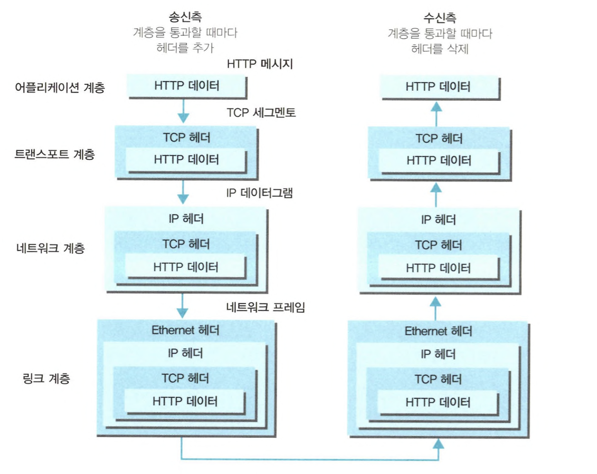

# 1주차

날짜: 2022년 10월 29일

## 제 1 장 - 웹과 네트워크의 기본에 대해 알아보자

- 웹은 HTTP로 나타난다
    - 서버에 의뢰를 하는 웹 브라우저 등을 클라이언트라고 한다.
    - 클라이언트에서 서버까지 일련의 흐름을 결정하고 있는 것은 웹에서 HTTP이라 불리는 프로토콜이다.
    - 프로토콜의 의미는 “약속”이다.
- HTTP는 이렇게 태어났고 성장했다.
    - HTTP의 발생 및 발전
    - HTTP/1.1을 가장 많이 사용한다.
- 네트워크의 기본은 TCP/IP
    - 인터넷을 포함하여 일반적으로 사용하고 있는 네트워크는 TCP/IP라는 프로토콜 위에서 움직이고 있다.
    HTTP는 그 중 하나다.
    - TCP/IP
        - 서로 다른 하드웨어와 운영체제 등을 가지고 서로 통신을 하기 위해서는 모든 요소에 규칙이 필요하다.
        이러한 규칙을 **프로토콜**이라 부른다
        - 인터넷과 관련된 프로토콜들을 모은 것을 **TCP/IP**라고 부른다.
        - TCP/IP 는 4계층으로 나뉜다.
            - 애플리케이션 계층
                - 유저에게 제공되는 애플리케이션에서 사용하는 통신의 움직임을 결정한다.
                - FTP, DNS, HTTP 등
            - 트랜스포트 계층
                - 애플리케이션 계층에 네트워크로 접속되어 있는 2대의 컴퓨터 사이의 데이터 흐름을 제공한다.
                - TCP, UDP
            - 네트워크 계층 (인터넷 계층)
                - 네트워크 상에서 패킷의 이동을 다룬다.
                    - 패킷이란, 전송하는 데이터의 최소 단위
                - IP 프로토콜
            - 링크 계층
                - 네트워크에 접속하는 하드웨어적인 부분
                - 디바이스 드라이버, 네트워크 인터페이스 카드(NIC), 케이블 등과 같이 물리적인 부분도 포함
            - 각 계층은 계층이 연결되어 있는 부분만 결정되어 있어, 각 계층의 내부는 자유롭게 설계할 수 있다.
        - 통신의 흐름
            
            
            
            - 각 계층을 거칠 때는 반드시 헤더로 불려지는 해당 계층마다 필요한 정보를 추가한다.
            반대로 수신측에서는 각 계층을 거칠 때마다 반드시 해당 계층마다 사용한 헤더를 삭제한다.
    - [https://nordvpn.com/ko/blog/tcp-ip-protocol/](https://nordvpn.com/ko/blog/tcp-ip-protocol/)
        - TCP/IP는 인터넷 프로토콜 스위트(Internet Protocol Suite)로 
        인터넷과 이와 유사한 컴퓨터 네트워크 사이에서 정보를 주고받는 데 이용되는 통신 프로토콜의 모음
- HTTP와 관계가 깊은 프로토콜은 IP/TCP/DNS
    - 배송을 담당하는 IP
        - IP는 계층으로 말하자면 네트워크 층에 해당한다.
        - IP의 역할은 개개의 패킷을 상대방에게 전달하는 것이다.
            - IP주소와 MAC주소가 중요하다.
            - IP 주소는 각 노드에 부여된 주소를 가리키고
            MAC 주소는 각 네트워크 카드에 할당된 고유 주소이다.
            - IP 주소는 변경 가능하지만 기본적으로 MAC 주소는 변경할 수 없다.
        - ARP
            - IP 통신은 MAC 주소에 의존해서 통신한다.
            - ARP는 주소를 해결하기 위한 프로토콜중 하나로, 수신지의 IP주소를 바탕으로 MAC 주소를 조사할 수 있다.
            - 그 누구도 인터넷 전체를 파악하고 있지는 않다.
                - 목적지까지 중계를 하는 도중에 컴퓨터와 라우터 등의 네트워크 기기는 목적지에 도착하기까지 대략적인 목적지만을 알고 있다.
                - 이 시스템을 **라우팅**이라고 부른다.
    - 신뢰성을 담당하는 TCP
        - TCP는 계층으로 말하자면 트랜스포트 층에 해당한다.
        - 신뢰성 있는 바이트 스트림 서비스를 제공한다.
            - 바이트 스트림 서비스란, 용량이 큰 데이터를 보내기 쉽게 TCP 세그먼트라고 불리는 단위 패킷으로 작게 분해하여 관리하는 것이다.
                - TCP 세그먼트를 작게 분해하여 관리하는 것을 세그멘테이션이라 한다.
                - 네트워크 데이터 단위 정리
                    - [https://www.youtube.com/watch?v=p6ASAAMwgd8&ab_channel=널널한개발자TV](https://www.youtube.com/watch?v=p6ASAAMwgd8&ab_channel=%EB%84%90%EB%84%90%ED%95%9C%EA%B0%9C%EB%B0%9C%EC%9E%90TV)
        - 쓰리웨이 핸드셰이킹
            - 패킷을 보내서 나서 바로 끝내는 것이 아니라, 보내졌는지 여부를 상대에게 확인하는 것
            - SYN, ACK라는 TCP 플래그를 사용한다.
            - TCP는 쓰리웨이 핸드셰이킹 외에도 통신의 신뢰성을 보증하기 위해 다양한 시스템을 갖추고 있다.
    - 이름 해결을 담당하는 DNS
        - DNS는 HTTP와 같이 응용 계층 시스템에서 도메인 이름과 IP 주소 이름 확인을 제공한다.
        - IP 주소 대신 이름을 이용하여 상대의 컴퓨터를 지정한다.
    - 각각과 HTTP와의 관계
        - 그림 그려서 @김현호 가 올려줄 예정
    - URI 와 URL
        - URI는 Uniform Resource Identifiers의 약자로 리소스 식별자를 의미
        - URL은 Uniform Resource Locator의 약자로 리소스 상의 장소(네트워크 상의 위치)를 의미
        - URL은 URI의 서브셋
        - URI와 URL의 차이점
            - [https://www.charlezz.com/?p=44767](https://www.charlezz.com/?p=44767)

## 제 2 장 - 간단한 프로토콜 HTTP

- HTTP는 클라이언트와 서버 간에 통신을 한다
    - 리소스를 필요하다고 요구하는 쪽이 클라이언트
    리소스를 제공하는 쪽이 서버가 된다.
- 리퀘스트와 리스폰스를 교환하여 성립
    - HTTP는 클라이언트로부터 리퀘스트가 송신되며, 그 결과가 서버로부터 리스폰스로 되돌아온다.
    - 리퀘스트 메시지는 메소드, URI, 프로토콜 버전, 옵션 리퀘스트 헤더필드와 엔티티(바디)로 구성되어 있다.
    - `Connection: keep-alive`에 대한 궁금증
        - [https://etloveguitar.tistory.com/137](https://etloveguitar.tistory.com/137)
- HTTP는 상태를 유지하지 않는 프로토콜
    - HTTP는 상태를 계속 유지하지 않는 스테이트리스(stateless) 프로토콜이다.
        - 리퀘스트와 리스폰스를 교환하는 동안에 상태를 관리하지 않는다.
    - 많은 데이터를 매우 빠르고 확실하게 처리하는 범위성을 확보하기 위해서 이와 같이 간단하게 설계되어 있다.
    - 서버의 CPU나 메모리 같은 리소스의 낭비를 억제할 수 있다.
    - 상태를 계속 유지하고 싶은 요구에 부응하기 위해 **쿠키**라는 기술이 도입되었다.
- 서버에 임무를 부여하는 HTTP 메소드
    - GET : 리소스 획득
        - 식별된 리소스를 가져올 수 있도록 요구한다.
    - POST : 엔티티 전송
        - 엔티티를 전송하기 위해 사용된다.
    - PUT : 파일 전송
        - 파일을 전송하기 위해 사용된다.
        - 보안 상의 문제로 일반적인 웹 사이트에서는 사용되지 않으나,
        REST와 웹끼리 연계하는 설계 양식을 사용할 때 이용하는 경우가 있다.
    - HEAD : 메시지 헤더 취득
        - GET과 같은 기능이지만 메시지 바디는 돌려주지 않는다.
        - URI 유효성과 리소스 갱신 시간을 확인하는 목적 등으로 사용된다.
    - DELETE : 파일 삭제
        - 파일을 삭제하기 위해 사용된다.
        - PUT 메소드와 같이 인증 기능이 없기 때문에 일반적인 웹 사이트에서는 사용되고 있지 않다.
    - OPTIONS : 제공하고 있는 메소드의 문의
        - 리퀘스트 URI로 지정한 리소스가 제공하고 있는 메소드를 조사하기 위해 사용된다.
        - OPTIONS가 활용되는 Prefilght
            - [https://wonit.tistory.com/571](https://wonit.tistory.com/571)
        - 궁금증: OPTIONS * 요청이 서버에서 직접 구현해 놓지 않아도 동작하는가?
    - TRACE : 경로 조사
        - Web 서버에 접속해서 자신에게 통신을 되돌려받는 루프백을 발생시킨다.
        - 크로스 사이트 트레이싱(XST)과 같은 공격을 일으키는 보안 상의 문제도 있기 때문에 보통은 사용되고 있지 않다.
    - CONNECT : 프록시에 터널링 요구
        - 프록시에 터널 접속 확립을 요구함으로써, TCP 통신을 터널링 시키기 위해서 사용된다.
        - SSL, TLS등의 프로토콜로 암호화된 것을 터널링 시키기 위해서 사용된다.
    - HTTP API vs REST API
        - REST API는 HTTP API에서 추가된 제약조건을 적용한 API
        - 우리가 API에 사용하는 GET, POST 등도 HTTP 메소드들이다.
        이에 대한 로직을 얼마나 잘 구현하느냐에 따라 REST API라고 부를 수 있다.
        - [https://www.inflearn.com/questions/126743](https://www.inflearn.com/questions/126743)
- 지속 연결로 접속량을 절약
    - HTTP 초기 버전에서는 HTTP 통신을 한 번 할 때마다 TCP에 의해 연결과 종료를 할 필요가 있었다.
    - HTTP가 널리 보급되어감에 따라, 다량의 이미지를 포함한 문서가 늘어났다.
    그래서 리퀘스트를 보낼 때마다 매번 TCP 연결과 종료를 하게 되는 일이 발생되어 통신량이 늘어났다.
    - 지속 연결
        - TCP 연결 문제를 해결하기 위해 **지속 연결**이라는 방법을 고안했다.
        - 어느 한 쪽이 명시적으로 연결을 종료하지 않는 이상 TCP 연결을 계속 유지한다.
        - TCP 커넥션의 연결과 종료로 반복되는 오버헤드를 줄여주기 때문에 서버에 대한 부하가 경감된다.
    - 파이프라인화
        - 지속 연결은 여러 리퀘스트를 보낼 수 있도록 파이프라인화를 가능하게 한다.
        - 여러 리퀘스트를 병행해서 보내는 것이 가능하기 때문에 일일이 리스폰스를 기다릴 필요가 없다.
- 쿠키를 사용한 상태 관리
    - HTTP는 스테이트리스 프로토콜이기 때문에, 과거에 교환했었던 리퀘스트와 리스폰스의 상태를 관리하지 않는다.
    - 쿠키는 리퀘스트와 리스폰스에 쿠키 정보를 추가해서 클라이언트의 상태를 파악하기 위한 시스템이다.

## 제 3 장 - HTTP 정보는 HTTP 메시지에 있다

- HTTP 메시지
    - HTTP 메시지는 복수 행(개행 문자는 CR+LF)의 데이터로 구성된 텍스트 문자열이다.
        - HTTP 메시지는 크게 메시지 헤더와 메시지 바디로 구성되어 있다.
- 여러 데이터를 보내는 멀티파트
    - MIME는 이미지 등의 바이너리 데이터를 아스키 문자열에 인코딩하는 방법과 데이터 종류를 나타내는 방법 등을 규정하고 있다.
    - MIME의 확장 사양에 있는 멀티파트라고 하는 여러 다른 종류의 데이터를 수용하는 방법을 사용할 수 있다.
- 일부분만 받는 레인지 리퀘스트
    - 리줌(resume)을 통해 이전에 다운로드를 한 곳에서부터 다운로드를 재개할 수 있다.
    - 범위를 지정하여 리퀘스트 하는 것을 레인지 리퀘스트라고 한다.
        - 레인지 리퀘스트에는 Range 헤더 필드를 사용해서 리소스의 바이트 레인지를 지정한다.
- 최적의 콘텐츠를 돌려주는 콘텐츠 네고시에이션
    - 웹 페이지에서 영어와 한국어 같이 서로 다른 언어를 주로 사용하는 브라우저가 같은 URI에 액세스할 때에 각각 영어판과 한국어판 웹 페이지를 표시한다.
    - 콘텐츠 네고시에이션은 제공하는 리소스를 언어와 문자 세트, 인코딩 방식 등을 기준으로 판단하고 있다.
    - 콘텐츠 네고시에이션 종류
        - 서버 구동형 네고시에이션
        - 에이전트 구동형 네고시에이션
        - 트랜스페어런트 네고시에이션
    - 예시 : 애플 공식사이트의 TV 및 홈을 검사해보면, title이 `tv and home`으로 나와있음