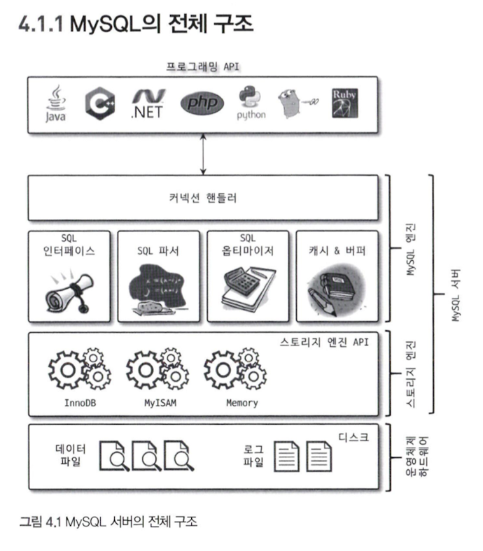
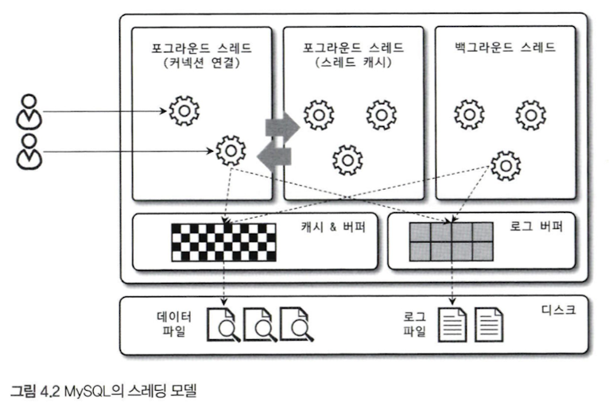
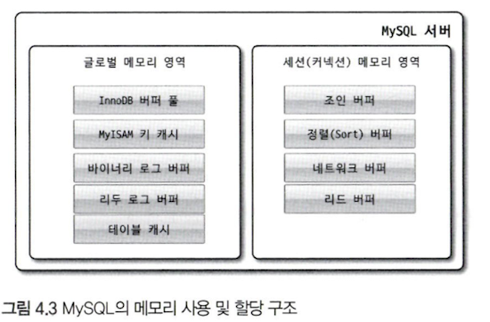
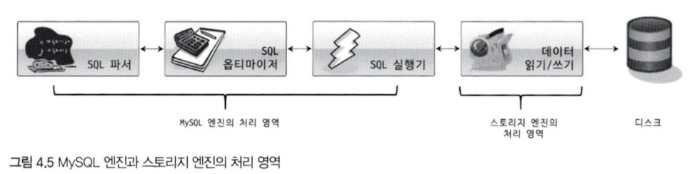
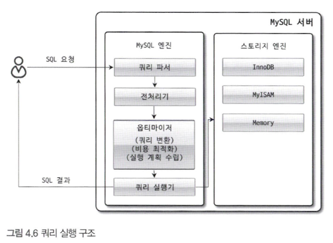
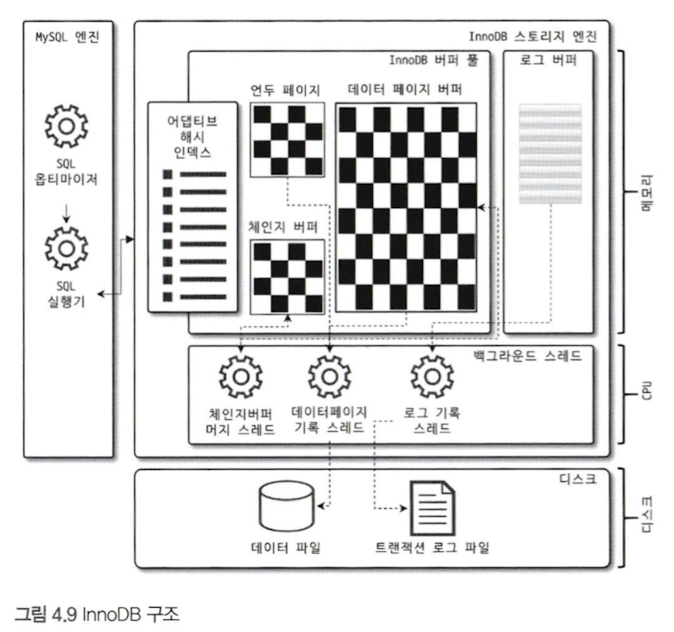

# 4장. 아키텍처

## 4.1 MySQL 엔진 아키텍처

### 4.1.1 MySQL의 전체 구조

MySQL 서버는 크게 MySQL 엔진과 스토리지 엔진으로 구분할 수 있다.

* MySQL 엔진
  * 클라이언트로부터의 접속 및 쿼리 요청을 처리하는 커넥션 핸들러
  * SQL 파서 및 전처리기, 쿼리의 최적화된 실행을 위한 옵티마이저
* 스토리지 엔진
  * 실제 데이터를 디스크 스토리지에 저장하거나 디스크 스토리지로부터 데이터를 읽어오는 부분을 전담한다.
  * 스토리지 엔진은 여러 개를 동시에 사용할 수 있다.
* 핸들러 API
  * MySQL 엔진의 쿼리 실행기에서 데이터를 쓰거나 읽어야 할 때는 각 스토리지 엔진에 쓰기 또는 읽기를 요청하는데, 이러한 요청을 핸들러 요청이라 하고, 여기서 사용되는 API를 핸들러 API라고 한다.

### 4.1.2 MySQL 스레딩 구조

MySQL 서버는 프로세스 기반이 아니라 스레드 기반으로 작동하며, 포어그라운드 스레드와 백그라운드 스레드로 구분할 수 있다.

* 포어그라운드 스레드 (클라이언트 스레드)
  * 포어그라운드 스레드는 최소한 MySQL 서버에 접속된 클라이언트의 수만큼 존재하며, 주로 각 클라이언트 사용자가 요청하는 쿼리 문장을 처리한다.
  * 클라이언트 사용자가 작업을 마치고 커넥션을 종료하면 해당 커넥션을 담당하던 스레드는 다시 스레드 캐시로 되돌아간다.
* 백그라운드 스레드
  * InnoDB는 다음과 같은 작업들이 백그라운드로 처리된다.
    * 인서트 버퍼를 병합하는 스레드
    * 로그를 디스크로 기록하는 스레드
    * InnoDB 버퍼 풀의 데이터를 디스크에 기록하는 스레드
    * 데이터를 버퍼로 읽어 오는 스레드
    * 잠금이나 데드락을 모니터링하는 스레드
  * 사용자의 요청을 처리하는 도중 데이터의 쓰기 작업은 지연되어 처리될 수 있지만 데이터의 읽기 작업은 절대 지연될 수 없다.

### 4.1.3 메모리 할당 및 사용 구조

글로벌 메모리 영역과 로컬 메모리 영역으로 구분할 수 있다.

글로벌 메모리 영역의 모든 메모리 공간은 MySQL 서버가 시작되면서 운영체제로부터 할당된다.

* 글로벌 메모리 영역
  * 일반적으로 클라이언트 스레드의 수와 무관하게 하나의 메모리 공간만 할당된다.
  * 생성된 글로벌 영역이 N개라 하더라도 모든 스레드에 의해 공유된다.
  * 대표적인 글로벌 메모리 영역은 다음과 같다.
    * 테이블 캐시
    * InnoDB 버퍼 풀
    * InnoDB 어댑티브 해시 인덱스
    * InnoDB 리두 로그 버퍼
* 로컬 메모리 영역
  * 세션 메모리 영역
  * MySQL 서버상에 존재하는 클라이언트 스레드가 쿼리를 처리하는데 사용하는 메모리 영역이다.
  * 각 클라이언트 스레드별로 독립적으로 할당되며 절대 공유되어 사용되지 않는다.
  * 각 쿼리의 용도별로 필요할 때만 공간이 할당되고 필요하지 않은 경우에는 MySQL이 메모리 공간을 할당조차도 하지 않을 수도 있다.
  * 커넥션이 열려있는 동안 계속 할당된 상태로 남아있는 공간이 있다.
    * 커넥션 버퍼, 결과 버퍼
  * 쿼리를 실행하는 순간에만 할당했다가 다시 해제하는 공간도 있다.
    * 소트 버퍼, 조인 버퍼
  * 대표적인 로컬 메모리 영역은 다음과 같다.
    * 정렬 버퍼 (Sort Buffer)
    * 조인 버퍼
    * 바이너리 로그 캐시
    * 네트워크 버퍼
  
### 4.1.4 플러그인 스토리지 엔진 모델

MySQL의 독특한 구조 중 대표적인 것이 바로 플러그인 모델이다.  
플러그인해서 사용할 수 있는 것이 스토리지 엔진만 있는것은 아니다.

MySQL 엔진이 각 스토리지 엔진에게 데이터를 읽어오거나 저장하도록 명령하려면 반드시 핸들러를 통해야 한다는 점만 기억한다.

실질적인 GROUP BY나 ORDER BY 등 복잡한 처리는 스토리지 엔진 영역이 아니라 MySQL 엔진의 처리 영역인 쿼리 실행기에서 처리된다.

여기서 중요한 내용은 '하나의 쿼리 작업은 여러 하위 작업으로 나뉘는데, 각 하위 작업이 MySQL 엔진 영역에서 처리되는지 아니면 스토리지 엔진 영역에서 처리되는지 구분할 줄 알아야 한다'는 점이다.

### 4.1.5 컴포넌트

MySQL 8.0부터는 기존의 플러그인 아키텍처를 대체하기 위해 컴포넌트 아키텍처가 지원된다.

플러그인은 다음과 같은 몇가지 단점이 있다.
* 오직 MySQL 서버와 인터페이스할 수 있고, 플러그인끼리는 통신할 수 없다.
* MySQL 서버의 변수나 함수를 직접 호출하기 때문에 안전하지 않다. (캡슐화 안됨)
* 상호 의존 관계를 설정할 수 없어서 초기화가 어렵다.

### 4.1.6 쿼리 실행 구조

* 쿼리 파서
  * 사용자 요청으로 들어온 쿼리 문장을 토큰으로 분리해 트리 형태의 구조로 만들어 내는 작업을 의미한다.
  * 기본 문법 오류는 이 과정에서 발견된다.
* 전처리기
  * 만들어진 파서 트리를 기반으로 쿼리 문장에 구조적인 문제점이 있는지 확인한다.
  * 실제 존재하지 않거나 권한상 사용할 수 없는 개체의 토큰은 이 단계에서 걸러진다.
* 옵티마이저
  * 사용자의 요청으로 들어온 쿼리 문장을 저렴한 비용으로 가장 빠르게 처리할지를 결정한다.
* 실행 엔진
  * 옵티마이저가 두뇌라면 실행 엔진과 핸들러는 손과 발에 비유할 수 있다.
  * 만들어진 계획대로 각 핸들러에게 요청해서 받은 결과를 또 다른 핸들러 요청의 입력으로 연결하는 역할을 수행한다.
* 핸들러(스토리지 엔진)
  * MySQL 서버의 가장 밑단에서 MySQL 실행 엔진의 요청에 따라 데이터를 디스크로 저장하고 디스크로부터 읽어 오는 역할을 담당한다.
  
### 4.1.7 복제

매우 중요한 역할을 담당한다. 16장에서 다룬다.

### 4.1.8 쿼리 캐시

SQL의 실행 결과를 메모리에 캐시하고, 동일 SQL 쿼리가 실행되면 테이블을 읽지 않고 즉시 결과를 반환하기 때문에 매우 빠른 성능을 보인다.

MySQL 8.0으로 올라오면서 쿼리 캐시는 MySQL 서버의 기능에서 완전히 제거되고, 관련된 시스템 변수도 모두 제거됐다.

### 4.1.9 스레드 풀

스레드 풀은 내부적으로 사용자의 요청을 처리하는 스레드 개수를 줄여서 동시 처리되는 요청이 많다하더라도 MySQL 서버의 CPU가 제한된 개수의 스레드 처리에만 집중할 수 있게 해서 서버의 자원 소모를 줄이는 것이 목적이다.

### 4.1.10 트랜잭션 지원 메타데이터

파일 기반의 메타데이터는 생성 및 변경 작업이 트랜잭션을 지원하지 않기 때문에 테이블의 생성 또는 변경 도중에 MySQL 서버가 비정상적으로 종료되면 일관되지 않은 상태로 남는 문제가 있었다.

MySQL 8.0부터는 이러한 문제점을 해결하기 위해 테이블의 구조정보나 스토어드 프로그램의 코드 관련 정보를 모두 InnoDB의 테이블에 저장하도록 개선됐다.

## 4.2 InnoDB 스토리지 엔진 아키텍처

거의 유일하게 레코드 기반의 잠금을 제공하며, 그 때문에 높은 동시성 처리가 가능하고 안정적이며 성능이 뛰어나다.

### 4.2.1 프라이머리 키에 의한 클러스터링

프라이머리 키 값의 순서대로 디스크에 저장된다는 뜻이며, 모든 세컨더리 인덱스는 레코드의 주소 대신 프라이머리 키의 값을 논리적인 주소로 사용한다.

InnoDB 스토리지 엔진과는 달리 MyISAM 스토리지 엔진에서는 클러스터링 키를 지원하지 않는다.

### 4.2.2 외래 키 지원

InnoDB에서 외래 키는 부모 테이블과 자식 테이블 모두 해당 칼럼에 인덱스 생성이 필요하고, 변경 시에는 반드시 부모 테이블이나 자식 테이블에 데이터가 있는지 체크하는 작업이 필요하므로 잠금이 여러 테이블로 전파되고, 그로 인해 데드락이 발생할 때가 많으므로 개발할 때도 외래 키의 존재에 주의하는 것이 좋다.

### 4.2.3 MVCC (Multi Version Concurrency Control)

일반적으로 레코드 레벨의 트랜잭션을 지원하는 DBMS가 제공하는 기능이며,  
MVCC의 가장 큰 목적은 잠금을 사용하지 않는 일관된 읽기를 제공하는 데 있다.

키야! SELECT할때 조회가 제대로 되는 이유다!

하나의 레코드에 대해 2개의 버전이 유지되고, 필요에 따라 어느 데이터가 보여지는지 여러 가지 상황에 따라 달라지는 구조다.

`COMMIT` 명령을 실행하면 InnoDB는 더 이상의 변경 작업 없이 지금의 상태를 영구적인 데이터로 만들어버린다.  
하지만 롤백을 실행하면 InnoDB는 언두 영역에 있는 백업된 데이터를 InnoDB 버퍼 풀로 다시 복구하고, 언두 영역의 내용을 삭제해버린다.

### 4.2.4 잠금 없는 일관된 읽기

InnoDB 스토리지 엔진은 MVCC 기술을 이용해 잠금을 걸지 않고 읽기 작업은 수행한다.

오랜 시간 동안 활성 상태인 트랜잭션으로 인해 MySQL 서버가 느려지거나 문제가 발생할 때가 가끔 있는데, 이러한 일관된 읽기를 위해 언두 로그를 삭제하지 못하고 계속 유지해야 하기 때문에 발생하는 문제다.  
트랜잭션이 시작됐다면 가능한 한 빨리 롤백이나 커밋을 통해 트랜잭션을 완료하는 것이 좋다.

### 4.2.5 자동 데드락 감지

InnoDB 스토리지 엔진은 내부적으로 잠금이 교착 상태에 빠지지 않았는지 체크하기 위해 잠금 대기 목록을 그래프 형태로 관리한다.

언두 로그 레코드를 더 적게 가진 트랜잭션이 일반적으로 롤백의 대상이 된다.

### 4.2.6 자동화된 장애 복구

InnoDB에는 손실이나 장애로부터 데이터를 보호하기 위한 여러 가지 메커니즘이 탑재돼 있다.  
그러한 메커니즘을 이용해 MySQL 서버가 시작될 때 완료되지 못한 트랜잭션이나 디스크에 일부만 기록된 데이터 페이지 등에 대한 일련의 복구 작업이 자동으로 진행된다.

InnoDB 데이터 파일은 기본적으로 MySQL 서버가 시작될 때 항상 자동 복구를 수행한다. 이 단계에서 자동으로 복구될 수 없는 손상이 있다면 자동 복구를 멈추고 MySQL 서버는 종료돼 버린다.

InnoDB의 복구를 위해 설정 가능한 값은 1부터 6까지 있다.

### 4.2.8 InnoDB 버퍼 풀

InnoDB 스토리지 엔진에서 가장 핵심적인 부분이다.  
디스크의 데이터 파일이나 인덱스 정보를 메모리에 캐시해두는 공간이다.  
쓰기 작업을 지연시켜 일괄 작업으로 처리할 수 있게 해주는 버퍼 역할도 한다.

랜덤한 디스크 IO의 횟수를 줄일 수 있다.

* 버퍼 풀의 크기 설정
  * 운영체제의 전체 메모리 공간이 8GB 미만이라면 50% 정도만 InnoDB 버퍼 풀로 설정하고 나머지 메모리 공간은 MySQL 서버와 운영체제, 그리고 다른 프로그램이 사용할 수 있는 공간으로 확보해주는 것이 좋다.
  * innoDB 버퍼 풀은 동적으로 버퍼 풀의 크기를 확장할 수 있다. 하지만 버퍼 풀의 크기 변경은 크리티컬한 변경이고, 크기를 줄이는 작업은 서비스 영향도가 매우 크므로 가능하면 버퍼 풀의 크기를 줄이는 작업은 하지 않도록 주의한다. InnoDB 버퍼 풀은 내부적으로 128MB 청크단위로 쪼개어 관리된다.
  * InnoDB 버퍼 풀은 전통적으로 버퍼 풀 전체를 관리하는 잠금으로 인해 내부 잠금 경합을 많이 유발해왔는데, 이런 경합을 줄이기 위해 버퍼 풀을 여러 개로 쪼개어 관리할 수 있게 개선됐다.
* 버퍼 풀의 구조
  * InnoDB 스토리지 엔진은 버퍼 풀이라는 거대한 메모리 공간을 페이지 크기의 조각으로 쪼개어 InnoDB 스토리지 엔진이 데이터를 필요로 할 때 해당 데이터 페이지를 읽어서 각 조각에 저장한다.
  * 버퍼 풀의 페이지 크기 조각을 관리하기 위해 InnoDB 스토리지 엔진은 크게 LRU 리스트와 플러시 리스트, 프리 리스트라는 자료구조를 관리한다.
    * LRU 리스트는 LRU(Least Recently Used)와 MRU(Most Recently Used)가 결합된 형태라고 보면된다. 관리하는 목적은 디스크로부터 한 번 읽어온 페이지를 최대한 오래동안 버퍼 풀의 메모리에 유지해서 디스크 읽기를 최소화하는 것이다.
    * 플러시 리스트는 디스크로 동기화되지 않은 데이터를 가진 데이터 페이지의 변경 시점 기준의 페이지 목록을 관리한다.
    * 프리 리스트는 실제 사용자 데이터로 채워지지 않은 비어있는 페이지들의 목록이며, 사용자의 쿼리가 새롭게 디스크의 데이터 페이지를 읽어와야 하는 경우 사용된다.
* 버퍼 풀과 리두 로그
  * InnoDB의 버퍼 풀은 서버의 메모리가 허용하는 만큼 크게 설정하면 할수록 쿼리의 성능이 빨라진다.
  * 버퍼 풀의 메모리 공간만 단순히 늘리는 것은 데이터 캐시 기능만 향상시키는 것이다.
  * 리두 로그 파일의 공간은 계속 순환되어 재사용되지만 매번 기록될 때마다 로그 포지션은 계속 증가된 값을 갖게 되는데, 이를 LSN(Log Sequence Number)이라고 한다.
* 버퍼 풀 플러시
  * 플러시 리스트 플러시
    * 일반적으로 innoDB 버퍼 풀은 더티 페이지를 많이 가지고 있을수록 디스크 쓰기 작업을 버퍼링함으로써 여러 번의 디스크 쓰기를 한 번으로 줄이는 효과를 극대화할 수 있다.
    * InnoDB 버퍼 풀에 더티 페이지가 많으면 많을수록 디스크 쓰기 폭발 현상이 발생할 가능성이 높아진다.
  * LRU 리스트 플러시
    * LRU 리스트에서 사용 빈도가 낮은 데이터 페이지들을 제거하기 위해 LRU 리스트 플러시 함수가 사용된다.
* 버퍼 풀 상태 백업 및 복구
  * 서버 재시작이 성능이 떨어지는 이유는 버퍼 풀에 쿼리들이 사용할 데이터가 이미 준비돼 있으므로 디스크에서 데이터를 읽지 않아도 쿼리가 처리될 수 있기 때문이다. 디스크의 데이터가 버퍼 풀에 적재돼 있는 상태를 워밍업이라고 표현한다.
  * MySQL 5.6 버전부터는 버퍼 풀 덤프 및 적재 기능이 도입됐다. 서버 셧다운 전에 시스템 변수를 이용해 버퍼 풀의 상태를 백업할 수 있다.
* 버퍼 풀의 적재 내용 확인
  * 쿼리 써봐라

### 4.2.8 Double Write Buffer

페이지가 일부만 기록되는 현상을 파셜 페이지(Partial-page) 또는 톤 페이지(Torn-page)라고 하는데, 이런 현상은 하드웨어의 오작동이나 시스템의 비정상 종료 등으로 발생할 수 있다.

InnoDB 스토리지 엔진에서는 이 문제를 해결하기 위해 Double-Write 기법을 이용한다.  
InnoDB 스토리지 엔진은 실제 데이터 파일에 변경 내역을 기록하기 전에 더티 페이지를 우선 묶어서 한 번의 디스크 쓰기로 시스템 테이블 스페이스의 DoubleWrite 버퍼에 기록한다. 그리고 InnoDB 스토리지 엔진은 각 더티 페이지를 파일의 적당한 위치에 하나씩 랜덤으로 쓰기를 실행한다.

DoubleWrite 버퍼는 데이터의 안정성을 위해 자주 사용된다.  
데이터의 무결성이 매우 중요한 서비스에서는 DoubleWrite의 활성화를 고려하는 것이 좋다.

### 4.2.9 언두 로그

InnoDB 스토리지 엔진은 트랜잭션과 격리 수준을 보장하기 위해 DML로 변경되기 이전 버전의 데이터를 별도로 백업한다. 이렇게 백업된 데이터를 언두 로그라고 한다.

* 트랜잭션 보장
  * 트랜잭션이 롤백되면 트랜잭션 도중 변경된 데이터를 변경 전 데이터로 복구해야 하는데, 이때 언두 로그에 백업해둔 이전 버전의 데이터를 이용해 복구한다.
* 격리 수준 보장
  * 특정 커넥션에서 데이터를 변경하는 도중에 다른 커넥션에서 데이터를 조회하면 트랜잭션 격리 수준에 맞게 변경중인 레코드를 읽지 않고 언두 로그에 백업해둔 데이터를 읽어서 반환하기도 한다.

MySQL 8.0에서는 언두 로그를 돌아가면서 순차적으로 사용해 디스크 공간을 줄이는 것도 가능하며, 때로는 서버가 필요한 시점에 사용 공간을 자동으로 줄여주기도 한다.

언두 로그가 저장되는 공간을 언두 테이블스페이스라고 한다.

### 4.2.10 체인지 버퍼

RDBMS에서 레코드가 ISNERT되거나 UPDATE될 때는 데이터 파일을 변경하는 작업뿐 아니라 해당 테이블에 포함된 인덱스를 업데이트하는 작업도 필요하다.  
랜덤하게 디스크를 읽는 작업이 필요하므로 테이블에 인덱스가 많다면 이 작업은 상당히 많은 자원을 소모하게 된다.  
그래서 InnoDB는 변경해야 할 인덱스 페이지가 버퍼 풀에 있으면 바로 업데이트를 수행하지만 그렇지 않고 디스크로부터 읽어와서 업데이트해야 한다면 즉시 실행하지 않고 임시 공간에 저장해 두고 바로 사용자에게 결과를 반환하는 형태로 성능을 향상시키게 되는데, 이 때 사용되는 임시 메모리 공간을 체인지 버퍼라고 한다.

### 4.2.11 리두 로그 및 로그 버퍼

리두 로그는 트랜잭션의 4가지 요소인 ACID 중에 D(Durable)에 해당하는 영속성과 가장 밀접하게 연관돼 있다. 기록되지 못한 데이터를 잃지않게 해주는 안전장치다.

DBMS에서 데이터 파일은 쓰기보다 읽기 성능을 고려한 자료 구조를 가지고 있기 때문에 데이터 파일 쓰기는 디스크의 랜덤 액세스가 필요하다. 그래서 상대적으로 큰 비용이 필요하다.  
이로 인한 성능 저하를 막기 위해 쓰기 비용이 낮은 자료 구조를 가진 리두 로그를 가지고 있다.

리두 로그는 트랜잭션이 커밋되면 즉시 디스크로 기록되도록 설정하는 것을 권장한다. 하지만 이 작업은 많은 부하를 유발한다. 그래서 어느 주기로 디스크에 동기화할지를 결정하는 시스템 변수를 제공한다.

> 트랜잭션 ACID
> Atomic, 원자성 작업이어야 함
> Consistent, 일관성을 유지해야함
> Isolated, 격리성
> Durable, 한 번 저장된 데이터는 지속적으로 유지돼야 함

MySQL 8.0 버전부터 InooDB 스토리지 엔진의 리두 로그를 아카이빙할 수 있는 기능이 추가됐다. (리두 로그 아카이빙)

### 4.2.12 어댑티브 해시 인덱스

사용자가 수동으로 생성하는 읻게스가 아니라 InnoDB 스토리지 엔진에서 사용자가 자주 요청하는 데이터에 대해 자동으로 생성하는 인덱스이다.

어댑티브 해시 인덱스는 이러한 B-Tree 검색 시간을 줄여주기 위해 도입된 기능이다. InnoDB 스토리지 엔진은 자주 읽히는 데이터 페이지의 키 값을 이용해 해시 인덱스를 만들고, 필요할 때마다 어댑티브 해시 인덱스를 검색해서 레코드가 저장된 데이터 페이지를 즉시 찾아갈 수 있다. B-Tree를 루트 노드부터 리프 노드까지 찾아가는 비용이 없어지고 그만큼 CPU는 적은 일을 하지만 쿼리의 성능은 빨라진다. 그와 동시에 컴퓨터는 더 많은 쿼리를 동시에 처리할 수 있게 된다.

### 4.2.13 InnoDB와 MyISAM, MEMORY 스토리지 엔진 비교

InnoDB가 짱이다!!!!!!!!

## 4.3 MyISAM 스토리지 엔진 아키텍처

현호형이 보지말래

## 4.4 MySQL 로그 파일

현호형이 보지말래