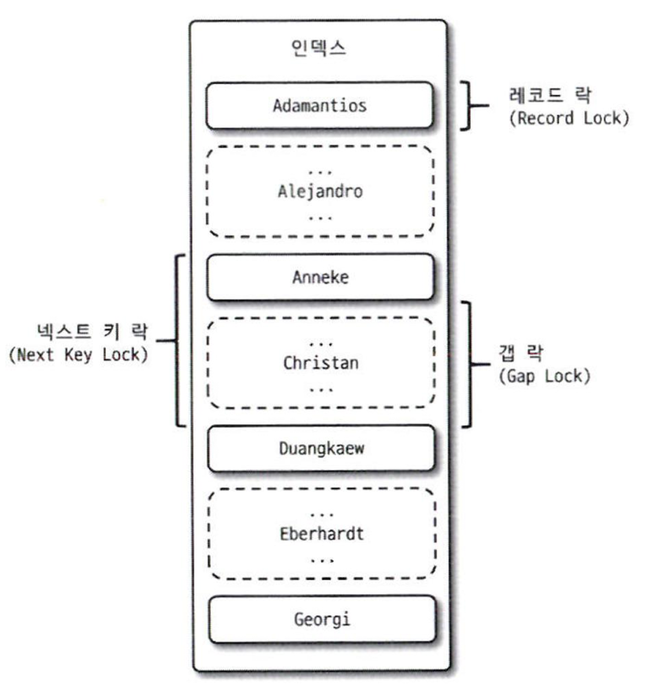
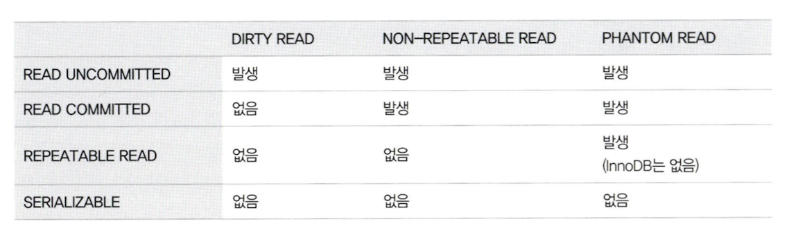
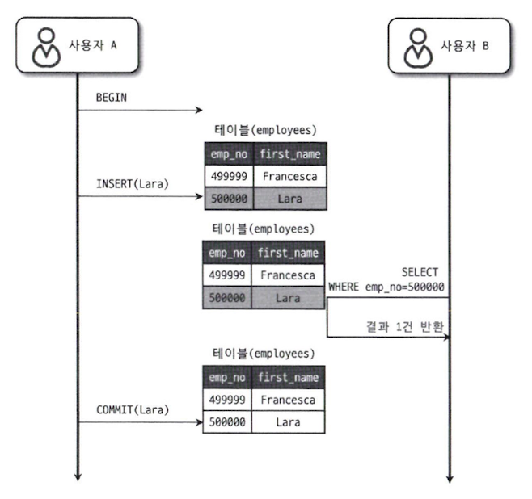
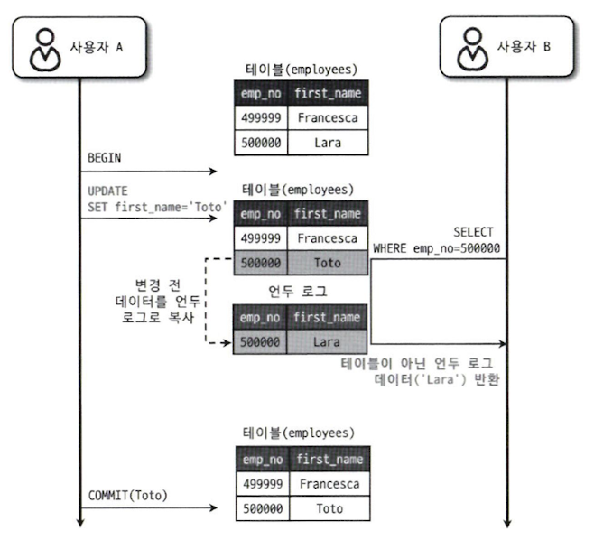
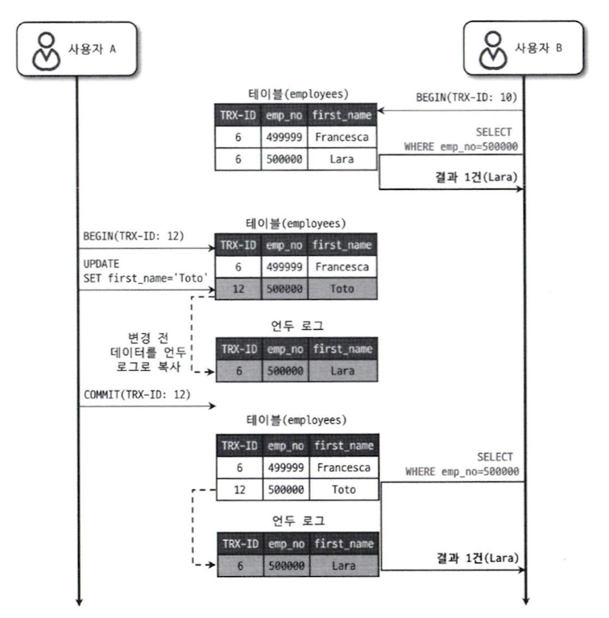

# 5장 트랜잭션과 잠금

트랜잭션은 작업의 완전성을 보장해 주는 것이다.  
논리적인 작업 셋을 모두 완벽하게 처리하거나, 처리하지 못할 경우에는 원 상태로 복구해서 작업의 일부만 적용되는 현상(Partial update, 부분 업데이트)이 발생하지 않게 만들어주는 기능이다.

잠금과 트랜잭션은 서로 비슷한 개념 같지만 사실 잠금은 동시성을 제어하기 위한 기능이고 트랜잭션은 데이터의 정합성을 보장하기 위한 기능이다.  
격리 수준이라는 것은 하나의 트랜잭션 내에서 또는 여러 트랜잭션 간의 작업 내용을 어떻게 공유하고 차단할 것인지를 결정하는 레벨을 의미한다.

## 5.1 트랜잭션

### 5.1.1 MySQL에서의 트랜잭션

트랜잭션은 하나의 논리적인 작업 셋에 하나의 쿼리가 있든 두 개 이상의 쿼리가 있든 관계없이 논리적인 작업 셋 자체가 100% 적용되거나 아무것도 적용되지 않아야 함을 보장해 주는 것이다.

### 5.1.2 주의사항

트랜잭션 또한 DBMS의 커넥션과 동일하게 꼭 필요한 최소의 코드에만 적용하는 것이 좋다.

네트워크 작업이 있는 경우에는 반드시 트랜잭션에서 배제해야 한다.

## 5.2 MySQL 엔진의 잠금

스토리지 엔진 레벨과 MySQL 엔진 레벨로 나눌수 있다.  
MySQL 엔진 레벨의 잠금은 모든 스토리지 엔진에 영향을 미치지만, 스토리지 엔진 레벨의 잠금은 스토리지 엔진 간 상호 영향을 미치지 않는다.

### 5.2.1 글로벌 락

`FLUSH TABLE READ LOCK` 명령으로 획득 가능  
MySQL에서 제공하는 잠금 가운데 가장 범위가 크다.

한 세션에서 글로벌 락을 획득하면 다른 세션에서 SELECT를 제외한 대부분의 DDL, DML을 실행하는 경우 글로벌 락이 해제될 때까지 해당 문장이 대기 상태로 남는다. 

영향을 미치는 범위는 MySQL 서버 전체이며, 작업 대상 테이블이나 데이터베이스가 다르더라도 동일하게 영향을 미친다.

> 주의!
> 글로벌 락을 거는 명령은 실행과 동시에 MySQL 서버에 존재하는 모든 테이블을 닫고 잠금을 건다.

InnoDB 스토리지 엔진은 트랜잭션을 지원하기 때문에 조금 더 가벼운 글로벌 락의 필요성이 생겨, 백업 락이 도입됐다.

백업 락은 일반적인 테이블의 데이터 변경은 허용된다.

### 5.2.2 테이블 락

개별 테이블 단위로 설정되는 잠금이다.  
명시적 또는 묵시적으로 특정 테이블의 락을 획득할 수 있다.  
`LOCK TABLES table_name [ READ | WRITE ]` 명령으로 획득할 수 있다.

명시적으로 획득한 잠금은 UNLOCK TABLES 명령으로 잠금을 해제할 수 있다.  
명시적으로 테이블을 잠그는 작업은 글로벌 락과 동일하게 온라인 작업에 상당한 영향을 미치기 때문이다.

묵시적인 테이블 락은 데이터를 변경하는 쿼리를 실행하면 발생한다. MySQL 서버가 데이터가 변경되는 테이블에 잠금을 설정하고 데이터를 변경한 후 즉시 잠금을 해제하는 형태로 사용된다.

InnoDB 테이블의 경우 스토리지 엔진 차원에서 레코드 기반의 잠금을 제공하기 때문에 단순 데이터 변경 쿼리로 인해 묵시적인 테이블 락이 설정되지는 않는다. 더 정확히는 InnoDB 테이블에도 테이블 락이 설정되지만 대부분의 데이터 변경 쿼리에서는 무시되고 스키마를 변경하는 쿼리의 경우에만 영향을 미친다.

### 5.2.3 네임드 락

`GET_LOCK()` 함수를 이용해 임의의 문자열에 대해 잠금을 설정할 수 있다.  
단순히 사용자가 지정한 문자열에 대해 획득하고 반납하는 잠금이다.  
여러 클라이언트가 상호 동기화를 처리해야 할 때 네임드 락을 이용하면 쉽게 해결할 수 있다.

많은 레코드에 대해서 복잡한 요건으로 레코드를 변경하는 트랜잭션에 유용하게 사용할 수 있다.  
한꺼번에 많은 케로드를 변경하는 쿼리는 자주 데드락의 원인이 되곤 한다. 동일 데이터를 변경하거나 참조하는 프로그램끼리 분류해서 네임드 락을 걸고 쿼리를 실행하면 아주 간단히 해결할 수 있다.

MySQL 8.0 버전부터는 네임드 락을 중첩해서 사용할 수 있게 됐으며, 현재 세션에서 획득한 네임드 락을 한 번에 모두 해제하는 기능도 추가됐다.

Redisson의 getLock과 비슷한 역할을 한다.

### 5.2.4 메타데이터 락

데이터베이스 객체의 이름이나 구조를 변경하는 경우에 자동으로 획득하는 잠금이다.  
명시적으로 획득하거나 해제할 수 있는 것이 아니다.

MySQL 서버의 DDL은 단일 스레드로 작동하기 때문에 상당히 많은 시간이 소모될 것이라는 문제가 있다.  
새로운 구조의 테이블을 생성하고 먼저 최근의 데이터까지는 프라이머리 키인 id 값을 범위별로 나눠서 여러 개의 스레드로 빠르게 복사한다.

## 5.3 InnoDB 스토리지 엔진 잠금

MySQL에서 제공하는 잠금과는 별개로 스토리지 엔진 내부에서 레코드 기반의 잠금 방식을 탑재하고 있다.

### 5.3.1 InnoDB 스토리지 엔진의 잠금

레코드 기반의 잠금 기능을 제공

#### 5.3.1.1 레코드 락

레코드 자체만을 잠그는 것을 레코드락이라고 한다.

InnoDB 스토리지 엔진은 레코드 자체가 아니라 인덱스의 레코드를 잠근다는 점이다.  
인덱스가 하나도 없는 테이블이더라도 내부적으로 자동 생성된 클러스터 인덱스를 이용해 잠금을 설정한다.

#### 5.3.1.2 갭 락

레코드 자체가 아니라 레코드와 바로 인접한 레코드 사이의 간격만을 잠그는 것을 의미한다.

넥스트 키 락의 일부로 자주 사용된다.

#### 5.3.1.3 넥스트 키 락

레코드 락과 갭 락을 합쳐 놓은 형태의 잠금을 넥스트 키 락이라고 한다.

InnoDB의 갭 락이나 넥스트 키 락은 바이너리 로그에 기록되는 쿼리가 레플리카 서버에서 실행될 때 소스 서버에서 만들어 낸 결과와 동일한 결과를 만들어내도록 보장하는 것이 주목적이다.

#### 5.3.1.4 자동 증가 락

AUTO_INCREMENT 칼럼이 사용된 테이블에 동시에 여러 레코드가 INSERT 되는 경우, 저장되는 각 레코드는 중복되지 않고 저장된 순서대로 증가하는 일련번호 값을 가져야 한다.

트랜잭션과 관계없이 INSERT, REPLACE 문장에서 AUTO_INCREMENT 값을 가져오는 순간만 락이 걸렸다가 즉시 해제된다.

AUTO_INCREMENT 락을 명시적으로 획득하고 해제하는 방법은 없다.

AUTO_INCREMENT 잠금을 최소화하기 위해 INSERT 쿼리가 실패했더라도 한 번 증가된 AUTO_INCREMENT 값은 다시 줄어들지 않고 그대로 남는다.

### 5.3.2 인덱스와 잠금

InnoDB의 잠금은 레코드를 잠그는 것이 아니라 인덱스를 잠그는 방식으로 처리된다. 즉, 변경해야 할 레코드를 찾기 위해 검색한 인덱스의 레코드를 모두 락을 걸어야 한다.

UPDATE 문장을 위해 적절히 인덱스가 준비돼 있지 않다면 각 클라이언트 간의 동시성이 상당히 떨어져서 한 세션에서 UPDATE 하는 작업을 하는 중에는 다른 클라이언트는 그 테이블을 업데이트하지 못하고 기다려야 하는 상황이 발생할 것이다.

### 5.3.3 레코드 수준의 잠금 확인 및 해제 

레코드 수준의 잠금은 테이블의 레코드 각각에 잠금이 걸리므로 그 레코드가 자주 사용되지 않는다면 오랜 시간 동안 잠겨진 상태로 남아 있어도 잘 발견되지 않는다.

performance_schema의 data_locks 테이블과 data_lock_waits 테이블을 조인해서 잠금 대기 순서를 살펴볼 수 있다.

## 5.4 MySQL의 격리 수준

트랜잭션의 격리 수준이란 여러 트랜잭션이 동시에 처리될 때 특정 트랜잭션이 다른 트랜잭션에서 변경하거나 조회하는 데이터를 볼 수 없게 허용할지 말지를 결정하는 것이다.

사실 SERIALIZABLE 격리 수준이 아니라면 크게 성능의 개선이나 저하는 발생하지 않는다.

일반적인 온라인 서비스 용도의 데이터베이스는 READ COMMITTED와 REPEATABLE READ 중 하나를 사용한다.

### 5.4.1 READ UNCOMMITTED

각 트랜잭션에서의 변경 내용이 COMMIT이나 ROLLBACK 여부에 상관없이 다른 트랜잭션에서 보인다.

어떤 트랜잭션에서 처리한 작업이 완료되지 않았는데도 다른 트랜잭션에서 볼 수 있는 현상을 더티 리드라 하고, 더티 리드가 허용되는 격리 수준이 READ UNCOMMITTED다.

### 5.4.2 READ COMMITTED

온라인 서비스에서 가장 많이 선택되는 격리 수준이다.

더티 리드 같은 현상은 발생하지 않는다.  
어떤 트랜잭션에서 데이터를 변경했더라도 COMMIT이 완료된 데이터만 다른 트랜잭션에서 조회할 수 있기 때문이다.

READ COMMITTED 격리 수준에서도 NON-REPEATABLE READ라는 부정합의 문제가 있다.  
하나의 트랜잭션 내에서 똑같은 SELECT 쿼리를 실행했을 때는 항상 같은 결과를 가져와야 한다는 REPEATABLE READ 정합성에 어긋나는 것이다.

### 5.4.3 REPEATABLE READ

InnoDB 스토리지 엔진에서 기본으로 사용되는 격리 수준이다.

InnoDB 스토리지 엔진은 트랜잭션이 ROLLBACK 될 가능성에 대비해 변경되기 전 데이터를 언두 공간에 백업해두고 실제 레코드 값을 변경한다.  
REPEATABLE READ는 이 MVCC를 위해 언두 영역에 백업된 이전 데이터를 이용해 동일 트랜잭션 내에서는 동일한 결과를 보여줄 수 있게 보장한다.  
READ COMMITTED와의 차이는 언두 영역에 백업된 레코드의 여러 버전 가운데 몇 번째 이전 버전까지 찾아 들어가야 하느냐에 있다.

다른 트랜잭션에서 수행한 변경 작업에 의해 레코드가 보였다 안 보였다 하는 현상을 PHANTOM READ라고 한다.  
하지만 InnoDB에서는 언두 영역을 MVCC로 관리하기 때문에 PHANTOM READ가 발생하지 않는다.

### 5.4.4 SERIALIZABLE

가장 단순한 격리 수준이면서 동시에 가장 엄격한 격리 수준이다.  
동시 처리 성능도 다른 트랜잭션 격리 수준보다 떨어진다.

트랜잭션의 격리 수준이 SERIALIZABLE로 설정되면 읽기 작업도 공유 잠금을 획득해야만 하며, 동시에 다른 트랜잭션은 그러한 레코드를 변경하지 못하게 된다.

InnoDB 스토리지 엔진에서는 갭 락과 넥스트 키 락 덕분에 REPEATABLE READ 격리 수준에서도 이미 PHANTOM READ가 발생하지 않기 때문에 굳이 SERIALIZABLE을 사용할 필요성은 없다.