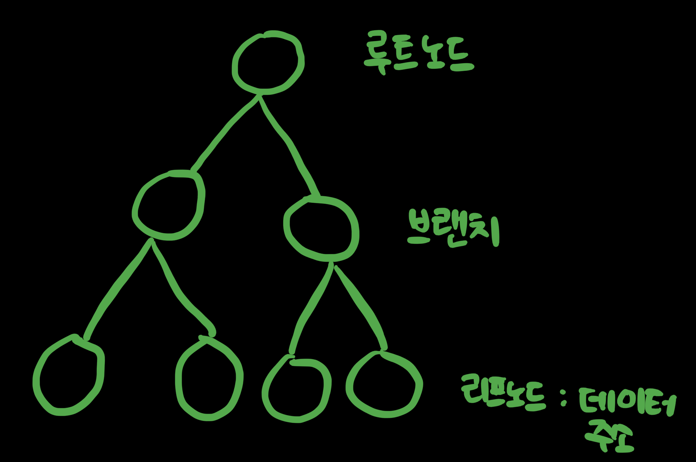
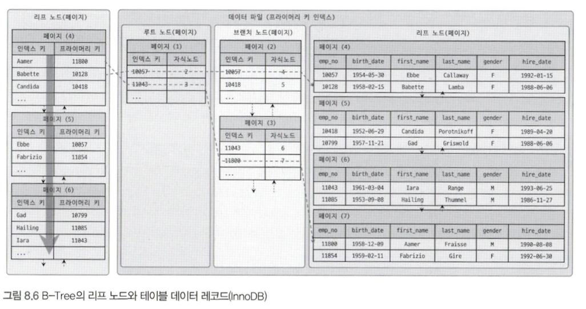

# 8장 인덱스

## 8.1 디스크 읽기 방식

랜덤 I/O, 순차 I/O와 같은 디스크 읽기 방식이 있다.

데이터베이스 성능 튜닝은 어떻게 I/O를 줄이느냐가 관건이다.

### 8.1.1 하드 디스크 드라이브(HDD)와 솔리드 스테이트 드라이브(SSD)

하드 디스크 드라이브는 기계식 장치다. 그래서 데이터베이스 서버에서는 항상 디스크 장치가 병목이 된다.

SSD는 기존 하드 디스크 드라이브보다 랜덤 I/O가 훨씬 빠르다.  
데이터베이스 서버에서 순차 I/O 작업은 그다지 비중이 크지 않고 랜덤 I/O를 통해 작은 데이터를 읽고 쓰는 작업이 대부분이므로 SSD의 장점은 DBMS용 스토리지에 최적이라고 볼 수 있다.

### 8.1.2 랜덤 I/O와 순차 I/O

랜덤 I/O는 하드 디스크 드라이브의 플래터(원판)를 돌려서 읽어야 할 데이터가 저장된 위치로 디스크 헤더를 이동시킨 다음 데이터를 읽는 것을 의미한다.  
사실 순차 I/O 또한 이 작업 과정은 같다.

디스크에 데이터를 쓰고 읽는 데 걸리는 시간은 디스크 헤더를 움직여서 읽고 쓸 위치로 옮기는 단계에서 결정된다.  
디스크의 성능은 디스크 헤더의 위치 이동 없이 얼마나 많은 데이터를 한 번에 기록하느냐에 의해 결정된다.

쿼리를 튜닝해서 랜덤 I/O를 순차 I/O로 바꿔서 실행할 방법은 많지 않다. 일반적으로 쿼리를 튜닝하는 것은 랜덤 I/O 자체를 줄여주는 것이 목적이다. 랜덤 I/O를 줄인다는 것은 쿼리를 처리하는 데 꼭 필요한 데이터만 읽도록 쿼리를 개선하는 것을 의미한다.

## 8.2 인덱스란?

DBMS도 데이터베이스 테이블의 모든 데이터를 검색해서 원하는 결과를 가져오려면 시간이 오래 걸린다. 그래서 칼럼의 값과 해당 레코드가 저장된 주소를 키와 값의 쌍으로 삼아 인덱스를 만들어 둔다.  
중요한 것이 바로 정렬인데, 최대한 빠르게 찾아갈 수 있게 칼럼의 값을 주어진 순서로 미리 정렬해서 보관한다.

인덱스와 흡사한 SortedList를 통해 살펴보면, 데이터가 저장될 때마다 항상 값을 정렬해야 하므로 저장하는 과정이 복잡하고 느리지만, 이미 정렬돼 있어서 아주 빨리 원하는 값을 찾아올 수 있다.

DBMS에서 인덱스는 데이터의 저장 성능을 희생하고 그 대신 데이터의 읽기 속도를 높이는 기능이다.  
SELECT 쿼리 문장의 WHERE 조건절에 사용되는 칼럼이라고 해서 전부 인덱스로 생성하면 데이터 저장 성능이 떨어지고 인덱스의 크기가 비대해져 오히려 역효과만 불러올 수 있다.

인덱스를 역할별로 구분해 본다면 프라이머리 키와 보조 키(세컨더리 인덱스)로 구분할 수 있다.  
* 프라이머리 키는 그 레코드를 대표하는 칼럼의 값으로 만들어진 인덱스를 의미한다.
* 프라이머리 키를 제외한 나머지 모든 인덱스는 세컨더리 인덱스로 분류한다.

데이터 저장 방식 별로 구분할 경우 B-Tree 인덱스와 Hash 인덱스로 구분할 수 있다.  
* B-Tree 알고리즘
  * 가장 일반적인 인덱스 알고리즘
  * 칼럼의 값을 변형하지 않고 원래의 값을 이용해 인덱싱하는 알고리즘
* Hash 인덱스 알고리즘
  * 칼럼의 값으로 해시 값을 계산해서 인덱싱하는 알고리즘
  * 매우 빠른 검색을 지원
  * 값의 일부만 검색하거나 범위를 검색할 때는 해시 인덱스를 사용 불가
  * 메모리 기반의 데이터베이스에서 많이 사용

데이터의 중복 허용 여부로 분류하면 유니크 인덱스와 유니크하지 않은 인덱스로 구분할 수 있다.  
유니크 인덱스에 대해 동증 조건으로 검색한다는 것은 항상 1건의 레코드만 찾으면 더 찾지 않아도 된다는 것을 옵티마이저에게 알려주는 효과를 낸다.

## 8.3 B-Tree 인덱스

인덱싱 알고리즘 가운데 가장 일반적으로 사용되고, 가장 먼저 도입된 알고리즘이고, 가장 범용적인 목적으로 사용되는 인덱싱 알고리즘이다.

B-Tree의 B는 Binary가 아니라 Balanced를 의미한다.

칼럼의 원래 값을 변형시키지 않고 인덱스 구조체 내에서는 항상 정렬된 상태로 유지한다.

### 8.3.1 구조 및 특성

트리 구조의 최상위에 하나의 루트 노드가 존재하고 그 하위에 자식 노드가 붙어 있는 형태다. 가장 하위에 있는 노드를 리프 노드라하고, 루트 노드도 아니고 리프 노드도 아닌 중간 노드를 브랜치 노드라고 한다.



데이터 베이스에서 인덱스와 실제 데이터가 저장된 데이터는 따로 관리되는데, 인덱스의 리프 노드는 항상 실제 데이터 레코드를 찾아가기 위한 주소값을 가지고 있다.

인덱스의 키 값은 모두 정렬돼 있지만, 데이터 파일의 레코드는 정렬돼 있지 않고 임의의 순서로 저장돼 있다.

> 참고
> 대부분 RDBMS의 데이터 파일에서 레코드는 특정 기준으로 정렬되지 않고 임의의 순서로 저장된다. 
> 하지만 InnoDB 테이블에서 레코드는 클러스터되어 디스크에 저장되므로 기본적으로 프라이머리 키 순서로 정렬되어 저장된다.

인덱스는 테이블의 키 칼럼만 가지고 있으므로 나머지 칼럼을 읽으려면 데이터 파일에서 해당 레코드를 찾아야 한다.



InnoDB 스토리지 엔진을 사용하는 테이블에서는 프라이머리 키가 ROWID의 역할을 한다.  
두 스토리지 엔진의 인덱스에서 가장 큰 차이점은 세컨더리 인덱스를 통해 데이터 파일의 레코드를 찾아가는 방법에 있다.  
MyISAM 테이블은 세컨더리 인덱스가 물리적인 주소를 가지는 반면 InnoDB 테이블은 프라이머리 키를 주소처럼 사용하기 때문에 논리적인 주소를 가진다고 볼 수 있다.

그래서 InnoDB 테이블에서 인덱스를 통해 레코드를 읽을 때는 데이터 파일을 바로 찾아가지 못한다. 인덱스에 저장돼 있는 프라이머리 키 값을 이용해 프라이머리 키 인덱스를 한 번 더 검색한 후, 프라이머리 키 인덱스의 리프 페이지에 저장돼 있는 레코드를 읽는다.

### 8.3.2 B-Tree 인덱스 키 추가 및 삭제

#### 8.3.2.1 인덱스 키 추가

B-Tree에 저장될 때는 저장될 키 값을 이용해 트리 상의 적절한 위치를 검색해야 한다.  
저장될 위치가 결정되면 레코드의 키 값과 대상 레코드의 주소 정보를 B-Tree의 리프 노드에 저장한다. 리프 노드가 꽉 차서 더는 저장할 수 없을 때는 리프 노드가 분리돼야 하는데, 이는 상위 브랜치 노드까지 처리의 범위가 넓어진다.

대략적으로 영향을 계산하는 방법은 테이블에 레코드를 추가하는 작업 비용을 1이라고 가정했을 때, 테이블의 인덱스에 키를 추가하는 작업 비용을 1.5 정도로 예측하는 것이다.

InnoDB 스토리지 엔진은 이 작업을 조금 더 지능적으로 처리하는데, 필요하다면 인덱스 키 추가 작업을 지연시켜 나중에 처리할 수 있다.  
하지만 프라이머리 키나 유니크 인덱스의 경우 중복 체크가 필요하기 때문에 즉시 추가하거나 삭제한다.

#### 8.3.2.2 인덱스 키 삭제

해당 키 값이 저장된 B-Tree의 리프 노드를 찾아서 그냥 삭제 마크만 하면 작업이 완료된다. 이렇게 삭제 마킹된 인덱스 키 공간은 계속 그대로 방치하거나 재활용할 수 있다.

InnoDB 스토리지 엔진에서는 이 작업 또한 버퍼링되어 지연 처리될 수도 있다.

#### 8.3.2.3 인덱스 키 변경

인덱스의 키 값은 그 값에 따라 저장될 리프 노드의 위치가 결정되므로 B-Tree의 키 값이 변경되는 경우네는 단순히 인덱스상의 키 값만 변경하는 것은 불가능하다.

키 값 변경 작업은 먼저 키 값을 삭제한 후, 다시 새로운 키 값을 추가하는 형태로 처리된다.

#### 8.3.2.4 인덱스 키 검색

INSERT, UPDATE, DELETE 작업을 할 때 인덱스 관리에 따르는 추가 비용을 감당하면서 인덱스를 구축하는 이유는 바로 빠른 검색을 위해서다.

인덱스를 검색하는 작업은 B-Tree의 루트 노드부터 시작해 브랜치 노드를 거쳐 최종 리프 노드까지 이동하면서 비교 작업을 수행하는데, 이 과정을 트리 탐색이라고 한다.

InnoDB 스토리지 엔진에서 인덱스는 더 특별한 의미가 있다.  
레코드 잠금이나 넥스트 키락이 검색을 수행한 인덱스를 잠근 후 테이블의 레코드를 잠그는 방식으로 구현돼 있다. 따라서 UPDATE나 DELETE 문장이 실행될 때 테이블에 적절히 사용할 수 있는 인덱스가 없으면 불필요하게 많은 레코드를 잠근다.

### 8.3.3 B-Tree 인덱스 사용에 영향을 미치는 요소

인덱스를 구성하는 칼럼의 크기와 레코드의 건수, 유니크한 인덱스 키 값의 개수 등에 의해 검색이나 변경 작업의 성능이 영향을 받는다.

#### 8.3.3.1 인덱스 키 값의 크기

데이터를 저장하는 가장 기본 단위를 페이지 또는 블록이라고 하며, 디스크의 모든 읽기 및 쓰기 작업의 최소 작업 단위가 된다.

인덱스의 페이지 크기와 키 값의 크기에 따라 B-Tree의 자식 노드 개수가 결정된다.

인덱스를 구성하는 키 값의 크기가 커지면 디스크로부터 읽어야 하는 횟수가 늘어나고, 그만큼 느려진다는 것을 의미한다.  
또한 인덱스 키 값의 길이가 길어진다는 것은 전체적인 인덱스의 크기가 커진다는 것을 의미한다. 캐시 영역은 크기가 제한적이기 때문에 하나의 레코드를 위한 인덱스 크기가 커지면 커질수록 메모리에 캐시해 둘 수 있는 레코드 수는 줄어든다. 그렇게 되면 메모리의 효율이 떨어지는 결과를 가져온다.

#### 8.3.3.2 B-Tree 깊이

인덱스 키 값의 크기가 커지면 커질수록 하나의 인덱스 페이지가 담을 수 잇는 인덱스 키 값의 개수가 적어지고, 그 때문에 같은 레코드 건수라 하더라도 B-Tree의 깊이가 깊어져서 디스크 읽기가 더 많이 필요하게 된다.

#### 8.3.3.3 선택도(기수성)

모든 인덱스 키 값 가운데 유니크한 값의 수를 의미한다.

인덱스는 선택도가 높을수록 검색 대상이 줄어들기 때문에 그만큼 빠르게 처리된다.

> 참고
> 선택도가 좋지 않다고 하더라도 정렬이나 그룹핑같은 갖ㄱ업을 위해 인덱스를 만드는 것이 훨씬 나은 경우도 많다.
> 인덱스가 항상 검색에만 사용되는 것은 아니므로 여러 가지 용도를 고려해 적절히 인덱스를 설계할 필요가 있다.

#### 8.3.3.4 읽어야 하는 레코드의 건수

일반적인 DBMS의 옵티마이저에서는 인덱스를 통해 레코드 1건을 읽는 것이 테이블에서 직접 레코드 1건을 읽는 것보다 4~5배 정도 비용이 더 많이 드는 작업인 것으로 예측한다.

읽어야 할 레코드의 건수가 전체 테이블 레코드의 20~25%를 넘어서면 인덱스를 이용하지 않고 테이블을 모두 직접 읽어서 필요한 레코드만 가려내는 방식으로 처리하는 것이 효율적이다.

물론 이러한 작업은 MySQL의 옵티마이저가 기본적으로 힌트를 무시하고 테이블을 직접 읽는 방식으로 처리한다.

### 8.3.4 B-Tree 인덱스를 통한 데이터 읽기

#### 8.3.4.1 인덱스 레인지 스캔

인덱스 레인지 스캔은 인덱스의 접근 방법 가운데 가장 대표적인 접근방식으로, 나머지 두 접근 방식보다는 빠른 방법이다.

인덱스 레인지 스캔은 검색해야 할 인덱스의 범위가 결정됐을 때 사용하는 방식이다.  
일단 시작해야 할 위치를 찾으면 그때부터는 리프 노드의 레코드만 순서대로 읽으면 된다. 이처럼 차례대로 쭉 읽는 것을 스캔이라고 표현한다.

리프 노드에 저장된 레코드 주소로 데이터 파일의 레코드를 읽어오는데, 레코드 한 건 한 건 단위로 랜덤 I/O가 한 번씩 일어난다.  
인덱스를 통해 데이터 레코드를 읽는 작업은 비용이 많이 드는 작업으로 분류된다.

커버링 인덱스로 처리되는 쿼리는 디스크의 레코드를 읽지 않아도 되기 때문에 랜덤 읽기가 상당히 줄어들고 성능은 그만큼 빨라진다.

#### 8.3.4.2 인덱스 풀 스캔

인덱스의 처음부터 끝까지 모두 읽는 방식을 인덱스 풀 스캔이라고 한다.  
대표적으로 쿼리의 조건절에 사용된 칼럼이 인덱스의 첫 번째 칼럼이 아닌 경우 인덱스 풀 스캔 방식이 사용된다.

인덱스 레인지 스캔보다는 빠르지 않지만 테이블 풀 스캔보다는 효율적이다.

#### 8.3.4.3 루스 인덱스 스캔

느슨하게 또는 듬성듬성하게 인덱스를 읽는 것을 의미한다.

인덱스 레인지 스캔과 비슷하게 작동하지만 중간에 필요치 않은 인덱스 키 값은 무시하고 다음으로 넘어가는 형태로 처리한다. 일반적으로 GROUP BY 또는 집합 함수 가운데 MAX(), MIN() 함수에 대해 최적화를 하는 경우에 사용된다.

#### 8.3.4.4 인덱스 스킵 스캔

MySQL 8.0 버전부터는 옵티마이저가 첫 번째 인덱스 칼럼을 건너뛰어서 두 번재 인덱스 칼럼만으로도 인덱스 검색이 가능하게 해주는 인덱스 스킵 스캔 최적화 기능이 도입됐다.

루스 인덱스 스캔은 GROUP BY 작업을 처리하기 위해 인덱스를 사용하는 경우에만 적용할 수 있었지만, MySQL 8.0 버전에 도입된 인덱스 스킵 스캔은 WHERE 조건절의 검색을 위해 사용 가능하도록 용도가 훨씬 넓어졌다.

인덱스 스킵 스캔 기능을 비활성화하면 어떤 실행 계획으로 처리됐는지 살펴보았을 때, type이 index라고 표시되며 이는 인덱스를 처음부터 끝까지 모두 읽었다는 의미이므로 인덱스를 비효율적으로 사용한 것이다.  
인덱스 스킵 스캔 기능을 활성화하면 type이 range라고 표시되며 이는 인덱스에서 꼭 필요한 부분만 읽었다는 것을 의미한다.

인덱스 스킵 스캔은 MySQL 8.0 버전에 새로이 도입된 기능이어서 아직 다음과 같은 단점이 있다.  
* WHERE 조건절에 조건이 없는 인덱스의 선행 칼럼의 유니크한 값의 개수가 적어야 함
  * 유니크한 값의 개수가 매우 많다면 옵티마이저는 인덱스에서 스캔해야 할 시작 지점을 검색하는 작업이 많이 필요해져서 쿼리의 처리 성능이 오히려 더 느려질 수 있다.
  * 인덱스 스킵 스캔은 인덱스의 선행 칼럼이 가진 유니크한 값의 개수가 소량일 때만 적용 가능한 최적화이다.
* 쿼리가 인덱스에 존재하는 칼럼만으로 처리 가능해야 함(커버링 인덱스)
  * 인덱스 칼럼 이외의 나머지 칼럼도 필요로 하는 쿼리의 경우, 인덱스 스킵 스캔을 사용하지 못하고 풀 테이블 스캔으로 실행 계획을 수립한다.

### 8.3.5 다중 칼럼 인덱스

두 개 이상의 칼럼으로 구성된 인덱스를 다중 칼럼 인덱스라고 한다.

중요한 것은 인덱스의 두 번째 칼럼은 첫 번째 칼럼에 의존해서 정렬돼 있다는 것이다.

인덱스 내에서 각 칼럼의 위치(순서)가 상당히 중요하며, 그것을 아주 신중히 결정해야 하는 이유가 바로 그것이다.

### 8.3.6 B-Tree 인덱스의 정렬 및 스캔 방향

인덱스를 생성할 때 설정한 정렬 규칙에 따라서 인덱스의 키 값은 항상 오름차순이거나 내림차순으로 정렬되어 저장된다.

#### 8.3.6.1 인덱스의 정렬

MySQL 8.0 버전부터는 다음과 같은 형태의 정렬 순서를 혼합한 인덱스도 생성할 수 있게 됐다.

```sql
CREATE INDEX ix_teamname_userscore ON employees (team_name ASC, user_score DESC);
```

##### 8.3.6.1.1 인덱스 스캔 방향

인덱스는 항상 오름차순으로만 정렬돼 있지만 인덱스를 최솟값부터 읽으면 오름차순으로 값을 가져올 수 있고, 최댓값부터 거꾸로 읽으면 내림차순으로 값을 가져올 수 있다는 것을 MySQL 옵티마이저는 이미 알고 있다.

##### 8.3.6.1.2 내림차순 인덱스

역순 정렬 쿼리가 정순 정렬 쿼리보다 28.9% 더 시간이 걸리는 것을 확인할 수 있다.

내부적으로는 InnoDB에서 인덱스 역순 스캔이 정순 스캔에 비해 느릴 수밖에 없는 다음의 두 가지 이유가 있다.  
* 페이지 잠금이 인덱스 정순 스캔에 적합한 구조
* 페이지 내에서 인덱스 레코드가 단방향으로만 연결된 구조

### 8.3.7 B-Tree 인덱스의 가용성과 효율성

#### 8.3.7.1 비교 조건의 종류와 효율성

다중 칼럼 인덱스에서 각 칼럼의 순서와 그 칼럼에 사용된 조건이 동등 비교인지 아니면 크다 또는 작다 같은 범위 조건인지에 따라 각 인덱스 칼럼의 활용 형태가 달라지며, 그 효율 또한 달라진다.

```sql
SELECT * FROM dept_emp
WHERE dept_no='d002' AND emp_no >= 10144;
```

위 쿼리를 두 가지 인덱스 케이스로 처리하는 경우를 예시로 들어본다.
* 케이스 A: INDEX (dept_no, emp_no)
* 케이스 B: INDEX (emp_no, dept_no)

다중 칼럼 인덱스의 정렬 방식 때문이다.  
케이스 A 인덱스에서 2번째 칼럼인 emp_no는 비교 작업의 범위를 좁히는데 도움을 준다. 하지만 케이스 B 인덱스에서 2번째 칼럼인 dept_no는 비교 작업의 범위를 좁히는 데 아무런 도움을 주지 못하고, 단지 쿼리의 조건에 맞는지 검사하는 용도로만 사용된다.

케이스 A 인덱스의 두 조건(dept_no='d002'와 emp_no >= 10144)과 같이 작업의 범위를 결정하는 조건을 작업 범위 결정 조건이라 하고, 케이스 B 인덱스의 dept_no='d002' 조건과 같이 비교 작업의 범위를 줄이지 못하고 단순히 거름종이 역할만 하는 조건을 필터링 조건 또는 체크 조건이라고 표현한다.

작업 범위를 결정하는 조건은 많으면 많을수록 쿼리의 처리 성능을 높이지만 체크 조건은 많다고해서 쿼리의 처리 성능을 높이지는 못한다. 오히려 쿼리 실행을 더 느리게 만들 때가 많다.

#### 8.3.7.2 인덱스의 가용성

B-Tree 인덱스의 특징은 왼쪽 값에 기준해서 오른쪽 값이 정렬돼 있다는 것이다.

#### 8.3.7.3 가용성과 효율성 판단

기본적으로 B-Tree 인덱스의 특성상 다음 조건에서는 사용할 수 없다.  
여기서 사용할 수 없다는 것은 작업 범위 결정 조건으로 사용할 수 없다는 것을 의미하며, 경우에 따라서는 체크 조건으로 인덱스를 사용할 수는 있다.

* NOT-EQUAL로 비교된 경우
  * `<>`
  * `NOT IN`
  * `NOT BETWEEN`
  * `IS NOT NULL`
* LIKE '%??' 형태로 문자열 패턴이 비교된 경우 (앞부분이 아닌 뒷부분 일치)
* 스토어드 함수나 다른 연산자로 인덱스 칼럼이 변형된 후 비교된 경우
  * `WHERE SUBSTRING(column, 1, 1) = 'X'`
  * `WHERE DAYOFMONTH(column) = 1`
* NOT-DETERMINISTIC 속성의 스토어드 함수가 비교 조건에 사용된 경우
  * `WHERE column = deterministic_function()`
* 데이터 타입이 서로 다른 비교
  * `WHERE char_column = 10`
* 문자열 데이터 타입의 콜레이션이 다른 경우
  * `WHERE utf8_bin_char_column = euckr_bin_char_column`

다중 컬럼으로 만들어진 인덱스는 어떤 조건에서 사용될 수 있고, 어떤 경우에 사용할 수 없는지 살펴보자.

```sql
INDEX ix_test (column_1, column_2, ..., column_n)
```

* 작업 범위 결정 조건으로 인덱스를 사용하지 못하는 경우
  * column_1 칼럼에 대한 조건이 없는 경우
  * column_1 칼럼의 비교 조건이 위의 인덱스 사용 불가 조건 중 하나인 경우
* 작업 범위 결정 조건으로 인데스를 사용하는 경우
  * column_1 ~ column_(i-1) 칼럼까지 동등 비교 형태로 비교하는 경우
  * column_i 칼럼에 대해 다음 연산자 중 하나로 비교
    * 동등 비교 (= 또는 IN)
    * 크다 작다 형태 (< 또는 >)
    * LIKE로 좌측 일치 패턴 (LIKE '??%')

## 8.4 R-Tree 인덱스

### 8.4.1 구조 및 특성

### 8.4.2 R-Tree 인덱스의 용도

## 8.5 전문 검색 인덱스

### 8.5.1 인덱스 알고리즘

### 8.5.2 전문 검색 인덱스의 가용성

## 8.6 함수 기반 인덱스

### 8.6.1 가상 칼럼을 이용한 인덱스

### 8.6.2 함수를 이용한 인덱스

## 8.7 멀티 밸류 인덱스

## 8.8 클러스터링 인덱스

### 8.8.1 클러스터링 인덱스

테이블의 프라이머리 키에 대해서만 적용되는 내용이다.  
즉, 프라이머리 키 값이 비슷한 레코드끼리 묶어서 저장하는 것을 클러스터링 인덱스라고 표현한다.  
여기서 중요한 것은 프라이머리 키 값에 의해 레코드의 저장 위치가 결정된다는 것이다.  
프라이머리 키 값 자체에 대한 의존도가 상당히 크기 때문에 신중히 프라이머리 키를 결정해야 한다.

세컨더리 인덱스를 위한 B-Tree의 리프 노드와는 달리 클러스터링 인덱스의 리프 노드에는 레코드의 모든 칼럼이 같이 저장돼 있음을 알 수 있다.

프라이머리 키가 없는 경우에는 InnoDB 스토리지 엔진이 다음 우선순위대로 프라이머리 키를 대체할 칼럼을 선택한다.
1. 프라이머리 키가 있으면 기본적으로 프라이머리 키를 클러스터링 키로 선택
2. NOT NULL 옵션의 유니크 인덱스 중에서 첫 번째 인덱스를 클러스터링 키로 선택
3. 자동으로 유니크한 값을 가지도록 증가되는 칼럼을 내부적으로 추가한 후 클러스터링 키로 선택

InnoDB 테이블에서 클러스터링 인덱스는 테이블당 단 하나만 가질 수 있는 엄청난 혜택이므로 가능하다면 프라이머리 키를 명시적으로 생성하자.

### 8.8.2 세컨더리 인덱스에 미치는 영향

MyISAM 테이블이나 MEMORY 테이블에서는 프라이머리 키와 세컨더리 인덱스는 구조적으로 아무런 차이가 없다.  
InnoDB 테이블에서 세컨더리 인덱스가 실제 레코드가 저장된 주소를 가지고 있다면, 클러스터링 키 값이 변경될 때마다 데이터 레코드의 주소가 변경되고 그때마다 해당 테이블의 모든 인덱스에 저장된 주솟값을 변경해야 할 것이다. 이런 오버헤드를 제거하기 위해 InnoDB 테이블의 모든 세컨더리 엔덱스는 해당 레코드가 저장된 주소가 아니라 프라이머리 키값을 저장하도록 구현돼 있다.

### 8.8.3 클러스터링 인덱스의 장점과 단점

* 장점
  * 프라이머리 키로 검색할 때 처리 성능이 매우 빠름
* 단점
  * INSERT할 때 프라이머리 키에 의해 레코드의 저장 위치가 결정되기 때문에 처리 성능이 느림
  * 프라이머리 키를 변경할 때 레코드를 DELETE하고 INSERT하는 작업이 필요하기 때문에 처리 성능이 느림

### 8.8.4 클러스터링 테이블 사용 시 주의사항

#### 8.8.4.1 클러스터링 인덱스 키의 크기

클러스터링 테이블의 경우 모든 세컨더리 인덱스가 프라이머리 키 값을 포함한다. 그래서 프라이머리 키의 크기가 커지면 세컨더리 인덱스도 자동으로 크기가 커진다.

인덱스가 커질수록 같은 성능을 내기 위해 그만큼의 메모리가 더 필요해지므로 InnoDB 테이블의 프라이머리 키는 신중하게 선택해야한다.

#### 8.8.4.2 프라이머리 키는 AUTO-INCREMENT보다는 업무적인 칼럼으로 생성

InnoDB의 프라이머리 키는 클러스터링 키로 사용되며, 이 값에 의해 레코드의 위치가 결정된다.

프라이머리 키는 그 의미만큼이나 중요한 역할을 하기 때문에 대부분 검색에서 상당히 빈번하게 사용되는 것이 일반적이다. 그러므로 설령 그 칼럼의 크기가 크더라도 업무적으로 해당 레코드를 대표할 수 있다면 그 칼럼을 프라이머리 키로 설정하는 것이 좋다.

#### 8.8.4.3 프라이머리 키는 반드시 명시할 것

가능하면 AUTO_INCREMENT 칼럼을 이용해서라도 프라이머리 키는 생성하는 것을 권장한다.  
InnoDB 테이블에서 프라이머리 키를 정의하지 않으면 InnoDB 스토리지 엔진이 내부적으로 일련번호 칼럼을 추가한다. 하지만 이렇게 자동으로 추가된 칼럼은 사용자가 접근할 수 없다.

즉, InnoDB 테이블에 프라이머리 키를 정의하지 않은 경우와 AUTO_INCREMENT 칼럼을 생성하고 프라이머리 키로 설정하는 것이 결국 똑같다.

#### 8.8.4.4 AUTO-INCREMENT 칼럼을 인조 식별자로 사용할 경우

세컨더리 인덱스도 필요하고 프라이머리 키의 크기도 같다면 AUTO_INCREMENT 칼럼을 추가하고, 이를 프라이머리 키로 설정하면 된다.  
이렇게 프라이머리 키를 대체하기 위해 인위적으로 추가된 프라이머리 키를 인조식별자 라고한다.

## 8.9 유니크 인덱스

유니크는 사실 인덱스라기보다 제약 조건에 가깝다고 볼 수 있다.  
MySQL에서는 인덱스 없이 유니크 제약만 설정할 방법이 없다.

### 8.9.1 유니크 인덱스와 일반 세컨더리 인덱스의 비교

인덱스의 구조상 아무런 차이점이 없다.

#### 8.9.1.1 인덱스 읽기

유니크하지 않은 세컨더리 인덱스에서 한 번 더 해야 하는 작업은 디스크 읽기가 아니라 CPU에서 칼럼값을 비교하는 작업이기 때문에 이는 성능상 영향이 거의 없다.  
유니크하지 않은 세컨더리 인덱스는 중복된 값이 허용되므로 읽어야 할 레코드가 많아서 느린것이지, 인덱스 자체의 특성 때문에 느린 것이 아니다.

읽어야 할 레코드 건수가 같다면 성능상의 차이는 미미하다.

#### 8.9.1.2 인덱스 쓰기

유니크 인덱스의 키 값을 쓸 때는 중복된 값이 있는지 없는지 체크하는 과정이 한 단계 더 필요하다. 그래서 유니크하지 않은 세컨더리 인덱스의 쓰기보다 느리다.

MySQL에서는 유니크 인덱스에서 중복된 값을 체크할 때는 읽기 잠금을 사용하고, 쓰기를 할 때는 쓰기 잠금을 사용하는데 이 과정에서 데드락이 아주 빈번히 발생한다.  
또한 InnoDB 스토리지 엔진에는 인덱스 키의 저장을 버퍼링하기 위해 체인지 버퍼가 사용된다.

### 8.9.2 유니크 인덱스 사용 시 주의사항

성능이 더 좋아질 것으로 생각하고 불필요하게 유니크 인덱스를 생성하지 않는 것이 좋다.

MySQL의 유니크 인덱스는 다른 일반 인덱스와 같은 역할을 하므로 중복해서 인덱스를 생성할 필요는 없다. 프라이머리 키와 동일하게 생성한 경우도 불필요한 중복이다.

## 8.10 외래키

InnoDB 스토리지 엔진에서만 생성할 수 있으며, 외래키 제약이 설정되면 자동으로 연관되는 테이블의 칼럼에 인덱스까지 생성된다.

외래키 관리에는 중요한 두 가지 특징이 있다.  
* 테이블의 변경이 발생하는 경우에만 잠금 경합이 발생한다.
  * 자식 테이블의 외래 키 칼럼의 변경은 부모 테이블의 확인이 필요한데, 이 상태에서 부모 테이블의 해당 레코드가 쓰기 잠금이 걸려있으면 해당 쓰기 잠금이 해제될 때까지 기다리게 되는 것
* 외래키와 연관되지 않은 칼럼의 변경은 최대한 잠금 경합을 발생시키지 않는다.
  * 자식 테이블의 외래키가 아닌 칼럼의 변경은 외래키로 인한 잠금 확장이 발생하지 않는다.

데이터베이스에서 외래 키를 물리적으로 생성하려면 잠금 경합까지 고려해 모델링을 진행하는 것이 좋다.  
물리적으로 외래키를 생성하면 자식 테이블에 레코드가 추가되는 경우 해당 참조키가 부모 테이블에 있는지 확인한다. 하지만 물리적인 외래키의 고려 사항은 이런 체크 작업이 아니라 이러한 체크를 위해 연관 테이블에 읽기 잠금을 걸어야 한다는 것이다. 이렇게 잠금이 다른 테이블로 확장되면 그만큼 전체적으로 쿼리의 동시 처리에 영향을 미친다.