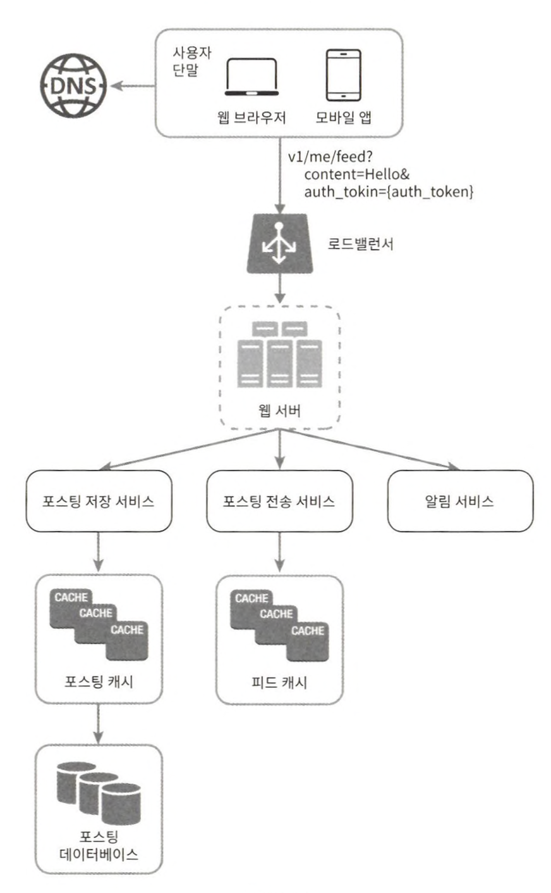
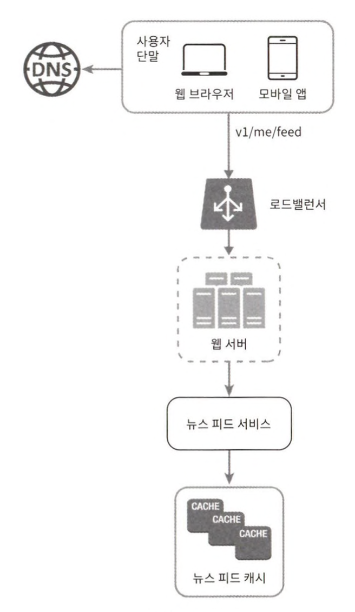
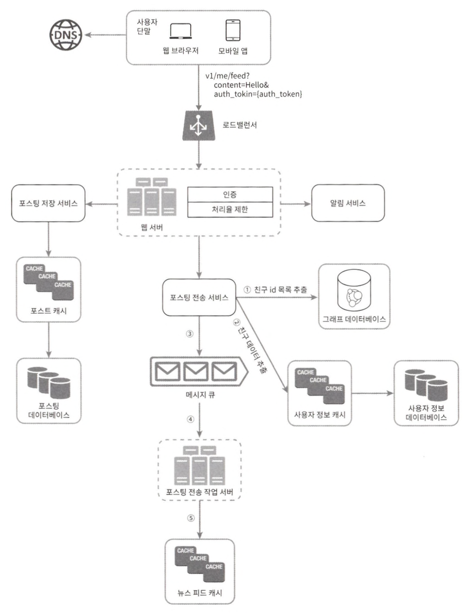
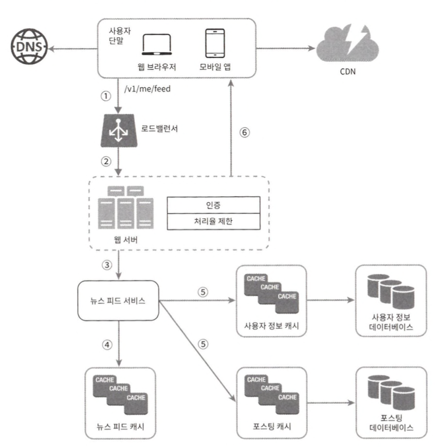

# 11장 뉴스 피드 시스템 설계

뉴스 피드란, 여러분의 홈 페이지 중앙에 지속적으로 업데이트되는 스토리들로 사용자 상태 정보 업데이트, 사진, 비디오, 링크, 앱 활동 등을 포함한다.

## 1단계 문제 이해 및 설계 범위 확정

## 2단계 개략적 설계안 제시 및 동의 구하기

### 피드 발행 설계

### 뉴스피드 설계

## 3단계 상세 설계

### 포스팅 전송(팬아웃) 서비스

포스팅 전송, 즉 팬아웃은 어떤 사용자의 새 포스팅을 그 사용자와 친구 관계에 있는 모든 사용자에게 전달하는 과정이다.

* 쓰기 시점에 팬아웃 하는 모델
  * 새로운 포스팅을 기록하는 시점에 뉴스 피드를 갱신하게 된다.
  * 장점
    * 뉴스 피드가 실시간으로 갱신되며 친구 목록에 있는 사용자에게 즉시 전송된다.
    * 새 포스팅이 기록되는 순간에 뉴스 피드가 이미 갱신되므로(pre-computed) 뉴스 피드를 읽는 데 드는 시간이 짧아진다.
  * 단점
    * 친구가 많은 사용자의 경우 친구목록을 가져오고 그 목록에 있는 사용자 모두의 뉴스 피드를 갱신하는 데 많은 시간이 소요될 수도 있다. 핫키(hotkey)라고 부르는 문제다.
    * 서비스를 자주 이용하지 않는 사용자의 피드까지 갱신해야 하므로 컴퓨팅 자원이 낭비된다.
* 읽기 시점에 팬아웃 하는 모델 (풀모델)
  * 피드를 읽어야 하는 시점에 뉴스 피드를 갱신한다.
  * 장점
    * 비활성화된 사용자, 또는 서비스에 거의 로그인하지 않는 사용자의 경우에는 이 모델이 유리하다. 로그인하기까지는 어떤 컴퓨팅 자원도 소모하지 않아서다.
    * 데이터를 친구 각각에 푸시하는 작업이 필요 없으므로 핫키 문제도 생기지 않는다.
  * 단점
    * 뉴스피드를 읽는데 많은 시간이 소요될 수 있다.

친구나 팔로어가 아주 많은 사용자의 경우에는 팔로어로 하여금 해당 사용자의 포스팅을 필요할 대 가져가도록 하는 풀 모델을 사용하여 시스템 과부하를 방지할 것이다.

### 피드 읽기 흐름 상세 설계

1. 사용자가 뉴스 피드를 읽으려는 요청을 보낸다. 요청은 /v1/me/feed로 전송될 것이다.
2. 로드밸런서가 요청을 웹 서버 가운데 하나로 보낸다.
3. 웹 서버는 피드를 가져오기 위해 뉴스 피드 서비스를 호출한다.
4. 뉴스 피드 서비스는 뉴스 피드 캐시에서 포스팅 ID 목록을 가져온다.
5. 뉴스 피드에 표시할 사용자 이름, 사용자 사진, 포스팅 콘텐츠, 이미지 등을 사용자 캐시와 포스팅 캐시에서 가져와 완전한 뉴스 피드를 만든다.
6. 생성된 뉴스 피드를 JSON 형태로 클라이언트에게 보낸다. 클라이언트는 해당 피드를 렌더 링한다.