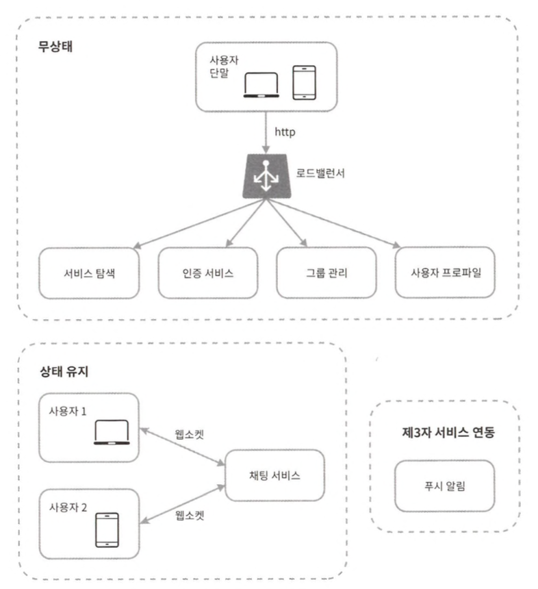

# 12장 채팅 시스템 설계

## 1단계 문제 이해 및 설계 범위 확정

## 2단계 개략적 설계안 제시 및 동의 구하기

채팅 서비스는 아래 기능을 제공해야 한다.
* 클라이언트들로부터 메시지 수신
* 메시지 수신자 결정 및 전달
* 수신자가 접속 상태가 아닌 경우에는 접속할 때까지 해당 메시지 보관

### 폴링

클라이언트가 주기적으로 서버에게 새 메시지가 있느냐고 물어보는 방법이다.  
폴링비용은 폴링을 자주하면 할수록 올라간다.

### 롱 폴링

클라이언트는 새 메시지가 반환되거나 타임아웃 될 때까지 연결을 유지한다.  
클라이언트는 새 메시지를 받으면 기존 연결을 종료하고 서버에 새로운 요청을 보내어 모든 절차를 다시 시작한다.

이 방법은 다음과 같은 약점이 있다.
* 메시지를 보내는 클라이언트와 수신하는 클라이언트가 같은 채팅 서버에 접속하게 되지 않을 수도 있다.
* 서버 입장에서는 클라이언트가 연결을 해제했는지 아닌지 알 좋은 방법이 없다.
* 여전히 비효율적이다.

### 웹 소켓

서버가 클라이언트에게 비동기 메시지를 보낼 때 가장 널리 사용하는 기술이다.

웹소켓은 일반적으로 방화벽이 있는 환경에서도 잘 동작한다.

유의할 것은 웹소켓 연결은 항구적으로 유지되어야 하기 때문에 서버 측에서 연결 관리를 효율적으로 해야 한다는 것이다.

## 개략적 설계안

채팅 시스템은 세 부분으로 나누어 볼 수 있다.  
무상태 서비스, 상태유지 서비스, 3자 서비스 연동의 세 부분으로 나누어 살펴볼 수 있다.

### 무상태 서비스

무상태 서비스는 로그인, 회원가입, 사용자 프로파일 표시 등을 처리하는 전통적인 요청/응답 서비스다.  
무상태 서비스는 로드밸런서 뒤에 위치한다.

### 상태 유지 서비스

각 클라이언트가 채팅 서버와 독립적인 네트워크 연결을 유지해야 하기 때문이다.

### 제3자 서비스 연동

새 메시지를 받았다면 설사 앱이 실행 중이지 않더라도 알림을 받아야 한다.

### 규모 확장성

지금까지 설명한 모든 것을 하나로 묶으면 다음과 같은 개략적 설계안이 만들어진다.

유의할 것은 실시간으로 메시지를 주고받기 위해 클라이언트는 채팅 서버와 웹소켓 연결을 끊지 않고 유지한다는 것이다.

### 저장소

채팅 시스템이 다루는 데이터는 보통 두 가지다.
* 사용자 프로파일, 설정, 친구 목록처럼 일반적인 데이터
  * 안정성을 보장하는 RDB에 보관한다.
* 채팅 시스템에 고유한 데이터로, 채팅 이력 데이터
  * 키-값 저장소를 추천한다.
  * 수평적 규모확장이 쉽고 데이터 접근 지연시간이 낮다.
  * RDB는 데이터 가운데 롱 테일에 해당하는 부분을 잘 처리하지 못하는 경향이 있다. 인덱스가 커지면 데이터에 대한 무작위적 접근을 처리하는 비용이 늘어난다.

## 데이터 모델

### 1:1 채팅을 위한 메시지 테이블

created_at을 사용하여 메시지 순서를 정할 수는 없는데, 서로 다른 두 메시지가 동시에 만들어질 수도 있기 때문이다.

### 그룹 채팅을 위한 메시지 테이블

### 메시지 ID

메시지 ID의 값은 고유해야 한다.  
ID 값은 정렬 가능해야 하며 시간 순서와 일치해야 한다. 즉, 새로운 ID는 이전 ID보다 큰 값이어야 한다.

위 조건을 만족시키려면 스노플레이크 같은 전역적 64-bit 순서 번호 생성기를 이용한다.  
혹은 지역적 순서 번호 생성기를 이용한다.

## 3단계 상세 설계