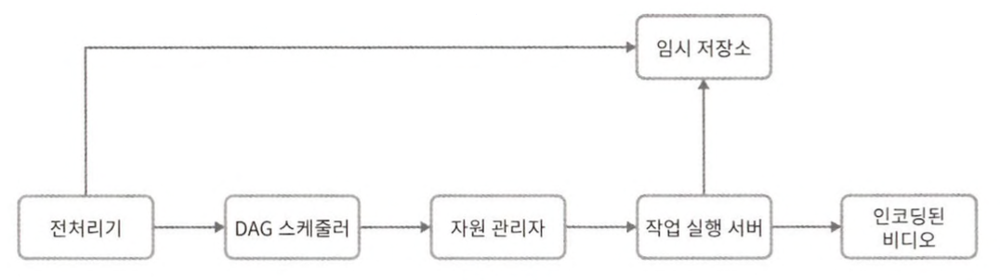

# 14장 유튜브 설계

## 1단계 문제 이해 및 설계 범위 확정

## 2단계 개략적 설계안 제시 및 동의 구하기

BLOB(Binary Large Object Storage), 이진 데이터를 하나의 개체로 보관하는 데이터베이스 관리 시스템

## 3단계 상세 설계

### 비디오 트랜스코딩

비디오를 녹화하면 단말은 해당 비디오를 특정 포맷으로 저장한다. 이 비디오가 다른 단말에서도 순조롭게 재생되려면 다른 단말과 호환되는 비트레이트와 포맷으로 저장되어야 한다.

### 유향 비순환 그래프 모델

비디오를 트랜스코딩하는 것은 컴퓨팅 자원을 많이 소모할 뿐 아니라 시간도 많이 드는 작업이다.

다른 유형의 비디오 프로세싱 파이프라인을 지원하는 한편 처리 과정의 병렬성을 높이기 위해서는 적절한 수준의 추상화를 도입하여 클라이언트 프로그램로 하여금 실행할 작업을 손수 정의할 수 있도록 해야 한다.

### 비디오 트랜스코딩 아키텍처

### 시스템 최적화

속도 최적화
* 비디오 병렬 업로드
* 업로드 센터를 사용자 근거리에 지정
* 모든 절차를 병렬화

안정성 최적화
* 미리 사인된 업로드 URL
* 비디오 보호

비용 최적화
* 인기 비디오만 CDN 통해 재생
* 인기가 별로 없는 비디오는 필요할 때 인코딩하여 재생
* 특정 지역에서만 인기가 높은 비디오는 다른 지역으로 이동 X
* CDN을 직접 구축하고 인터넷 서비스 제공자와 제휴
  
### 오류 처리

회복 가능 오류  
일반적으로 몇 번 재시도하면 해결된다. 계속해서 실패하고 복구가 어렵다 판단되면 클라이언트에게 적절한 오류 코드를 반환한다.

회복 불가능 오류  
클라이언트에게 적절한 오류 코드를 반환한다.