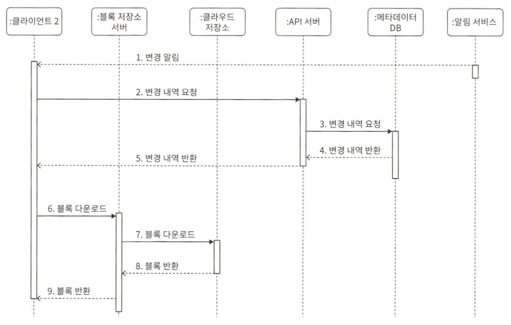

# 15장 구글 드라이브 설계

## 1단계 문제 이해 및 설계 범위 확정

## 2단계 개략적 설계안 제시 및 동의 구하기

* 블록 저장소 서버
  * 파일 블록을 클라우드 저장소에 업로드하는 서버
* 클라우드 저장소
  * 파일은 블록 단위로 나눠져 클라우드 저장소에 보관된다.
* 아카이빙 저장소
  * 오랫동안 사용되지 않은 비활성 데이터를 저장하기 위한 컴퓨터 시스템
* 로드밸런서
  * 요청을 모든 API 서버에 고르게 분산하는 구실
* API 서버
  * 파일 업로드 외에 거의 모든 것을 담당하는 서버
* 메타데이터 데이터베이스
  * 메타데이터 정보를 관리
* 메타데이터 캐시
  * 성능을 높이기 위해 자주 쓰이는 메타데이터는 캐시
* 알림 서비스
  * 특정 이벤트가 발생했음을 클라이언트에게 알리는데 쓰이는 발생/구독 프로토콜 기반 시스템
* 오프라인 사용자 백업 큐
  * 클라이언트가 접속 중이 아니라서 파일의 최신 상태를 확인할 수 없을 때는 해당 정보를 큐에 두어 나중에 클라이언트가 접속했을 때 동기화될 수 있음

## 3단계 상세 설계

### 블록 저장소 서버

정기적으로 갱신되는 큰 파일들은 업데이트가 일어날 때마다 전체 파일을 서버로 보내면 네트워크 대역폭을 많이 잡아먹는다.

최적화하는 방법
* 델타 동기화
  * 파일이 수정되면 전체 파일 대신 수정이 일어난 블록만 동기화하는 것
* 압축
  * 블록 단위로 압축해 두면 데이터 크기를 많이 줄일 수 있다.

### 높은 일관성 요구사항

같은 파일이 단말이나 사용자에 따라 다르게 보이는 것은 허용할 수 없다.

메모리 캐시는 보통 최종 일관성 모델을 지원한다.

강한 일관성을 달성하려면 다음 사항을 보장해야 한다.
* 캐시에 보관된 사본과 데이터베이스에 있는 원본이 일치한다.
* 데이터베이스에 보관된 원본에 변경이 발생하면 캐시에 있는 사본을 무효화한다.

### 업로드 절차

* 파일 메타데이터 추가
* 파일을 클라우드 저장소로 업로드하기 위한 것

### 다운로드 절차

파일 다운로드는 파일이 새로 추가되거나 편집되면 자동으로 시작된다.

클라이언트는 다른 클라이언트가 파일을 편집하거나 추가했다는 사실을 어떻게 감지하나?  
* 클라이언트 A가 접속중이고 다른 클라이언트가 파일을 변경하면 알림 서비스가 클라이언트 A에게 변겨잉 발생했으니 새 버전을 끌어가야 한다고 알린다.
* 클라이언트 A가 네트워크에 연결된 상태가 아닐 경우에는 데이터는 캐시에 보관될 것이다. 해당 클라이언트의 상태가 접속 중으로 바뀌면 그때 해당 클라이언트는 새 버전을 가져갈 것이다.

### 알림 서비스

파일의 일관성을 유지하기 위해, 클라이언트는 로컬에서 파일이 수정되었음을 감지하는 순간 다른 클라이언트에 그 사실을 알려서 충돌 가능성을 줄여야 한다.

알림 서비스는 이벤트 데이터를 클라이언트로 보내는 서비스다.
* 롱 폴링
  * 드롭박스가 이 방식을 채택하고 있다.
* 웹소켓
  * 클라이언트와 서버 사이에 지속적인 통신 채널을 제공한다. 양방향 통신이 가능하다.

채팅 서비스와는 달리, 본 시스템의 경우에는 알림 서비스와 양방향 통신이 필요하지 않다.

### 저장소 공간 절약

모든 버전을 자주 백업하게 되면 저장용량이 너무 빨리 소진될 가능성이 있다.  
이런 문제를 피하고 비용을 절감하기 위해 아래 세 가지 방법을 사용한다.  
* 중복 제거
* 지능적 백업 전략
  * 한도 설정
  * 중요한 버전만 보관
* 자주 쓰이지 않는 데이터는 아카이빙 저장소로 옮긴다.