# 1장 사용자 수에 따른 규모 확장성

## 단일서버

웹 앱, 데이터베이스 캐시 등이 전부 서버 한 대에서 실행된다.

시스템 구성을 이해하기 위해서는 사용자의 요청이 처리되는 과정과 요청을 만드는 단말에 대해서 이해할 필요가 있다.

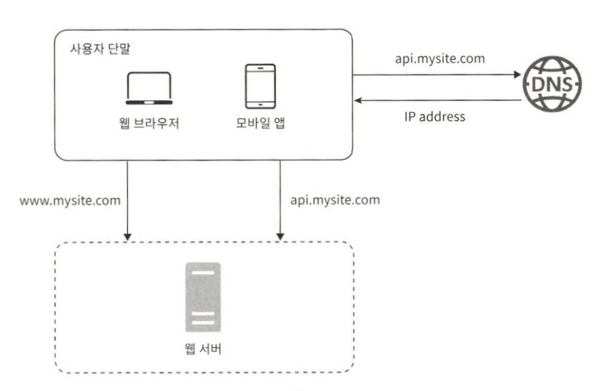

1. 사용자는 도메인 이름(api.mysite.com)을 이용하여 웹사이트에 접속한다.  
    도메인 이름을 도메인 이름 서비스(DNS)에 질의하여 IP 주소로 변환하는 과정이 필요하다.
2. DNS 조회 결과로 IP 주소가 반환된다.
3. 해당 IP 주소로 HTTP 요청이 전달된다.
4. 요청을 받은 웹 서버는 HTML 페이지나 JSON 형태의 응답은 반환한다.

## 데이터베이스

사용자가 늘면 서버 하나로는 충분하지 않아서 여러 서버를 두어야 한다.

웹/모바일 트래픽 처리 서버(웹 계층)와 데이터베이스 서버(데이터 계층)를 분리하면 그 각각을 독립적으로 확장해 나갈 수 있게 된다.

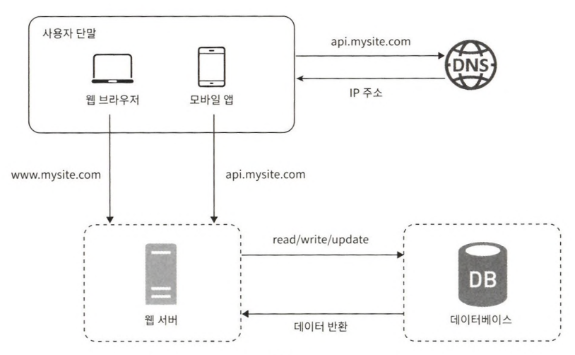

### 어떤 데이터베이스를 사용할 것인가?

관계형 데이터베이스와 비관계형 데이터베이스 사이에서 선택한다.

* 관계형 데이터베이스
  * 관계형 데이터베이스 관리 시스템(RDBMS)
  * MySQL, 오라클 데이터베이스, PostgreSQL
  * 자료를 테이블과 열, 칼럼으로 표현
  * 관계에 따라 조인하여 합칠 수 있음
* 비 관계형 데이터베이스
  * NoSQL이라고 부름
  * CouchDB, Neo4j, Cassandra, HBase, Amazon DynamoDB, Mongo DB
  * 다시 네 부류로 나눌 수 있음
    * 키-값 저장소 (Key-value store)
    * 그래프 저장소 (Graph store)
    * 칼럼 저장소 (Column store)
    * 문서 저장소 (Document store)
  * 조인 연산은 지원하지 않음

비 관계형 데이터베이스가 바람직한 선택인 경우
* 아주 낮은 응답 지연시간(latency)이 요구됨
* 다루는 데이터가 비정형(unstructured)이라 관계형 데이터가 아님
* 데이터(JSON, YAML, XML 등)를 직렬화하거나(serialize) 역직렬화(deserialize) 할 수 있기만 하면 됨
* 아주 많은 양의 데이터를 저장할 필요가 있음

## 수직적 규모 확장 vs 수평적 규모 확장

**스케일 업 (scale up)**  
수직적 규모 확장 프로세스는 서버에 고사양 지원(더 좋은 CPU, RAM 등)을 추가하는 행위

**스케일 아웃 (scale out)**  
수평적 규모 확장 프로세스는 더 많은 서버를 추가하여 성능을 개선하는 행위

서버로 유입되는 트래픽의 양이 적을 때는 수직적 확장이 좋은 선택이며, 이 방법의 가장 큰 장점은 단순함이다. 그러나 심각한 단점이 있다.
* 수직적 규모 확장에는 한계가 있다. 한 대의 서버에 CPU나 메모리를 무한대로 증설할 방법은 없다.
* 수직적 규모 확장법은 장애에 대한 자동복구(failover) 방안이나 다중화(redundancy) 방안을 제시하지 않는다. 서버에 장애가 발생하면 웹 사이트/앱은 완전히 중단된다.

이런 단점때문에 대규모 애플리케이션을 지원하는 데는 수평적 규모 확장법이 보다 적절하다.  
이런 문제를 해결하는 데는 부하 분산기 또는 로드밸런서를 도입하는 것이 최선이다.

### 로드 밸런서

로드 밸런서는 부하 분산 집합에 속한 웹 서버들에게 트래픽 부하를 고르게 분산하는 역할을 한다.

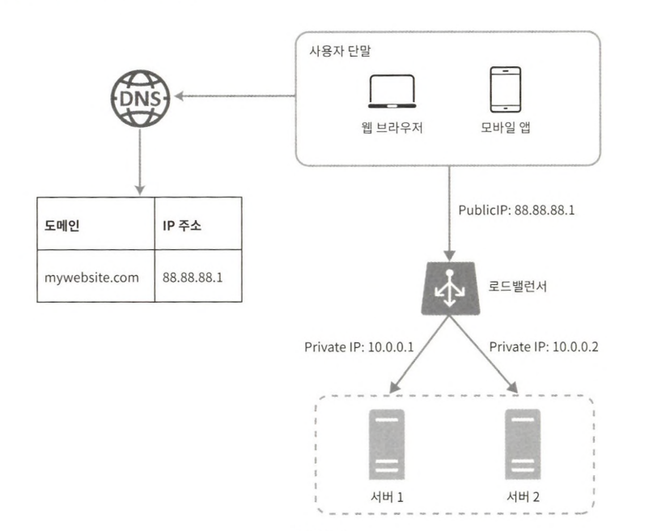

사용자는 로드밸런스의 공개 IP주소로 접속한다. 따라서 웹 서버는 클라이언트의 접속을 직접 처리하지 않는다.  
더 나은 보안을 위해 서버간 통신에는 사설 IP 주소가 이용된다. 사설 IP 주소는 같은 네트워크에 속한 서버 사이의 통신에만 쓰일 수 있는 IP 주소로 인터넷을 통해서는 접속할 수 없다.

### 데이터베이스 다중화

보통은 서버 사이에 주(master)-부(slave) 관계를 설정하고 데이터 원본은 주 서버에, 사본은 부 서버에 저장하는 방식이다.  
쓰기 연산은 마스터에서만 지원한다. 부 데이터베이스는 주 데이터베이스로부터 그 사본을 전달받으며, 읽기연산만을 지원한다.

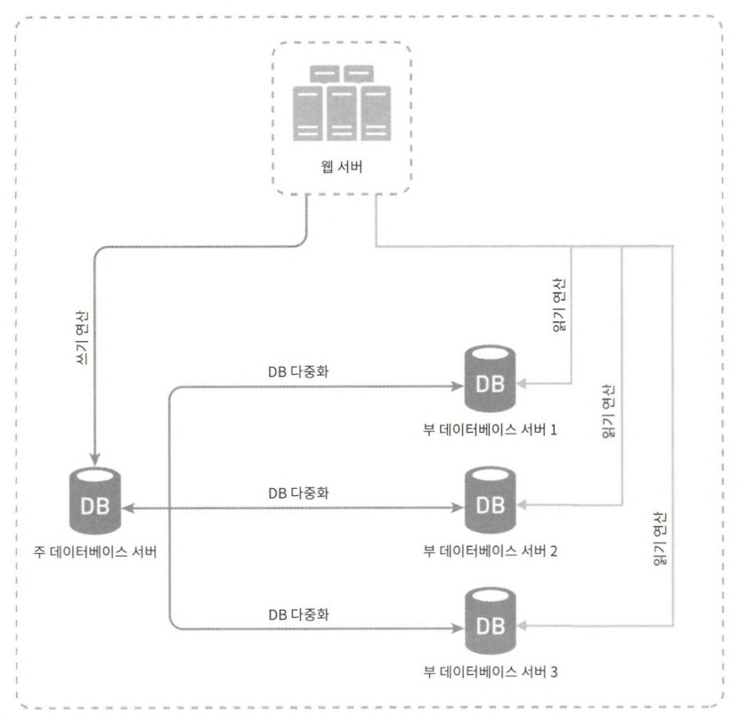

데이터베이스를 다중화하면 다음과 같은 이득이 있다.
* 더 나은 성능
* 안정성
* 가용성

주 데이터베이스 서버가 다운되면, 부 서버에 보관된 데이터가 최신 상태가 아닐 수 있다. 없는 데이터는 복구 스크립트를 돌려서 추가해야 한다.  
다중 마스터나 원형 다중화 방식을 도입하면 도움이 될 수 있지만 구성이 훨씬 복잡하다.

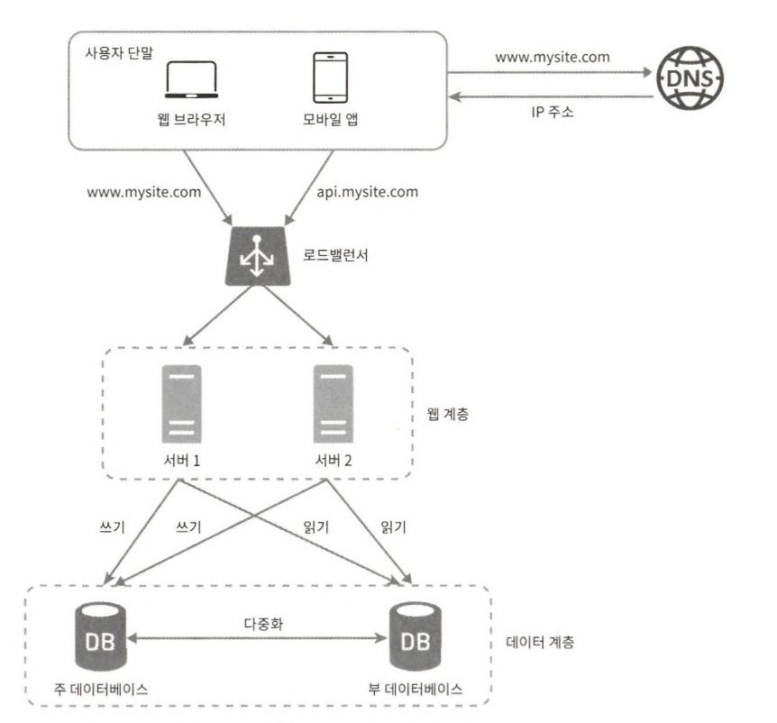

웹 계층과 데이터 계층에 대해 충분히 이해하게 되었으니, 응답시간을 개선해 볼 순서다.  
응답 시간은 캐시를 붙이고 정적 컨텐츠를 컨텐츠 전송 네트워크(CDN)로 옮기면 개선할 수 있다.

## 캐시

캐시는 값비싼 연산 결과 또는 자주 참조되는 데이터를 메모리 안에 두고, 뒤이은 요청이 보다 빨리 처리될 수 있도록 하는 저장소다.

### 캐시 계층

캐시 계층은 데이터가 잠시 보관되는 곳으로 데이터베이스보다 훨씬 빠르다.

다양한 캐시 전략이 있는데, 캐시할 데이터 종류, 크기, 액세스 패턴에 맞는 캐시 전략을 선택하면 된다.

캐시 서버를 이용하는 방법은 간단한데 대부분의 캐시 서버들이 일반적으로 널리 쓰이는 프로그래밍 언어로 API를 제공하기 때문이다.

### 캐시 사용 시 유의할 점

캐시를 사용할 때는 아래 사항들을 고려해야 한다.
* 어떤 상황에서 사용하는 것이 바람직한가?  
    데이터 갱신은 자주 일어나지 않지만 참조는 빈번하게 일어난다면 고려해본다.
* 어떤 데이터를 캐시해야 하는가?  
    영속적으로 보관할 데이터를 캐시에 두는 것은 바람직하지 않다.
* 캐시에 보관된 데이터는 어떻게 만료되는가?  
    이에 대한 정책을 마련해 두는 것은 좋은 습관이다. 만료된 데이터는 캐시에서 삭제되어야 한다.
* 일관성은 어떻게 유지되는가?
* 장애에는 어떻게 대처할 것인가?  
    캐시 서버를 한 대만 두는 경우 해당 서버는 단일 장애 지점(SPOF)이 되어버릴 가능성이 있다.
* 캐시 메모리는 얼마나 크게 잡을 것인가?
* 데이터 방출 정책은 무엇인가?  
    캐시가 꽉 차버리면 추가로 캐시에 데이터를 넣어야 할 경우 기존 데이터를 내보내야 한다.

## 컨텐츠 전송 네트워크 (CDN)

CDN은 정적 컨텐츠를 전송하는 데 쓰이는, 지리적으로 분산된 서버의 네트워크다

### CDN 사용 시 고려해야 할 사항

* 비용
* 적절한 만료 시한 설정
* CDN 장애에 대한 대처 방안
* 컨텐츠 무효화 방법

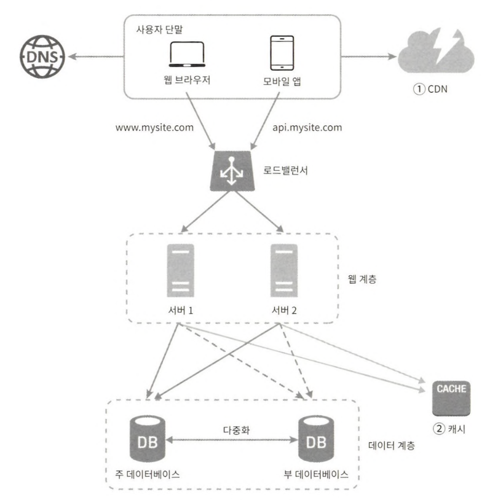

## 무상태 웹 계층

웹 계층을 수평적으로 확장하는 방법을 고민해본다.  
이를 위해서는 상태 정보(사용자 세션 데이터와 같은)를 웹 계층에서 제거하여야 한다.

### 상태 정보 의존적인 아키텍처

상태 정보를 보관하는 서버는 클라이언트 정보, 즉 상태를 유지하여 요청들 사이에 공유되도록 한다.

문제는 같은 클라이언트로부터의 요청은 항상 같은 서버로 전송되어야 한다는 것이다.  
대부분의 로드밸런서가 이를 지원하기 위해 고정 세션이라는 기능을 제공하는데 이는 로드밸런서에 부담을 준다.  
게다가 로드밸런서 뒷단에 서버를 추가하거나 제거하기도 까다로워진다. 이들 서버의 장애를 처리하기도 복잡해진다.

### 무상태 아키텍처

웹 서버는 상태 정보가 필요할 경우 공유 저장소로부터 데이터를 가져온다.  
상태 정보는 웹 서버로부터 물리적으로 분리되어 있다. 이런 구조는 단순하고 안정적이며 규모 확장이 쉽다.

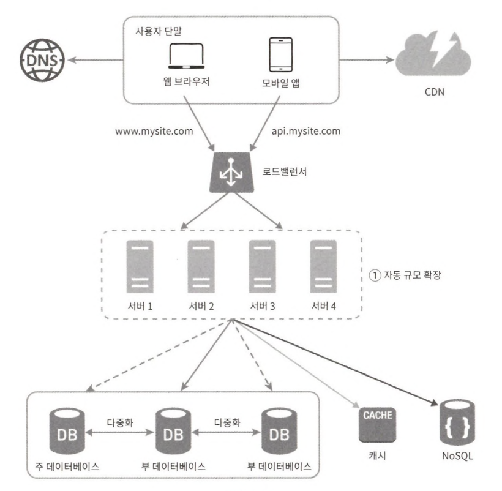

세션 데이터를 웹 계층에서 분리하고 지속성 데이터 보관소에 저장하도록 만들었다.

가용성을 높이고 전 세계 어디서도 쾌적하게 사용할 수 있도록 하기 위해서는 여러 데이터 센터를 지원하는 것이 필수다.

## 데이터 센터

장애가 없는 상황에서 사용자는 가장 가까운 데이터 센터로 안내된다.  
이 절차를 지리적 라우팅(geoDNS-routing, geo-routing)이라고 부른다.  
*참고: GSLB - Global Server Load Balancing*

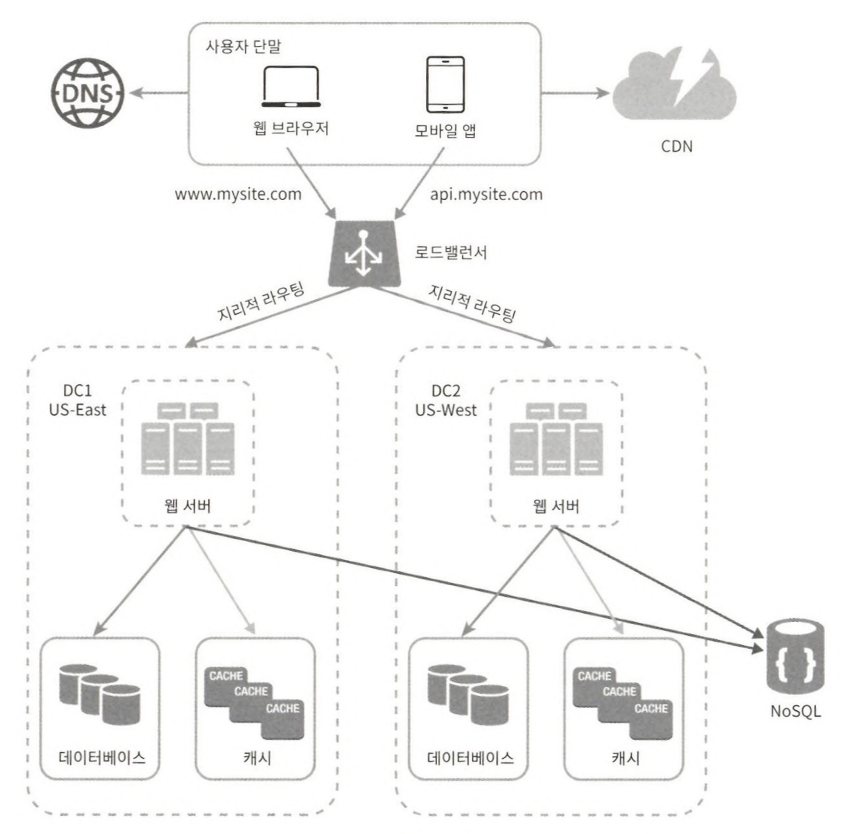

데이터 센터 중 하나에 심각한 장애가 발생하면 모든 트래픽은 장애가 없는 데이터 센터로 전송된다.

다중 데이터 센터 아키텍처를 만들려면 몇 가지 기술적 난제를 해결해야 한다.
* 트래픽 우회
* 데이터 동기화
* 테스트와 배포

시스템을 더 큰 규모로 확장하기 위해서는 시스템의 컴포넌트를 분리하여 각기 독립적으로 확장될 수 있도록 하여야 한다.  
메시지 큐는 많은 실제 분산 시스템이 이 문제를 풀기 위해 채용하고 있는 핵심적 전략 가운데 하나다.

## 메시지 큐 

메시지 큐는 메시지의 무손실을 보장하는 비동기 통신을 지원하는 컴포넌트다. (무손실: durability, 메시지 큐에 일단 보관된 메시지는 소비자가 꺼낼 때까지 안전히 보관된다는 특성)  
메시지의 버퍼 역할을 하며, 비동기적으로 전송된다.

메시지 큐를 이용하면 서비스 또는 서버 간 결합이 느슨해져서, 규모 확장성이 보장되어야 하는 안정적 애플리케이션을 구성하기 좋다.

## 로그, 메트릭 그리고 자동화

* 로그
  * 에러 로그를 모니터링하는 것은 중요하다.
* 메트릭
  * 메트릭을 잘 수집하면 사업 현황에 관한 유용한 정보를 얻을 수도 있고, 시스템의 현재 상태를 손쉽게 파악할 수도 있다.
* 자동화
  * 시스템이 크고 복잡해지면 생산성을 높이기 위해 자동화 도구를 활용해야 한다.

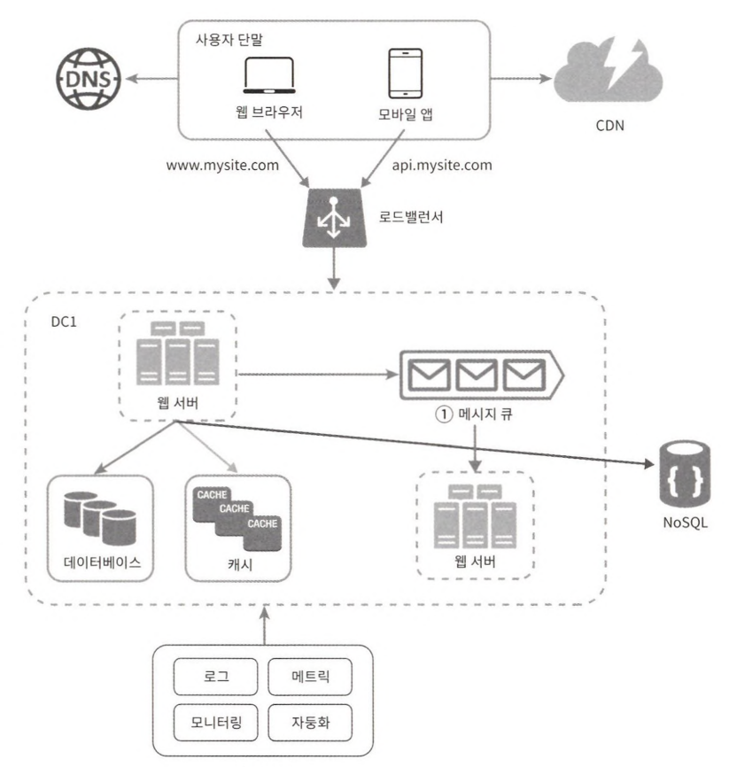

## 데이터베이스의 규모 확장

### 수직적 확장

기존 서버에 더 많은, 또는 고성능의 자원(CPU, RAM, DISK)을 증설하는 방법이다.

수직적 접근법에는 몇 가지 심각한 약점이 있다.  
* 데이터베이스 서버 하드웨어에는 한계가 있으므로 CPU, RAM 등을 무한 증설할 수 없다.
* 단일 장애 지점(SPOF)로 인한 위험성이 크다.
* 비용이 많이 든다. 고성능의 서버로 갈수록 가격이 올라가기 마련이다.

### 수평적 확장

데이터베이스의 수평적 확장은 샤딩이라고도 부르는데, 더 많은 서버를 추가함으로써 성능을 향상시킨다.

모든 샤드는 같은 스키마를 쓰지만 샤드에 보관되는 데이터 사이에는 중복이 없다.

샤딩 전략을 구현할 때 고려해야 할 가장 중요한 것은 샤딩 키를 어떻게 정하느냐 하는 것이다. 샤딩 키는 파티션 키라고도 부르는데, 데이터가 어떻게 분산될지 정하는 하나 이상의 칼럼으로 구성된다. 

샤딩을 도입하면 시스템이 복잡해지고 풀어야 할 새로운 문제도 생긴다.  
* 데이터의 재 샤딩
* 유명인사 문제
  * 유명인사 각각에 샤드 하나씩을 할당해야 할 수도 있고, 심지어는 더 잘게 쪼개야 할 수도 있다.
* 조인과 비정규화

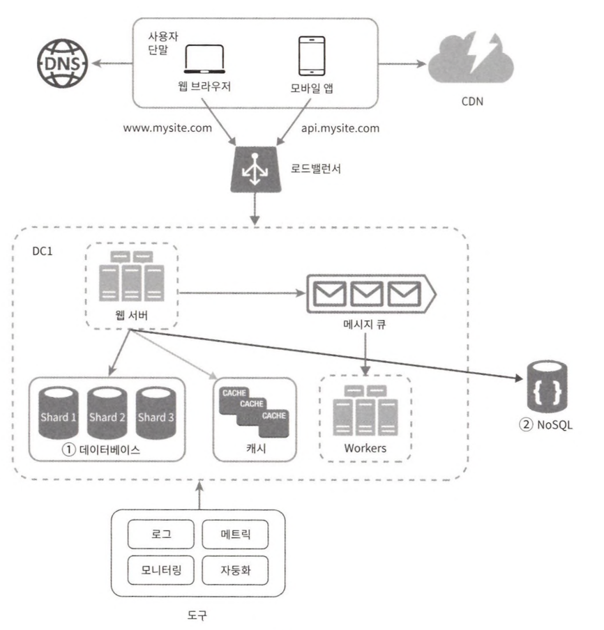

## 백만 사용자, 그리고 그 이상

시스템의 규모를 확장하는 것은 지속적이고 반복적인 과정이다.

시스템 규모 확장을 위해 살펴본 기법들을 다시 한번 정리해 보면 다음과 같다.  
* 웹 계층은 무상태 계층으로
* 모든 계층에 다중화 도입
* 가능한 한 많은 데이터를 캐시할 것
* 여러 데이터 센터를 지원할 것
* 정적 컨텐츠는 CDN을 통해 서비스할 것
* 데이터 계층은 샤딩을 통해 그 규모를 확장할 것
* 각 계층은 독립적 서비스로 분할할 것
* 시스템을 지속적으로 모니터링하고, 자동화 도구들을 활용할 것

# 2장 개략적인 규모 추정

시스템 용량이나 성능 요구사항을 개략적으로 추정해 보라는 요구를 받을 수 있다.  
개략적인 규모추정(back-of-the-envelope esti-mation)은 보편적으로 통용되는 성능 수치상에서 사고 실험을 행하여 추정치를 계산하는 행위로서, 어떤 설계가 요구사항에 부합할 것인지 보기 위한 것이다.  
개략적인 규모 추정을 효과적으로 해 내려면 규모 확장성을 표현하는 데 필요한 기본기에 능숙해야 한다.

## 2의 제곱수

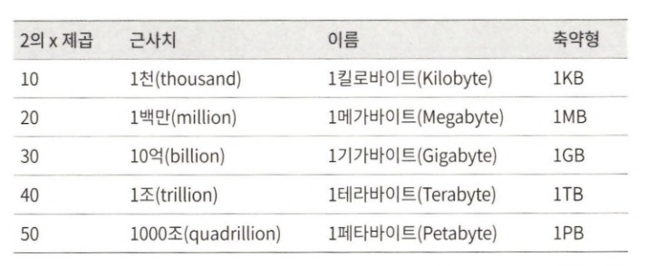

## 응답지연 값

구글의 제프 딘은 2010년에 통상적인 컴퓨터에서 구현된 연산들의 응답지연 값을 공개한 바 있다. 몇몇은 더 빠른 컴퓨터가 등장하면서 더 이상 유효하지 않게 되었지만, 아직도 이 수치들은 컴퓨터 연산들의 처리 속도가 어느 정도인지 짐작할 수 있게 해준다.

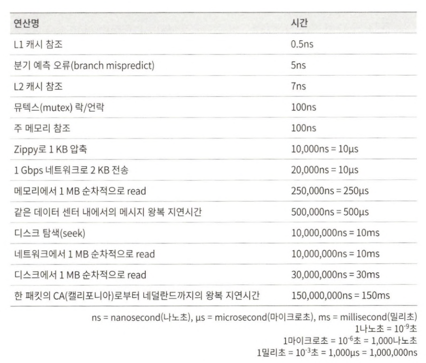

제시된 수치들을 분석하면 다음과 같은 결론이 나온다.  
* 메모리는 빠르지만 디스크는 아직도 느리다
* 디스크 탐색은 가능한 한 피하라
* 단순한 압축 알고리즘은 빠르다
* 데이터를 인터넷으로 전송하기 전에 가능하면 압축하라
* 데이터 센터는 보통 여러 지역에 분산되어 있고, 센터들 간에 데이터를 주고받는 데는 시간이 걸린다.

## 가용성에 관계된 수치들

고가용성은 시스템이 오랜 시간 동안 지속적으로 중단 없이 운영될 수 있는 능력을 지칭하는 용어다. 고가용성을 표현하는 값은 퍼센트로 표현한다.

## 팁

개략적인 규모 추정과 관계된 면접에서 가장 중요한 것은 문제를 풀어 나가는 절차다.

* 근사치를 활용한 계산
* 가정들은 적어두라
* 단위를 붙이라
* 많이 출제되는 개략적 규모 추정 문제는 QPS, 최대 QPS, 저장소 요구량, 캐시 요구량, 서버 수 등을 추정하는 것이다.

# 3장 시스템 설계 면접 공략법

대규모 시스템을 AWS안쓰고 직접 설계하는 직군으로 가고싶으신분? 은 읽어보는 것을 추천한다.

시스템 설계 면접에 대한 조언이기 때문에 그 외의 직군은 필요없다.