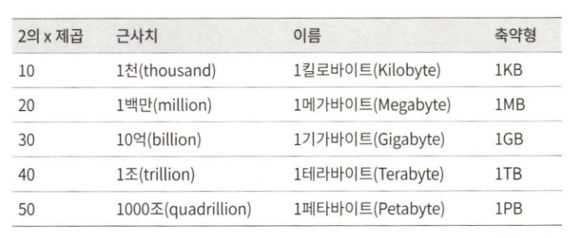
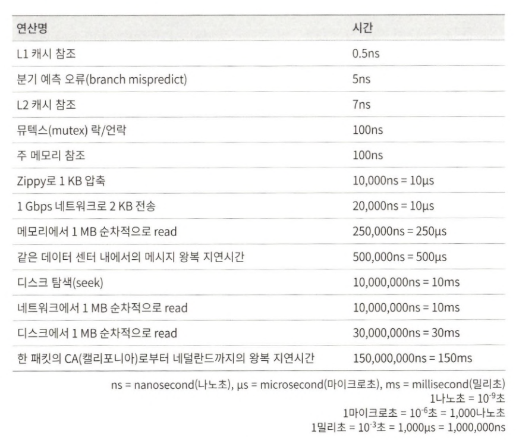

# 2장 개략적인 규모 추정

시스템 용량이나 성능 요구사항을 개략적으로 추정해 보라는 요구를 받을 수 있다.  
개략적인 규모추정(back-of-the-envelope esti-mation)은 보편적으로 통용되는 성능 수치상에서 사고 실험을 행하여 추정치를 계산하는 행위로서, 어떤 설계가 요구사항에 부합할 것인지 보기 위한 것이다.  
개략적인 규모 추정을 효과적으로 해 내려면 규모 확장성을 표현하는 데 필요한 기본기에 능숙해야 한다.

## 2의 제곱수

## 응답지연 값

구글의 제프 딘은 2010년에 통상적인 컴퓨터에서 구현된 연산들의 응답지연 값을 공개한 바 있다. 몇몇은 더 빠른 컴퓨터가 등장하면서 더 이상 유효하지 않게 되었지만, 아직도 이 수치들은 컴퓨터 연산들의 처리 속도가 어느 정도인지 짐작할 수 있게 해준다.

제시된 수치들을 분석하면 다음과 같은 결론이 나온다.  
* 메모리는 빠르지만 디스크는 아직도 느리다
* 디스크 탐색은 가능한 한 피하라
* 단순한 압축 알고리즘은 빠르다
* 데이터를 인터넷으로 전송하기 전에 가능하면 압축하라
* 데이터 센터는 보통 여러 지역에 분산되어 있고, 센터들 간에 데이터를 주고받는 데는 시간이 걸린다.

## 가용성에 관계된 수치들

고가용성은 시스템이 오랜 시간 동안 지속적으로 중단 없이 운영될 수 있는 능력을 지칭하는 용어다. 고가용성을 표현하는 값은 퍼센트로 표현한다.

## 팁

개략적인 규모 추정과 관계된 면접에서 가장 중요한 것은 문제를 풀어 나가는 절차다.

* 근사치를 활용한 계산
* 가정들은 적어두라
* 단위를 붙이라
* 많이 출제되는 개략적 규모 추정 문제는 QPS, 최대 QPS, 저장소 요구량, 캐시 요구량, 서버 수 등을 추정하는 것이다.