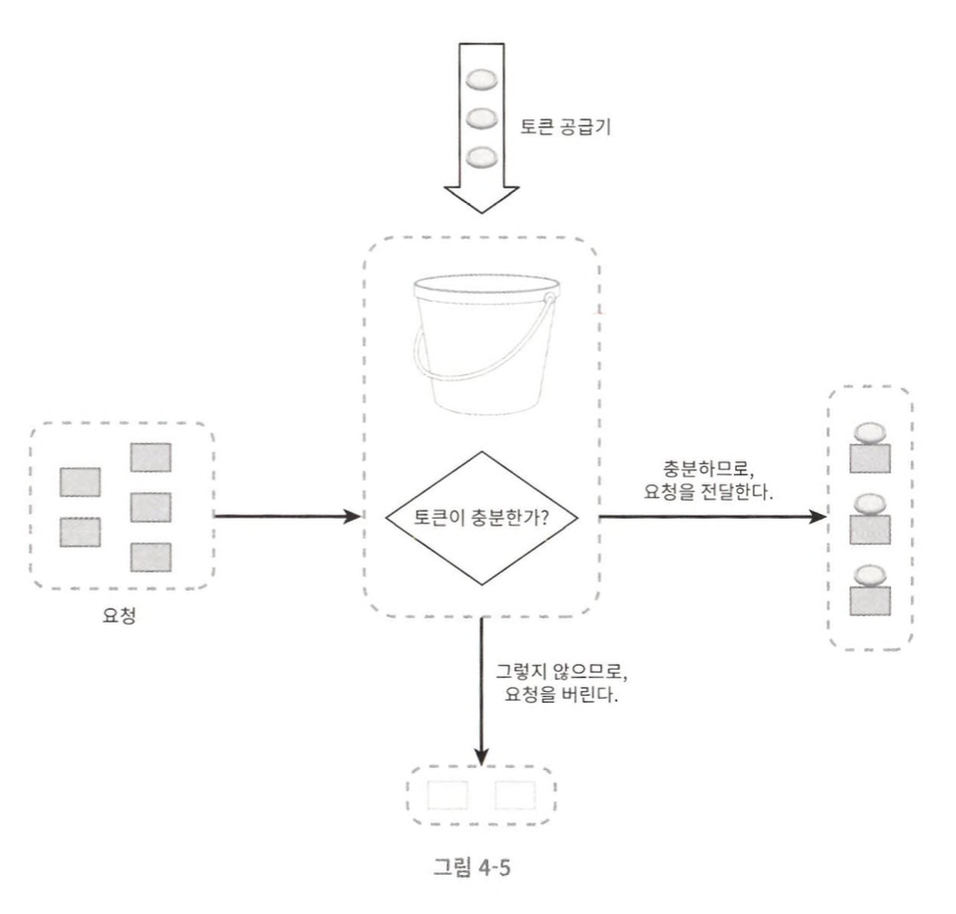
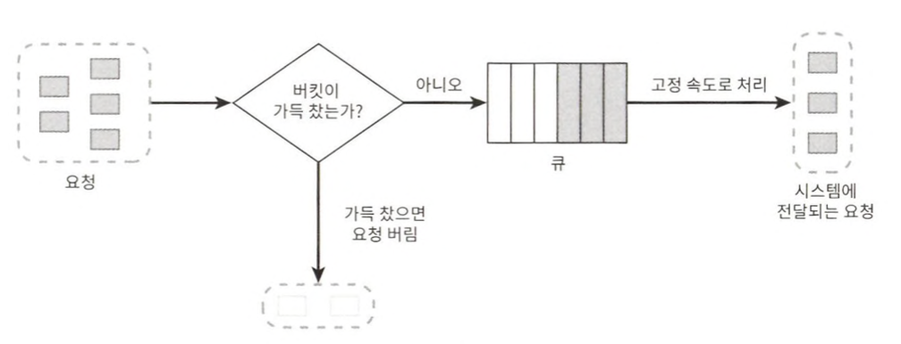
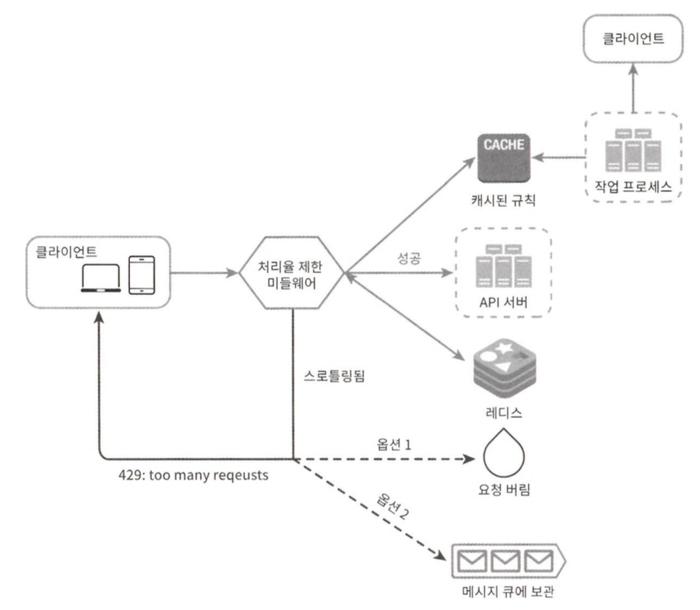

# 4장 처리율 제한 장치의 설계

API에 처리율 제한 장치를 두면 좋은 점 
* DoS 공격에 의한 자원고갈을 방지
* 비용 절감
* 서버 과부하를 방지

## 1단계 문제 이해 및 설계 범위 확정

요구사항 요약

## 2단계 개략적 설계안 제시 및 동의 구하기

### 처리율 제한 장치는 어디에 둘 것인가?

클라이언트 측에 둔다면,  
클라이언트는 처리율 제한을 안정적으로 걸 수 있는 장소가 못 된다.

서버 측에 둔다면,  
처리율 제한 장치를 API 서버에 두거나, 미들웨어를 만들어 API 서버로 가는 요청을 통제하도록 할 수 있다.

마이크로서비스의 경우, 처리율 제한 장치는 보통 API 게이트웨이라 불리는 컴포넌트에 구현된다.

**처리율 제한 기능을 설계할 때 일반적으로 적용될 수 있는 지침**  
* 기술 스택을 점검하라
* 처리율 제한 알고리즘을 찾아라
* API 게이트웨이를 이미 설계에 포함시켰다면 처리율 제한 기능 또한 게이트웨이에 포함시켜야 할 수도 있다.
* 처리율 제한 서비스를 직접 만드는 데는 시간이 든다. 구현하기에 충분한 인력이 없다면 상용 API 게이트웨이를 쓰는 것이 바람직한 방법일 것이다.

### 처리율 제한 알고리즘

* 토큰 버킷  
  
  * 버킷에는 사전 설정된 양의 토큰이 주기적으로 채워진다.
  * 각 요청은 처리될 때마다 하나의 토큰을 사용한다.
  * 버킷에 토큰이 존재하는 경우에만 요청을 처리한다.
  * 장점
    * 구현이 쉽다.
    * 메모리 사용 측면에서도 효율적이다.
    * 짧은 시간에 집중되는 트래픽도 처리가능하다.
  * 단점
    * 버킷 크기가 토큰 공급률이라는 두 인자를 적절하게 튜닝하는 것은 까다로운 일이다.
* 누출 버킷  
  
  * 토큰 버킷 알고리즘과 비슷하지만 요청 처리율이 고정되어 있다는 점이 다르다.
  * 장점
    * 큐의 크기가 제한되어 있어 메모리 사용량 측면에서 효율적이다.
    * 고정된 처리율을 갖고 있기 때문에 안정적 출력이 필요한 경우에 적합하다.
  * 단점
    * 단시간에 많은 트래픽이 몰리는 경우 큐에는 오래된 요청들이 쌓이게 되고, 그 요청들을 제때 처리 못하면 최신 요청들은 버려지게 된다.
    * 두 개 인자를 갖고 있는데, 이들을 올바르게 튜닝하기가 까다로울 수 있다.
* 고정 윈도 카운터
  * 동작 방식
    * 타임라인을 고정된 간격의 윈도로 나누고, 각 윈도마다 카운터를 붙인다.
    * 요청이 접수될 때마다 이 카운터의 값은 1씩 증가한다.
    * 이 카운터의 값이 사전에 설정된 임계치에 도달하면 새로운 요청은 새 윈도가 열릴 때까지 버려진다.
  * 이 알고리즘의 가장 큰 문제는 윈도의 경계 부근에 순간적으로 많은 트래픽이 집중될 경우 윈도에 할당된 양보다 더 많은 요청이 처리될 수 있다는 것이다.
  * 장점
    * 메모리 효율이 좋다.
    * 이해하기 쉽다.
    * 윈도가 닫히는 시점에 카운터를 초기화하는 방식은 특정한 트래픽 패턴을 처리하기에 적합하다.
  * 단점
    * 윈도 경계 부근에서 일시적으로 많은 트래픽이 몰려드는 경우, 기대했던 시스템의 처리 한도보다 많은 양의 요청을 처리하게 된다.
* 이동 윈도 로그
  * 동작 원리
    * 요청의 타임스탬프를 추적한다.
    * 새 요청이 오면 만료된 타임스탬프는 제거한다.
    * 새 요청의 타임스탬프를 로그에 추가한다.
    * 로그의 크기가 허용치보다 같거나 작으면 요청을 시스템에 전달하고, 그렇지 않으면 처리를 거부한다.
  * 장점
    * 이 알고리즘이 구현하는 처리율 제한 메커니즘은 아주 정교하다. 어느 순간의 윈도를 보더라도 허용되는 요청의 개수는 시스템의 처리율 한도를 넘지 않는다.
  * 단점
    * 다량의 메모리를 사용하는데, 거부된 요청의 타임스탬프도 보관한다.
* 이동 윈도 카운터
  * 고정 윈도 카운터 알고리즘과 이동 윈도 로깅 알고리즘을 결합한 것이다.
  * 장점
    * 이전 시간대의 평균 처리율에 따라 현재 윈도의 상태를 계산하므로 짧은 시간에 몰리는 트래픽에도 잘 대응한다.
  * 단점
    * 직전 시간대에 도착한 요청이 균등하게 분포되어 있다고 가정한 상태에서 추정치를 계산하기 때문에 다소 느슨하다.

### 개략적인 아키텍처

처리율 제한 알고리즘의 기본 아이디어는 단순하다. 얼마나 많은 요청이 접수되었는지를 추적할 수 있는 캉누터를 추적 대상별로 두고 이 카운터의 값이 어떤 한도를 넘어서면 한도를 넘어 도착한 요청은 거부하는 것이다.

레디스는 처리율 제한 장치를 구현할 때 자주 사용되는 메모리 기반 저장장치로서, INCR과 EXPIRE의 두 가지 명령어를 지원한다.  
* INCR: 메모리에 저장된 카운터의 값을 1만큼 증가시킨다.
* EXPIRE: 카운터에 타임아웃 값을 설정한다. 설정된 시간이 지나면 카운터는 자동으로 삭제된다.

## 3단계 상세 설계

* 처리율 제한 규칙은 어떻게 만들어지고 어디에 저장되는가?
* 처리가 제한된 요청들은 어떻게 처리되는가?

### 처리율 제한 규칙

규칙들은 보통 설정 파일 형태로 디스크에 저장된다.

### 처리율 한도 초과 트래픽의 처리

어떤 요청이 한도 제한에 걸리면 API는 HTTP 429 응답을 클라이언트에게 보낸다.  
경우에 따라 한도 제한에 걸린 메시지를 나중에 처리하기 위해 큐에 보관할 수도 있다.

**처리율 제한 장치가 사용하는 HTTP 헤더**  
* X-Ratelimit-Remaining: 윈도 내에 남은 처리 가능 요청의 수
* X-Ratelimit-Limit: 매 윈도마다 클라이언트가 전송할 수 있는 요청의 수
* X-Ratelimit-Retry-After: 한도 제한에 걸리지 않으려면 몇 초 뒤에 요청을 다시 보내야 하는지 알림

**상세 설계**

* 클라이언트가 요청을 서버에 보내면 요청은 먼저 처리율 제한 미들웨어에 도달한다.
* 처리율 제한 미들웨어는 제한 규칙을 캐시에서 가져온다. 아울러 카운터 및 마지막 요청의 타임스탬프를 레디스 캐시에서 가져온다.
  * 처리율 제한에 걸리지 않으면 API 서버로 보낸다.
  * 처리율 제한에 걸리면 429 에러를 클라이언트에 보낸다.

분산 환경에서의 처리율 제한 장치의 구현
* 경쟁 조건
  * 데이터베이스 잠금과 비슷한 이슈로, 공유자원에 대해 여러 개의 프로세스가 동시에 접근을 시도할 때 접근의 타이밍이나 순서 등이 결과값에 영향을 줄 수 있는 상태.
  * 경쟁 조건 문제를 해결하는 가장 널리 알려진 해결책은 락이다.  
    락은 시스템의 성능을 상당히 떨어뜨리는 문제가 있다.
  * 락 대신 쓸 수 있는 해결책은 루아 스크립트와 정렬 집합이라 불리는 레디스 자료구조를 쓰는것이다.
* 동기화 문제
  * 분산 환경에서 고려해야 할 중요한 요소
  * 여러 스레드가 동일한 자원에 접근할 때 동기화 이슈가 발생하는데, 동일한 자원을 여러 스레드가 동시에 수정하려고 할 때 각각 스레드 결과 에 영향을 주는 문제
  * 해결책은 고정세션을 활용하여 같은 클라이언트로부터의 요청은 항상 같은 처리율 제한 장치로 보낼수 있도록 하는 것이다.
    * 추천하지 않는 방법, 규모면에서 확장 가능하지도 않고 유연하지도 않기 때문이다.
  * 더 나은 해결책은 레디스와 같은 중앙 집중형 데이터 저장소를 쓰는 것이다.
* 성능 최적화
  * 여러 데이터센터를 지원하는 문제는 처리율 제한 장치에 매우 중요한 문제라는 것을 상기하자.
    * 세계 곳곳에 엣지 서버를 심어놓고 사용자의 트래픽을 가장 가까운 엣지 서버로 전달하여 지연시간을 줄인다.
  * 제한 장치 간에 데이터를 동기화할 때 최종 일관성 모델을 사용하는 것이다.
* 모니터링
  * 처리율 제한 장치를 설치한 이후에는 효과적으로 동작하고 있는지 보기 위해 데이터를 모을 필요가 있다.