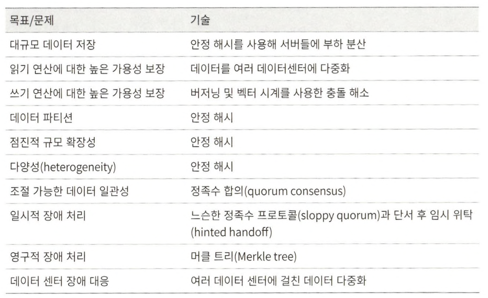

# 6장 키-값 저장소 설계

키-값 저장소는 키-값 데이터베이스라고도 불리는 비 관계형 데이터베이스다.  
저장소에 저장되는 값은 고유 식별자를 키로 가져야 한다.

키-값 쌍에서의 키는 유일해야 하며 해당 키에 매달린 값은 키를 통해서만 접근할 수 있다.  키는 일반 텍스트일 수도 있고 해시 값일 수도 있다. 키는 짧을수록 좋다.  
값은 문자열일 수도 있고 리스트일 수도 있고 객체일 수도 있다.

키-값 저장소로 널리 알려진 것으로는 아마존 다이나모, memcached, 레디스 같은 것들이 있다.

## 단일 서버 키-값 저장소

가장 직관적인 방법은 키-값 쌍 전부를 메모리에 해시 테이블로 저장하는 것이다.  
이 방법은 빠른 속도를 보장하긴 하지만 모든 데이터를 메모리 안에 두는 것이 불가능할 수도 있다는 약점을 갖고 있다.  
개선책으로는 데이터 압축, 자주 쓰이는 데이터만 메모리에 두고 나머지는 디스크에 저장하는 방법이 있다.

많은 데이터를 저장하려면 분산 키-값 저장소를 만들 필요가 있다.

## 분산 키-값 저장소

분산 해시 테이블이라고도 불린다.  
분산 시스템을 설계할 때는 CAP정리를 이해하고 있어야 한다.

### CAP 정리

CAP 정리는 데이터 일관성(Consistency), 가용성(Availability), 파티션 감내(Partition tolerance)라는 세 가지 요구사항을 동시에 만족하는 분산 시스템을 설계하는 것은 불가능하다는 정리다.  
각 요구사항의 의미부터 명확히 정리한다.  
* 데이터 일관성
  * 어떤 노드에 접속했느냐에 관계없이 언제나 같은 데이터를 보게 되어야 한다.
* 가용성
  * 일부 노드에 장애가 발생하더라도 항상 응답을 받을 수 있어야 한다.
* 파티션 감내
  * 파티션은 두 노드 사이에 통신 장애가 발생하였음을 의미한다.
  * 네트워크에 파티션이 생기더라도 시스템은 계속 동작해야 한다는 것을 의미한다.

키-값 저장소는 앞서 제시한 세 가지 요구사항 가운데 어느 두 가지를 만족하느냐에 따라 다음과 같이 분류한다.
* CP 시스템
  * 일관성과 파티션 감내를 지원하는 키-값 저장소
  * 가용성을 희생
* AP 시스템
  * 가용성과 파티션 감내를 지원하는 키-값 저장소
  * 데이터 일관성을 희생
* CA 시스템
  * 일광성과 가용성을 지원하는 키-값 저장소
  * 통상 네트워크 장애는 피할수 없는 일로 여겨지므로, 반드시 파티션 문제를 감내할 수 있도록 설계되어야 한다.  
    그러므로 실세계에 CA 시스템은 존재하지 않는다.

분산 키-값 저장소를 만들 때는 그 요구사항에 맞도록 CAP 정리를 적용해야 한다.

### 시스템 컴포넌트

키-값 저장소 구현에 사용될 핵심 컴포넌트들 및 기술들  
* 데이터 파티션
  * 데이터를 작은 파티션들로 분할한 다음 여러 대 서버에 저장한다.
  * 데이터를 파티션 단위로 나눌 때 두 가지 문제를 중요하게 따져봐야 한다.
    * 데이터를 여러 서버에 고르게 분산할 수 있는가
    * 노드가 추가되거나 삭제될 때 데이터의 이동을 최소화할 수 있는가
  * 이전에 다룬 안정 해시는 이런 문제를 푸는데 적합한 기술이다.
  * 안정 해시를 사용하여 데이터를 파티션하면 좋은 점
    * 규모 확장 자동화
    * 다양성
      * 각 서버의 용량에 맞게 가상 노드의 수를 조정할 수 있다.
      * 고성능 서버는 더 많은 가상 노드를 갖도록 설정할 수 있다.
* 데이터 다중화
  * 높은 가용성과 안정성을 확보하기 위해서는 데이터를 N개 서버에 비동기적으로 다중화할 필요가 있다.
  * 안정성을 담보가히 위해 데이터의 사본은 다른 센터의 서버에 보관하고, 센터들은 고속 네트워크로 연결한다.
* 일관성
  * 여러 노드에 다중화된 데이터는 적절히 동기화가 되어야 한다.
  * 정족수 합의 프로토콜을 사용하면 읽기/쓰기 연산 모두에 일관성을 보장할 수 있다.
    * 중재자는 클라이언트와 노드 사이에서 프록시 역할을 한다.
  * 일관성 모델
    * 일관성 모델은 데이터 일관성의 수준을 결정하는데 종류가 다양하다.
    * 강한 일관성
    * 약한 일관성
    * 최종 일관성
* 일관성 불일치 해소
  * 데이터를 다중화하면 가용성은 높아지지만 사본 간 일관성은 깨질 가능성은 높아진다.
  * 버저닝은 데이터를 변경할 때마다 해당 데이터의 새로운 버전을 만드는 것을 의미한다. 각 버전 데이터는 변경 불가능하다.
  * 벡터 시계는 [서버, 버전]의 순서쌍을 데이터에 매단 것이다.
    * 벡터 시계를 사용하면 어떤 버전 X가 버전 Y의 이전 버전인지 쉽게 판단할 수 있다.
  * 벡터 시계를 사용해 충돌을 감지하고 해소하는 방법에는 두 가지 단점이 있다.
    * 충돌 감지 및 해소 로직이 클라이언트에 들어가야 하므로, 클라이언트 구현이 복잡해진다는 것이다.
    * [서버, 버전]의 순서쌍 개수가 굉장히 빨리 늘어난다는 것이다.
* 장애 처리
  * 우선 장애 감지 기법을 살펴보고 다음으로 장애 해소 전략을 짚어본다.
  * 장애 감지
    * 모든 노드 사이에 멀티캐스팅 채널을 구축하는 것이 서버 장애를 감지하는 가장 손쉬운 방법이다.
    * 서버가 많을 때는 분명 비효율적이다.
    * 가십 프로토콜같은 분산형 장애 감지 솔루션을 채택하는 편이 보다 효율적이다.
  * 일시적 장애 처리
    * 엄격한 정족수 접근법을 쓴다면, 읽기와 쓰기 연산을 금지해야 한다.
    * 느슨한 정족수 접근법은 이 조건을 완화하여 가용성을 높인다.
      * 네트워크나 서버 문제로 장애 상태인 서버로 가는 요청은 다른 서버가 잠시 맡아 처리한다.
      * 그동안 발생한 변경사항은 해당 서버가 복구되었을 때 일괄 반영하여 데이터 일관성을 보존한다.
    * 이런 장애 처리방안을 단서 후 임시 위탁 기법이라 부른다.
  * 영구 장애 처리
    * 반-엔트로피 프로토콜을 구현하여 사본들을 동기화할 것이다.
    * 반-엔트로피 프로토콜은 사본들을 비교하여 최신 버전으로 갱신하는 과정을 포함한다.
    * 사본 간의 일관성이 망가진 상태를 탐지하고 전송 데이터의 양을 줄이기 위해서는 머클 트리를 사용할 것이다.
      * 머클 트리 == 해시 트리
  * 데이터 센터 장애 처리
    * 데이터 센터 장애에 대응할 수 있는 시스템을 만들려면 데이터를 여러 데이터 센터에 다중화하는 것이 중요하다.
* 시스템 아키텍처 다이어그램
* 쓰기 경로
* 읽기 경로

## 요약

