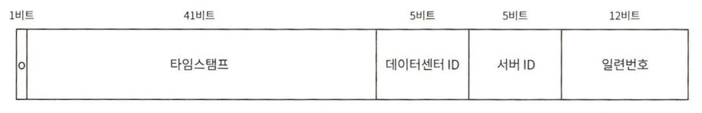

# 7장 분산 시스템을 위한 유일 ID 생성기 설계

분산 환경에서 auto_increment 속성이 설정된 관계형 데이터베이스 기본키 접근법은 통하지 않는다.  
데이터베이스 서버 한 대로는 그 요구를 감당할 수 없을뿐더러, 여러 데이터베이스 서버를 쓰는 경우에는 지연시간을 낮추기가 무척 힘들 것이기 때문이다.

## 다중 마스터 복제

데이터베이스의 auto_increment 기능을 활용한다. 다만 다음 ID의 값을 구할 때 1만큼 증가시켜 얻는 것이 아니라, 현재 사용중인 데이터베이스 서버의 수만큼 증가시킨다.

데이터베이스의 수를 늘리면 초당 생산 가능 ID 수도 늘릴 수 있다.  
하지만 이 방법은 여러 중대한 단점이 있다.
* 여러 데이터 센터에 걸쳐 규모를 늘리기 어렵다.
* ID의 유일성은 보장되겠지만 그 값이 시간 흐름에 맞추어 커지도록 보장할 수는 없다.
* 서버를 추가하거나 삭제할 때도 잘 동작하도록 만들기 어렵다.

## UUID

UUID는 컴퓨터 시스템에 저장되는 정보를 유일하게 식별하기 위한 128비트짜리 수다. 충돌 가능성이 지극히 낮다.

UUID는 서버 간 조율없이 독립적으로 생성 가능하다.

장점
* UUID를 만드는 것은 단순하다. 동기화 이슈도 없다.
* 각 서버가 자기가 쓸 ID를 알아서 만드는 구조이므로 규모 확장도 쉽다.

단점
* ID가 128비트로 길다.
* ID를 시간순으로 정렬할 수 없다.
* ID에 숫자 아닌 값이 포함될 수 있다.

## 티켓 서버
핵심은 auto_increment 기능을 갖춘 데이터베이스 서버, 즉 티켓 서버를 중앙 집중형으로 하나만 사용하는 것이다.

장점
* 유일성이 보장되는 오직 숫자로만 구성된 ID를 쉽게 만들 수 있다.
* 구현하기 쉽고, 중소 규모 애플리케이션에 적합하다.

단점
* 티켓 서버가 SPOF가 된다.
  * 서버에 장애가 발생하면, 해당 서버를 이용하는 모든 시스템이 영향을 받는다.
  * 위 이슈를 피하려면 여러 대 준비해야 하는데, 여러 대를 준비하면 데이터 동기화와 같은 새로운 문제가 발생한다.

## 트위터 스노플레이크 접근법

생성해야 하는 ID의 구조를 여러 절로 분할하는 것이다.

