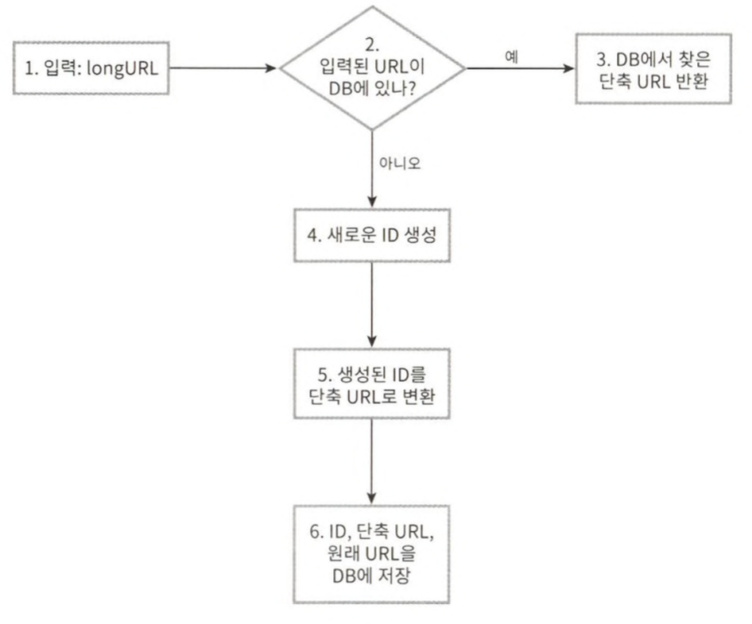

# 8장 URL 단축기 설계

## URL 리디렉션

* 301 Permanently Moved
  * 해당 URL에 대한 HTTP 요청의 처리 책임이 영구적으로 Location 헤더에 반환된 URL로 이전되었다는 응답이다.
  * 브라우저는 이 응답을 캐시한다.
* 302 Found
  * 주어진 URL로의 요청이 일시적으로 Location 헤더가 지정하는 URL에 의해 처리되어야 한다는 응답이다.

두 방법은 각기 다른 장단점을 가지고 있다.  
서버 부하를 줄이는 것이 중요하다면 301을 사용하는 것이 좋은데 첫 번째 요청만 단축 URL 서버로 전송될 것이기 때문이다.  
하지만 트래픽 분석이 중요할 때는 302를 쓰는 쪽이 클릭 발생률이나 발생 위치를 추적하는 데 좀 더 유리하다.

## 데이터 모델

해시 테이블에 두고 사용하는 방법은 실제 시스템에 쓰기 곤란하다. 메모리는 유한한데다 비싸기 때문이다.

더 나은 방법은 순서쌍을 관계형 데이터베이스에 저장하는 것이다.

## URL 단축기 상세 설계

1. 입력으로 긴 URL을 받는다.
2. 데이터베이스에 해당 URL이 있는지 검사한다.
3. 데이터베이스에 있다면 해당 URL에 대한 단축 URL을 만들 적이 있는 것이다. 따라서 데이터베이스에 해당 단축 URL을 가져와서 클라이언트에게 반환한다.
4. 데이터베이스에 없는 경우에는 해당 URL은 새로 접수된 것이므로 유일한 ID를 생성한다. 이 ID는 데이터베이스의 기본 키로 사용된다.
5. 62진법 변환을 적용, ID를 단축 URL로 만든다.
6. ID, 단축 URL, 원래 URL로 새 데이터베이스 레코드를 만든 후 단축 URL을 클라이언트에 전달한다.