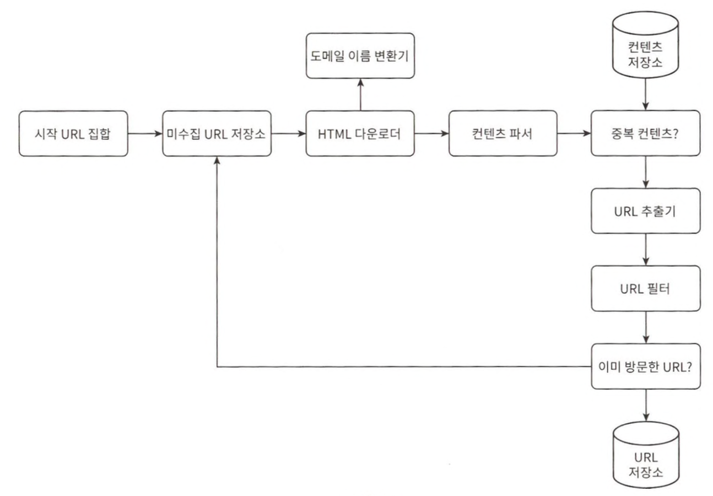
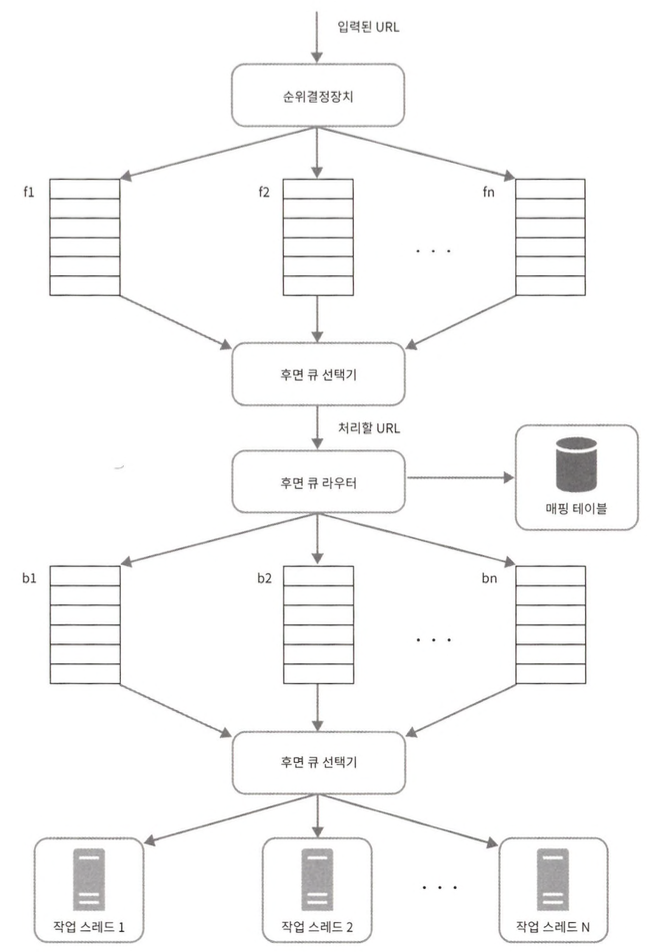

# 9장 웹 크롤러 설계

웹 크롤러는 로봇(robot) 또는 스파이더(spider)라고 부른다.

웹에 새로 올라오거나 갱신된 콘텐츠를 찾아내는 것이 주된 목적이다.  
콘텐츠는 웹 페이지일 수도 있고, 이미지나 비디오 또는 PDF 파일일 수도 있다.

크롤러는 다양하게 이용된다.
* 검색 엔진 인덱싱
  * 크롤러는 웹 페이지를 모아 검색 엔진을 위한 로컬 인덱스를 만든다.
* 웹 아카이빙
  * 나중에 사용할 목적으로 장기보관하기 위해 웹에서 정보를 모으는 절차를 말한다.
* 웹 마이닝
  * 폭발적 성장세는 데이터 마이닝 업계에 전례 없는 기회다.
* 웹 모니터링
  * 크롤러를 사용하몀ㄴ 인터넷에서 저작권이나 상표권이 침해되는 사례를 모니터링할 수 있다.

## 1단계 문제 이해 및 설계 범위 확정

웹 크롤러의 기본 알고리즘
1. URL 집합이 입력으로 주어지면, 해당 URL들이 가리키는 모든 웹 페이지를 다운로드한다.
2. 다운받은 웹 페이지에서 URL들을 추출한다.
3. 추출된 URL들을 다운로드할 URL 목록에 추가하고 위의 과정을 처음부터 반복한다.

좋은 웹 크롤러가 만족시켜야할 속성
* 규모 확장성
* 안정성
* 예절
* 확장성

## 2단계 개략적 설계안 제시 및 동의 구하기

웹 크롤러 작업 흐름
1. 시작 URL들을 미수집 URL 저장소에 저장한다.
2. HTML 다운로더는 미수집 URL 저장소에서 URL 목록을 가져온다.
3. HTML 다운로더는 도메인 이름 변환기를 사용하여 URL의 IP 주소를 알아내고, 해당 IP 주소로 접속하여 웹 페이지를 다운받는다.
4. 콘텐츠 파서는 다운된 HTML 페이지를 파싱하여 올바른 형식을 갖춘 페이
지인지 검증한다.
5. 콘텐츠 파싱과 검증이 끝나면 중복 콘텐츠인지 확인하는 절차를 개시한다.
6. 중복 콘텐츠인지 확인하기 위해서, 해당 페이지가 이미 저장소에 있는지 본다.
   * 이미 저장소에 있는 콘텐츠인 경우에는 처 리하지 않고 버 린다.
   *  저장소에 없는 콘텐츠인 경우에는 저장소에 저장한 뒤 URL 추출기로 전 달한다.
7. URL 추출기는 해당 HTML 페이지에서 링크를골라낸다.
8. 골라낸 링크를 URL 필터로 전달한다.
9. 필터링이 끝나고 남은 URL만 중복 URL 판별 단계로 전달한다.
10. 이미 처리한 URL인지 확인하기 위하여, URL 저장소에 보관된 URL인지 살핀다. 이미 저장소에 있는 URL은 버 린다.
11. 저장소에 없는 URL은 URL 저장소에 저장할 뿐 아니라 미수집 URL 저장소에도 전달한다.

## 3단계 상세 설계

### DFS를 쓸 것인가, BFS를 쓸것인가?  

웹 크롤러는 보통 BFS, 너비 우선 탐색법을 사용한다. BFS는 FIFO 큐를 사용하는 알고리즘이다.

BFS의 구현법에는 두 가지 문제점어 있다.
* 한 페이지에서 나오는 링크의 상당수는 같은 서버로 되돌아간다.
  * 링크들을 병렬로 처리하게 되면 예의없는 크롤러가 될 수 있다.
* 표준적 BFS 알고리즘은 URL 간에 우선순위를 두지 않는다.
  * 페이지 순위, 사용자 트래픽 양, 업데이트 빈도 등 여러가지 척도에 비추어 처리 우선순위를 구별하는 것이 온당하다.

### 미수집 URL 저장소

URL 저장소는 다운로드할 URL을 보관하는 장소다.  
저장소를 잘 구현하면 예의를 갖춘 크롤러, URL 사이의 우선순위와 신선도를 구별하는 크롤러를 구현할 수 있다.

#### 예의

웹 크롤러는 수집 대상 서버로 짧은 시간 안에 너무 많은 요청을 보내는 것을 삼가야 한다.  
예의 바른 크롤러를 만드는 데 있어서 지켜야 할 한 가지 원칙은, 동일 웹 사이트에 대해서는 한 번에 한 페이지만 요청한다는 것이다. 같은 웹 사이트의 페이지를 다운받는 태스크는 시간차를 두고 실행한다.  

#### 우선순위

유용성에 따라 URL의 우선순위를 나눌 때는 페이지랭크, 트래픽 양, 갱신 빈도 등 다양한 척도를 사용할 수 있다.

* 전면 큐 : 우선순위 결정 과정을 처리한다.
* 후면 큐 : 크롤러가 예의 바르게 동작하도록 보증한다.

#### 신선도

웹 페이지는 수시로 추가되고, 삭제되고, 변경된다.  
데이터의 신선함을 유지하기 위해서는 이미 다운로드한 페이지라고 해도 주기적으로 재수집할 필요가 있다.

작업을 최적화하기 위한 전략은 다음과 같다.
* 웹 페이지의 변경 이력 활용
* 우선순위를 활용하여 중요한 페이지는 좀 더 자주 재수집

#### 미수집 URL 저장소를 위한 지속적 저장장치

대부분의 URL은 디스크에 두지만 IO 비용을 줄이기 위해 메모리 버퍼에 큐를 두었다. 버퍼에 있는 데이터는 주기적으로 디스크에 기록할 것이다.

### HTML 다운로더

#### Robots.txt

로봇 제외 프로토콜이라고 부른다.  
웹 사이트가 크롤러와 소통하는 표준적 방법이다. 이 파일에는 크롤러가 수집해도 되는 페이지 목록이 들어 있다.

#### 성능 최적화

1. 분산 크롤링
   * 성능을 높이기 위해 크롤링 작업을 여러 서버에 분산하는 방법
2. 도메인 이름 변환 결과 캐시
   * 도메인 이름 변환기는 크롤러 성능의 병목 중 하나다.
   * DNS 조회 결과로 얻어진 도메인 이름과 IP 주소 사이의 관계를 캐시에 보관해 놓고 크론 잡 등을 돌려 주기적으로 갱신하도록 해 놓으면 성능을 효과적으로 높일 수 있다.
3. 지역성
   * 크롤링 작업을 수행하는 서버를 지역별로 분산하는 방법
4. 짧은 타임아웃
   * 최대 얼마나 기다릴지를 미리 정해두는 것
   * 해당 시간 동안 서버가 응답하지 않으면 크롤러는 해당 페이지 다운로드를 중단하고 다음 페이지로 넘어간다.

#### 안정성

* 안정 해시
  * 다운로더 서버들에 부하를 분산할 때 적용가능한 기술
* 크롤링 상태 및 수집 데이터 저장
  * 장애가 발생한 경우에도 쉽게 복구할 수 있도록 크롤링 상태와 수집된 데이터를 지속적 저장장치에 기록해 두는 것이 바람직하다.
* 예외 처리
  * 예외가 발생해도 전체 시스템이 중단되는 일 없이 그 작업을 우아하게 이어나갈 수 있어야 한다.
* 데이터 검증

#### 확장성

#### 문제 있는 콘텐츠 감지 및 회피