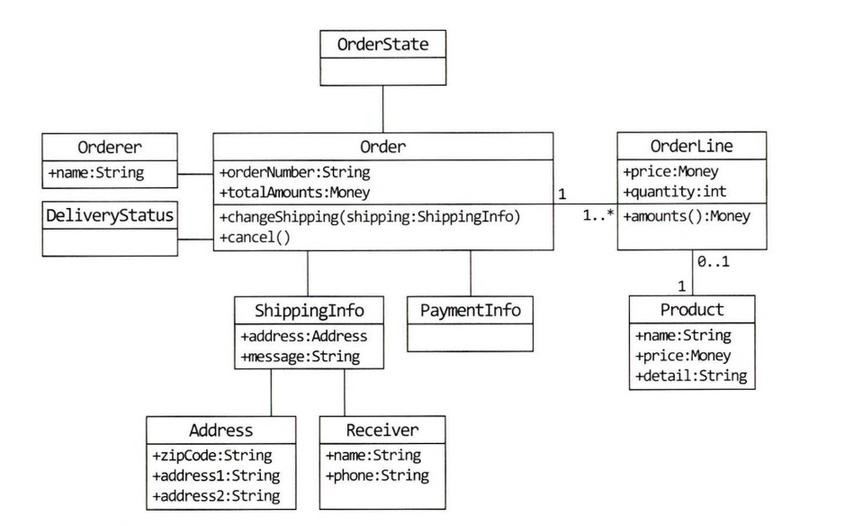
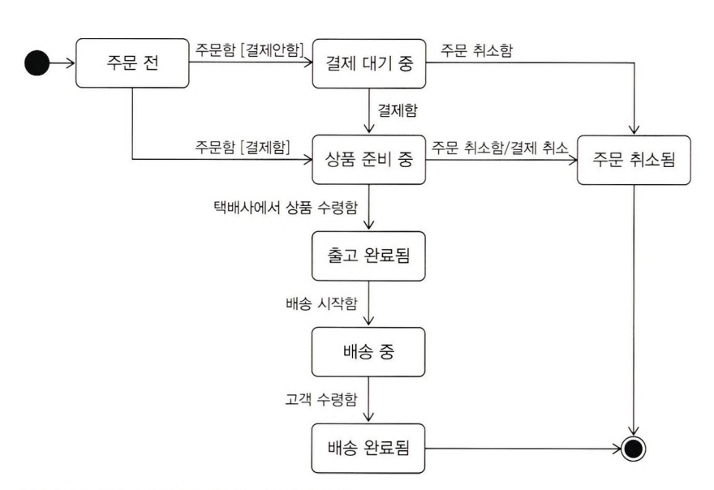
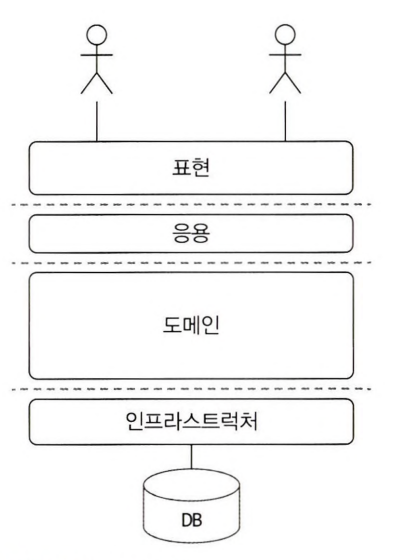

# 1장. 도메인 모델 시작하기

## 1.1 도메인이란?

<u>도메인 Domain, 소프트웨어로 해결하고자 하는 문제 영역</u>

* 한 도메인은 다시 하위 도메인으로 나눌 수 있다.
* 한 하위 도메인은 다른 하위 도메인과 연동하여 완전한 기능을 제공한다.
  * 특정 도메인을 위한 소프트웨어라고 해서 도메인이 제공해야 할 모든 기능을 직접 구현하는 것은 아니다.
  * ex) 결제 (외부 PG), 배송 (외부 물류)
* 도메인마다 고정된 하위 도메인이 존재하는 것은 아니다.
  * 하위 도메인을 어떻게 구성할지 여부는 상황에 따라 달라진다.

## 1.2 도메인 전문가와 개발자간 지식공유

* 코딩에 앞서 요구사항을 올바르게 이해하는 것이 중요하다.
  * 쓸모없거나 유용함이 떨어지는 시스템을 만들기 때문이다.
  * 변경하거나 다시 만들어야 할 코드가 많아지고 경우에 따라 소프트웨어를 만드는데 실패하거나 일정이 크게 밀릴 수 있다.
* 요구사항을 올바르게 이해하려면, 개발자와 전문가가 직접 대화하는 것이다.
  * 이해관계자와 개발자도 도메인 지식을 갖춰야 한다.

**"Garbage in, Garbage Out"**
* 전문가나 관련자가 요구한 내용이 항상 올바른 것은 아니다.
* 때론 본인들이 실제로 원하는 것을 정확하게 표현하지 못할 때도 있다.
* 개발자는 요구사항을 이해할 때 왜 이런 기능을 요구하는지 또는 실제로 원하는 게 무엇인지 생각하고 전문가와 대화를 통해 진짜로 원하는 것을 찾아야 한다.

## 1.3 도메인 모델

<u>도메인 모델은 특정 도메인을 개념적으로 표현한 것</u>

* 도메인 모델을 사용하면 여러 관계자들이 동일한 모습으로 도메인을 이해하고 도메인 지식을 공유하는 데 도움이 된다.
  * 객체를 이용한 도메인 모델링
    * 기능과 데이터를 함께 보여주는 객체 모델
    
    

  * 상태 다이어그램을 이용해서 주문의 상태 전이를 모델링

    

  * UML 표기법만 사용해야 하는 것은 아니다.
    * 도메인을 이해하는데 도움이 된다면 표현 방식이 무엇인지는 중요하지 않다.
* 도메인 모델은 기본적으로 도메인 자체를 이해하기 위한 개념 모델
  * 구현 기술에 맞는 구현 모델이 따로 필요하다.
  * 개념 모델과 구현 모델은 서로 다른 것이지만, 구현 모델이 개념 모델을 최대한 따르도록 할 수 있다.

**하위 도메인과 모델**

* 도메인에 따라 용어 의미가 결정되므로 여러 하위 도메인을 하나의 다이어그램에 모델링하면 안 된다.
* 모델의 각 구성요소는 특정 도메인으로 한정할 때 비로소 의미가 완전해지기 때문에 각 하위 도메인마다 별도로 모델을 만들어야 한다.

## 1.4 도메인 모델 패턴

일반적인 애플리케이션의 아키텍처

|영역|설명|
|:--:|:--|
|사용자 인터페이스  또는 표현 Presentation|사용자의 요청을 처리하고 사용자에게 정보를 보여준다.   여기서 사용자는 소프트웨어를 사용하는 사람뿐만 아니라 외부 시스템일 수도 있다.|
|응용 Application|사용자가 요청한 기능을 실행한다.  업무 로직을 직접 구현하지 않으며 도메인 계층을 조합해서 기능을 실행한다.|
|도메인 Domain|시스템이 제공할 도메인 규칙을 구현한다.|
|인프라스트럭쳐 Infrastructure|데이터베이스나 메시징 시스템과 같은 외부시스템과의 연동을 처리한다.|

* 도메인 모델 패턴은 아키텍처 상의 도메인 계층을 객체 지향 기법으로 구현하는 패턴을 말한다.
  * 도메인 계층은 도메인의 핵심 규칙을 구현한다.
  * 도메인 규칙을 객체 지향 기법으로 구현하는 패턴이 도메인 모델 패턴이다.

* 중요한 점은 중요 업무 규칙을 도메인 모델에서 구현한다는 점
  * 핵심 규칙을 구현한 코드는 도메인 모델에만 위치하기 때문에 규칙이 바뀌거나 규칙을 확장해야 할 때,   다른 코드에 영향을 덜 주고 변경 내역을 모델에 반영할 수 있게 된다.

**개념 모델과 구현 모델**

* 개념 모델은 순수하게 문제를 분석한 결과물
  * 실제 코드를 작성할 때 개념모델을 있는 그대로 사용할 수 없다.
  * 그래서 개념 모델을 구현 가능한 형태의 모델로 전환하는 과정을 거친다.
* 프로젝트 초기에는 개요 수준의 개념 모델로 도메인에 대한 전체 윤곽을 이해하는데 집중하고, 구현하는 과정에서 개념 모델을 구현 모델로 점진적으로 발전시켜 나가야 한다.

## 1.5 도메인 모델 도출

도메인을 모델링할 때 기본이 되는 작업은 모델을 구성하는 핵심 구성요소, 규칙, 기능을 찾는 것이다.

**문서화**
* 도메인 관점에서 코드가 도메인을 잘 표현해야 비로소 코드의 가독성이 높아지고 문서로서 코드가 의미를 갖는다.

## 1.6 엔티티와 밸류

엔티티와 밸류를 제대로 구분해야 도메인을 올바르게 설계하고 구현할 수 있다.

### 1.6.1 엔티티

엔티티의 가장 큰 특징은 객체마다 고유한 식별자를 가진다.
* 엔티티를 생성하고 속성을 바꾸고 삭제할 때까지 식별자는 유지한다.

### 1.6.2 엔티티의 식별자 생성

* 엔티티의 식별자를 생성하는 시점은 도메인의 특징과 사용하는 기술에 따라 달라진다.
* 식별자 생성 방식
  * 특정 규칙에 따라 생성
    * 흔히 사용하는 규칙은 현재 시간과 다른 값을 함께 조합하는 것이다.
  * UUID, Nano ID와 같은 고유 식별자 생성기 사용
  * 값을 직접 입력
  * 일련번호 사용 (시퀀스나 DB의 auto increment 사용)
    * DB 테이블에 데이터를 삽입해야 비로소 값을 알 수 있기 때문에 테이블에 데이터를 추가하기 전에는 식별자를 알 수 없다.

### 1.6.3 밸류 타입

밸류 타입은 개념적으로 완전한 하나를 표현할 때 사용한다.

* 밸류 타입이 꼭 두 개 이상의 데이터를 가져야 하는 것은 아니다.
  * 하나의 데이터만 가져도 코드를 이해하는 데 도움이 된다.
* 밸류 타입을 위한 기능을 추가할 수 있다는 장점이 있다.
* 밸류 객체의 데이터를 변경할 때는 기존 데이터를 변경하기보다는 변경한 데이터를 갖는 새로운 밸류 객체를 생성하는 방식을 선호한다.
  * 데이터 변경 기능을 제공하지 않는 타입을 불변이라고 표현한다.
  * 안전한 코드를 작성할 수 있다.
  * 불변 객체는 참조 투명성과 스레드에 안전한 특징을 가지고 있다.

**엔티티 vs 밸류**

* 엔티티는 식별자를 가진 객체, 밸류는 식별자가 없는 객체
* 객체를 예시로 들면
  * 객체의 참조값이 동일한지를 보고 객체가 동일하다고 판단하는 경우가 엔티티
  * 객체의 참조값이 다르더라도 객체의 값들이 같으면 동일하다고 판단하는 경우가 밸류

### 1.6.4 엔티티 식별자와 밸류 타입

식별자는 단순한 문자열이 아니라 도메인에서 특별한 의미를 지니는 경우가 많기 때문에 식별자를 위한 밸류 타입을 사용해서 의미가 잘 드러나도록 할 수 있다.

* *ID는 이미 많은 사용자가 변수 이름으로 의미를 파악하는데, 밸류 타입이 필요할까?*

### 1.6.5 도메인 모델에 set 메소드 넣지 않기

* 도메인 모델에 get/set 메소드를 무조건 추가하는 것은 좋지 않은 버릇이다.
* 특히 set 메소드는 도메인의 핵심 개념이나 의도를 코드에서 사라지게 한다.
  * set 메소드는 필드값만 변경하고 끝나기 때문에, 상태 변경과 관련된 도메인 지식이 코드에서 사라지게 된다.
  * 또 다른 문제는 도메인 객체를 생성할 때 온전하지 않은 상태가 될 수 있다.
* 도메인 객체가 불완전한 상태로 사용되는 것을 막으려면 생성 시점에 필요한 것을 전달해주어야 한다.  즉, 생성자를 통해 필요한 데이터를 모두 받아야 한다.
* 밸류 타입을 사용하면 자연스럽게 밸류 타입에는 set 메소드를 구현하지 않는다.

## 1.7 도메인 용어와 유비쿼터스 언어

유비쿼터스 언어란, 보편 언어로 도메인과 관련된 공통의 언어이다.
* 모든 관계자가 유비쿼터스 언어를 모든 곳에서 같이 사용한다.
* 소통 과정에서 발생하는 용어의 모호함을 줄일 수 있고 개발자는 도메인과 코드 사이에서 불필요한 해석 과정을 줄일 수 있다.
* 도메인 영어를 영어로 해석하는 노력이 필요하다.
* 도메인에 어울리지 않은 단어를 사용하면 코드는 도메인과 점점 멀어지게 된다.