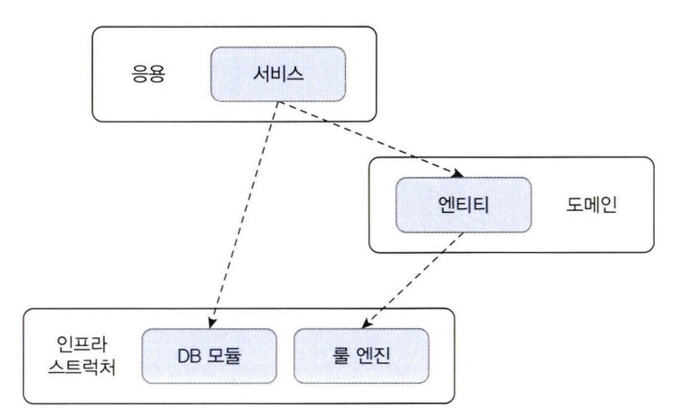
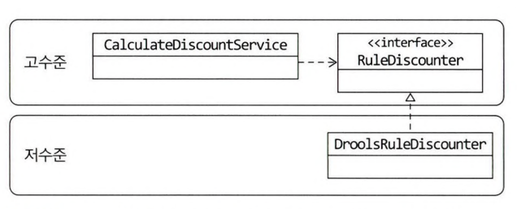
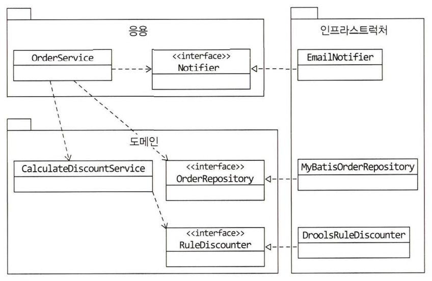
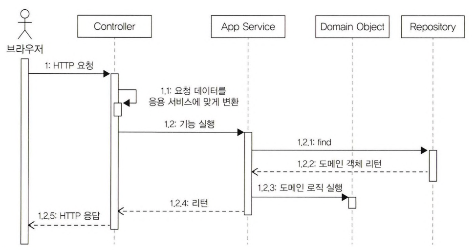
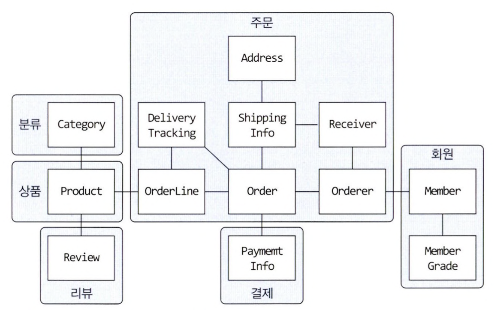

[:toc]

# 2장. 아키텍처 개요

## 2.1 네 개의 영역

<u>표현, 응용, 도메인, 인프라스트럭처는 아키텍처를 설계할 때 출현하는 전형적인 네 가지 영역이다.</u>

* **표현 영역 (또는 UI 영역)**
  * 사용자의 요청을 받아 응용 영역에 전달하고 응용 영역의 처리 결과를 다시 사용자에게 보여주는 역할
* **응용 영역**
  * 시스템이 사용자에게 제공해야 할 기능을 구현
  * 기능을 구현하기 위해 도메인 영역의 도메인 모델을 사용
  * 응용 서비스는 로직을 직접 수행하기보다는 도메인 모델에 로직 수행을 위임
    * <u>이 부분이 기존 아키텍처와 다른부분. 비즈니스 로직이 응용 서비스에 있지 않고 도메인 모델에 있음</u>
* **도메인 영역**
  * 도메인 모델을 구현
  * 도메인 모델은 도메인의 핵심 로직을 구현
* **인프라스트럭처 영역**
  * 논리적인 개념을 표현하기보다는 실제 구현을 다룸
  * RDBMS 연동 처리, 메시징 큐에 메시지 전송 및 수신, 몽고DB나 Redis의 데이터 연동 처리 등

도메인, 응용, 표현 영역은 구현 기술을 사용한 코드를 직접 만들지 않는다.  
대신 인프라스트럭처 영역에서 제공하는 기능을 사용해서 필요한 기능을 개발한다.

## 2.2 계층 구조 아키텍처

기존의 계층형은 표현 > 응용 > 도메인 > 인프라 스트럭쳐로 구성되어,  
계층 구조 특성상 상위 계층에서 하위 계층으로의 의존만 존재하고 하위 계층은 상위 계층에 의존하지 않는다.
다만, 구현의 편리함을 위해 계층 구조를 유연하게 적용하기도 한다. (응용 영역의 Service에서 인프라 영역의 Repository를 사용하는 경우)

응용 영역과 도메인 영역은 DB나 외부 시스템 연동을 위해 인프라스트럭처의 기능을 사용하므로 이런 계층 구조를 사용하는 것은 직관적으로 이해하기 쉽다. 
하지만 짚고 넘어가야 할 것은 <u>표현, 응용, 도메인 계층이 인프라 스트럭처 계층에 종속된다는 점</u>이다.

위와 같이 구현된 아키텍처는 인프라스트럭처 영역의 기술에 완전히 의존하기 때문에 두 가지 문제를 가진다. 
1. 테스트하기 어렵다는 점
2. 구현 방식을 변경하기 어렵다는 점

이에 대한 해답은 DIP에 있다.

## 2.3 DIP

<u>DIP, Dependency Inversion Principle, 의존 역전 원칙</u>  
DIP를 이해하려면 고수준 모듈과 저수준 모듈에 대한 이해가 먼저 필요하다.

* **고수준 모듈**
  * 의미 있는 단일 기능을 제공하는 모듈
  * 고수준 모듈의 기능을 구현하려면 여러 하위 기능이 필요
  * 예시
    * Service의 특정한 기능
* **저수준 모듈**
  * 하위 기능을 실제로 구현한 것
  * 예시
    * JPA를 이용해서 고객정보를 읽어오는 모듈

고수준 모듈이 제대로 동작하려면 저수준 모듈을 사용해야 한다.  
그런데 고수준 모듈이 저수준 모듈을 사용하면 앞서 계층 구조 아키텍처에서 언급했던 두 가지 문제, 구현변경과 테스트가 어렵다는 문제가 발생한다.

DIP는 이 문제를 해결하기 위해 저수준 모듈이 고수준 모듈에 의존하도록 바꾼다. 추상화된 인터페이스를 활용해서.

DIP를 적용하면 위의 그림과 같이 저수준 모듈이 고수준 모듈에 의존하게 된다.

DIP를 적용하면 앞서 계층 구조 아키텍처에서 발생했던 두 가지 문제를 해소할 수 있다.

* 구현 기술 교체 문제
  * 실제 사용할 저수준 구현 객체를 의존 주입을 이용해서 전달 받을 수 있다. 
    `RuleDiscounter ruleDiscounter = new DroolsRuleDiscounter();`
  * 구현 기술을 변경하더라도 Service를 수정할 필요가 없다. 사용할 저수준 구현 객체를 생성하는 코드만 변경하면 된다.
* 테스트 문제
  * 저수준 모듈에 직접 의존했다면 저수준 모듈이 만들어지기 전까지 테스트가 불가능하다.
  * 고수준 모듈이 인터페이스이므로 대역 객체를 사용해서 테스트를 진행할 수 있다.
    * Stub이나 모의 객체와 같은 테스트 목적의 대역
  * 메소드가 한 개인 객체는 람다식을 활용해서 객체를 생성할 수 있다. 
    `RuleDiscounter stubRule = (cust, lines) -> null;`
  * 실제 구현 없이 테스트를 할 수 있는 이유는 DIP를 적용해서 고수준 모듈이 저수준 모듈에 의존하지 않도록 했기 때문이다.

### 2.3.1 DIP 주의사항

DIP를 잘못 생각하면 단순히 인터페이스와 구현 클래스를 분리하는 정도로 받아들일 수 있다. 
DIP의 핵심은 고수준 모듈이 저수준 모듈에 의존하지 않도록 하기 위함인데, DIP를 적용한 결과 구조만 보고 저수준 모듈에서 인터페이스를 추출하는 경우가 있다.  

> 이해가 잘 안되어 비유를 들어보자면, DIP가 정상적으로 적용된 경우 Repository라는 고수준 모듈 Interface가 도출되고 이를 구현한 JpaRepository, MongoRepository 등의 저수준 모듈이 나타날 수 있다. 하지만 저수준 모듈인 JpaRepository에서 Repository라는 Interface를 도출하면 이는 Jpa의 특징을 가지고 있기 때문에 Mongo와는 맞지 않아 해당 Repository에서 MongoRepository를 구현할 수 없다.

DIP를 적용할 때 하위 기능을 추상화한 인터페이스는 고수준 모듈 관점에서 도출한다.

### 2.3.2 DIP와 아키텍처

DIP를 적용하면 인프라스트럭처 영역이 응용 영여과 도메인 영역에 의존(상속)하는 구조가 된다.

인프라스트럭처에 위치한 클래스가 도메인이나 응용 영역에 정의한 인터페이스를 상속받아 구현하는 구조가 되므로 도메인과 응용 영역에 대한 영향을 주지 않거나 최소화하면서 구현 기술을 변경하는 것이 가능하다.

## 2.4 도메인 영역의 주요 구성요소

|요소|설명|
|---|---|
|엔티티 Entity|고유의 식별자를 갖는 객체로 자신의 라이프 사이클을 가진다.  주문, 회원, 상품과 같이 도메인의 고유한 개념을 표현한다. 도메인 모델의 데이터를 포함하며 해당 데이터와 관련된 기능을 함께 제공한다.|
|밸류 Value|고유의 식별자를 갖지 않는 객체로 주로 개념적으로 하나인 값을 표현할때 사용된다.  배송지 주소를 표현하기 위한 주소나 구매 금액을 위한 금액과 같은 타입이 밸류타입이다. 엔티티의 속성으로 사용할 뿐만 아니라 다른 밸류 타입의 속성으로도 사용할 수 있다. |
|애그리거트 Aggregate|애그리거트는 연관된 엔티티와 밸류 객체를 개념적으로 하나로 묶은 것이다.  예를 들어 주문과 관련된 Order 엔티티, Orderline 밸류, Orderer 밸류 객체를 '주문' 애그리거트로 묶을 수 있다.|
|리포지터리 Repository|도메인 모델의 영속성을 처리한다. 예를 들어 DBMS 테이블에서 엔티티 객체를 로딩하거나 저장하는 기능을 제공한다.|
|도메인 서비스 Domain Service|특정 엔티티에 속하지 않은 도메인 로직을 제공한다.   '할인 금액 계산'은 상품, 쿠폰, 회원 등급, 구매 금액 등 다양한 조건을 이용해서 구현하게 되는데,  이렇게 도메인 로직이 여러 엔티티와 밸류를 필요로 하면 도메인 서비스에서 로직을 구현한다.|

### 2.4.1 엔티티와 밸류

DB 테이블의 엔티티와 도메인 모델의 엔티티를 구분해야 한다.

두 모델의 가장 큰 차이점은 도메인 모델의 엔티티는 데이터와 도메인 기능을 함께 제공한다는 점이다.  
도메인 모델의 엔티티는 단순히 데이터를 담고 있는 데이터 구조라기보다는 데이터와 함께 기능을 제공하는 객체이다.  
도메인 관점에서 기능을 구현하고 기능 구현을 캡슐화해서 데이터가 임의로 변경되는 것을 막는다.

또 다른 차이점은 도메인 모델의 엔티티는 두 개 이상의 데이터가 개념적으로 하나인 경우 밸류타입을 이용해서 표현할 수 있다는 것이다.  
밸류는 불변으로 구현할 것을 권장하며, 이는 엔티티의 밸류 타입 데이터를 변경할 때는 객체 자체를 완전히 교체한다는 것을 의미한다.

### 2.4.2 애그리거트

애그리거트는 관련 객체를 하나로 묶은 군집이다.

도메인 모델에서 전체적인 구조를 이해하는데 도움이 된다.  
객체 군집 단위로 모델을 바라볼 수 있게 되어 큰 틀에서 도메인 모델을 관리할 수 있다.

애그리거트는 군집에 속한 객체를 관리하는 <u>루트 엔티티</u>를 갖는다.  
루트 엔티티는 애그리거트에 속해 있는 엔티티와 밸류 객체를 이용해서 애그리거트가 구현해야 할 기능을 제공한다.  
애그리거트 루트를 통해서 간접적으로 애그리거트 내의 다른 엔티티나 밸류 객체에 접근한다.  
이것은 애그리거트의 내부 구현을 숨겨서 애그리거트 단위로 구현을 캡슐화할 수 있도록 돕는다.

### 2.4.3 리포지터리

리포지터리는 구현을 위한 도메인 모델이다.

리포지터리는 애그리거트 단위로 도메인 객체를 저장하고 조회하는 기능을 정의한다.

응용 서비스는 의존 주입과 같은 방식을 사용해서 실제 리포지터리 구현 객체에 접근한다.

## 2.5 요청 처리 흐름

1. 사용자가 애플리케이션에 기능 실행을 요청하면 그 요청을 처음 받는 영역은 표현 영역이다.
   * 표현 영역은 사용자가 전송한 데이터 형식이 올바른지 검사하고 문제가 없다면 데이터를 이용해서 응용 서비스에 기능 실행을 위임한다.
   * 표현 영역은 사용자가 전송한 데이터를 응용 서비스가 요구하는 형식으로 변환해서 전달한다.
2. 응용 서비스는 도메인 모델을 이용해서 기능을 구현한다.
3. 기능 구현에 필요한 도메인 객체를 리포지터리에서 가져와 실행하거나 신규 도메인 객체를 생성하여 리포지터리에 저장한다.

## 2.6 인프라스트럭처 개요

무조건 인프라스트럭처에 대한 의존을 없앨 필요는 없다.

구현의 편리함은 DIP가 주는 다른 장점(변경의 유연함, 테스트가 쉬움)만큼 중요하기 때문에 DIP의 장점을 해치지 않는 범위에서 응용 영역과 도메인 영역에서 구현 기술에 대한 의존을 가져가는 것은 나쁘지 않다.

## 2.7 모듈 구성

표현 영역(UI), 응용 영역(application), 도메인 영역(domain), 인프라스터럭처 영역(infrastructure)

위 4개의 영역별로 패키지를 나누고 하위에 도메인 별로 패키지를 세분화할 수 있다.  
혹은 도메인 별로 패키지를 먼저 나누고 각 패키지 하위에 4개의 영역별로 세분화할 수도 있다.

모듈 구조를 얼마나 세분화해야 하는지에 대해 정해진 규칙은 없다. 한 패키지에 너무 많은 파일이 몰려서 코드를 찾을 때 불편한 정도만 아니면 된다.

# 3장. 애그리거트

## 3.1 애그리거트

도메인 객체 모델이 복잡해지면 개별 구성요소 위주로 모델을 이해하게 되고 전반적인 구조나 큰 수준에서 도메인 간의 관계를 파악하기 어려워진다  
주요 도메인 요소 간의 관계를 파악하기 어렵다는 것은 코드를 변경하고 확장하는 것이 어려워진다는 것을 의미한다.

복잡한 도메인을 이해하고 관리하기 쉬운 단위로 만들려면 상위 수준에서 모델을 조망할 수 있는 방법이 필요한데, 그 방법이 바로 **애그리거트**다.  
수많은 객체를 애그리거트로 묶어서 바라보면 상위 수준에서 도메인 모델간의 관계를 파악할 수 있다.

애그리거트는 모델을 이해하는데 도움을 줄 뿐만 아니라 일관성을 관리하는 기준도 된다.

한 애그리거트에 속한 객체는 유사하거나 동일한 라이프 사이클을 갖는다.

한 애그리거트에 속한 객체는 다른 애그리거트에 속하지 않는다. 애그리거트는 독립된 객체 군이며 각 애그리거트는 자기 자신을 관리할 뿐 다른 애그리거트를 관리하지 않는다.

경계를 설정할 때 기본이 되는 것은 도메인 규칙과 요구사항이다. 도메인 규칙에 따라 함께 생성되는 구성요소는 한 애그리거트에 속할 가능성이 높다.

도메인에 대한 경험이 생기고 도메인 규칙을 제대로 이해할수록 애그리거트의 실제 크기는 줄어든다.  
다수의 애그리거트가 한 개의 엔티티 객체만 갖는 경우가 많았으며 두 개 이상의 엔티티로 구성되는 애그리거트는 드물었다.

## 3.2 애그리거트 루트

애그리거트는 여러 객체로 구성되기 때문에 한 객체만 상태가 정상이면 안된다. 도메인 규칙을 지키려면 애그리거트에 속한 모든 객체가 정상 상태를 가져야 한다.

애그리거트에 속한 모든 객체가 일관된 상태를 유지하려면 애그리거트 전체를 관리할 주체가 필요한데, 이 책임을 지는 것이 바로 애그리거트의 루트 엔티티이다.

### 3.2.1 도메인 규칙과 일관성

애그리거트 루트의 핵심 역할은 애그리거트의 일관성이 깨지지 않도록 하는 것이다. 이를 위해 애그리거트 루트는 애그리거트가 제공해야 할 도메인 기능을 구현한다.

애그리거트 외부에서 애그리거트에 속한 객체를 직접 변경하면 안된다. 애그리거트 루트가 강제하는 규칙을 적용할 수 없어 모델의 일관성을 깨는 원인이 된다.

불필요한 중복을 피하고 애그리거트 루트를 통해서만 도메인 로직을 구현하게 만들려면 (1) 단순히 필드를 변경하는 set 메소드를 공개(public) 범위로 만들지 않아야하고, (2) 밸류 타입은 불변으로 구현해야 한다.

(1) 먼저 습관적으로 작성하는 공개(public) set 메소드를 피해야 한다.  
공개 set 메소드는 도메인의 의미나 의도를 표현하지 못하고 도메인 로직을 도메인 객체가 아닌 응용 영역이나 표현 영역으로 분산시킨다. 도메인 로직이 한 곳에 응집도지 않으므로 코드를 유지 보수할 때에도 분석하고 수정하는데 더 많은 시간이 필요하다.

(2) 공개 set 메소드를 만들지 않는 것의 연장으로 밸류는 불변 타입으로 구현한다.  
밸류 객체의 값을 변경할 수 없으면 애그리거트 루트에서 밸류 객체를 구해도 애그리거트 외부에서 밸류 객체의 상태를 변경할 수 없다.

밸류 타입의 내부 상태를 변경하려면 애그리거트 루트를 통해서만 가능하다.

### 3.2.2 애그리거트 루트의 기능 구현

애그리거트 루트는 애그리거트 내부의 다른 객체를 조합해서 기능을 완성한다.

애그리거트 루트가 구성요소의 상태만 참조하는 것은 아니다. 기능 실행을 위임하기도 한다.

보통 한 애그리거트에 속하는 모델은 한 패키지에 속하기 때문에 패키지나 protected 범위를 사용하면 애그리거트 외부에서 상태 변경 기능을 실행하는 것을 방지할 수 있다.

### 3.2.3 트랜잭션 범위

트랜잭션 범위는 작을수록 좋다.  
한 트랜잭션이 한 개 테이블을 수정하는 것과 세 개의 테이블을 수정하는 것을 비교하면 성능에서 차이가 발생한다.

동일하게 한 트랜잭션에서는 한 개의 애그리거트만 수정해야 한다.  
한 트랜잭션에서 두 개 이상의 애그리거트를 수정하면 트랜잭션 충돌이 발생할 가능성이 더 높아지기 때문이다.

한 트랜잭션에서 한 애그리거트만 수정한다는 것은 애그리거트에서 다른 애그리거트를 변경하지 않는다는 것을 의미한다.

애그리거트는 최대한 서로 독립적이어야 하는데 한 애그리거트가 다른 애그리거트의 기능에 의존하기 시작하면 애그리거트 간 결합도가 높아진다. 결합도가 높아지면 높아질수록 향후 수정 비용이 증가하므로 애그리거트에서 다른 애그리거트의 상태를 변경하지 말아야 한다.  
부득이하게 한 트랜잭션으로 두 개 이상의 애그리거트를 수정해야 한다면 애그리거트에서 다른 애그리거트를 직접 수정하지 말고 응용 서비스에서 두 애그리거트를 수정하도록 구현한다.

다음 경우에는 한 트랜잭션에서 두 개 이상의 애그리거트를 변경하는 것을 고려할 수 있다.
* 팀 표준
  * 팀이나 조직의 표준에 따라 사용자 유즈케이스와 관련된 응용 서비스의 기능을 한 트랜잭션으로 실행해야 하는 경우가 있다.
* 기술 제약
  * 기술적으로 이벤트 방식을 도입할 수 없는 경우 한 트랜잭션에서 다수의 애그리거트를 수정해서 일관성을 처리해야 한다.
* UI 구현의 편리
  * 운영자의 편리함을 위해 주문 목록 화면에서 여러 주문의 상태를 한 번에 변경하고 싶을 것이다. 이 경우 한 트랜잭션에서 여러 주문 애그리거트의 상태를 변경해야 한다.

## 3.3 리포지터리와 애그리거트

애그리거트는 개념상 완전한 한 개의 도메인 모델을 표현하므로 객체의 영속성을 처리하는 리포지터리는 애그리거트 단위로 존재한다.

리포지터리는 보통 애그리거트를 저장하는 `save` 메소드와 ID로 애그리거트를 조회하는 `findById` 메소드를 기본으로 제공한다.

애그리거트는 개념적으로 하나이므로 리포지터리는 애그리거트 전체를 저장소에 영속화해야 한다.  
동일하게 애그리거트를 구하는 리포지터리 메소드는 완전한 애그리거트를 제공해야 한다.

## 3.4 ID를 이용한 애그리거트 참조

한 객체가 다른 객체를 참조하는 것처럼 애그리거트도 다른 애그리거트를 참조한다.

필드를 이용한 애그리거트 참조는 (1) 편한 탐색 오용, (2) 성능에 대한 고민, (3) 확장 어려움 과 같은 문제를 야기할 수 있다.

가장 큰 문제는 (1) 편리함을 오용할 수 있다는 것이다.  
한 애그리거트 내부에서 다른 애그리거트 객체에 접근할 수 있으면 다른 애그리거트의 상태를 쉽게 변경할 수 있게 된다. 한 애그리거트에서 다른 애그리거트의 상태를 변경하는 것은 애그리거트 간의 의존 결합도를 높여서 결과적으로 애그리거트의 변경을 어렵게 만든다.

두 번째 문제는 (2) 애그리거트를 직접 참조하면 성능과 관련된 여러가지 고민을 해야한다는 것이다.  
다양한 경우의 수를 고려하여 JPA의 지연로딩, 즉시로딩과 같은 로딩 전략을 결정하는 등 성능에 대한 고민을 해야한다.

세 번째 문제는 (3) 확장이다.  
하위 도메인이 서로 다른 데이터 저장소를 사용하면 더 이상 다른 애그리거트 루트를 참조하기 위해 단일 기술을 사용할 수 없게된다.

세 가지 문제를 완화할 때 사용할 수 있는 것이 ID를 이용해서 다른 애그리거트를 참조하는 것이다.  
ID 참조를 사용하면 모든 객체가 참조로 연결되지 않고 한 애그리거트에 속한 객체들만 참조로 연결된다. 이는 애그리거트의 경계를 명확히 하고 애그리거트 간 물리적인 연결을 제거하기 때문에 모델의 복잡도를 낮춰준다. 또한 애그리거트 간의 의존을 제거하므로 응집도를 높여주는 효과도 있다.  
구현 복잡도도 낮아진다. 참조하는 애그리거트가 필요하면 응용 서비스에서 ID를 이용해서 로딩하면 된다.

ID를 이용한 참조 방식을 사용하면 복잡도를 낮추는 것과 함께 한 애그리거트에서 다른 애그리거트를 수정하는 문제를 근원적으로 방지할 수 있다. 외부 애그리거트를 직접 참조하지 않기 때문에 애초에 한 애그리거트에서 다른 애그리거트의 상태를 변경할 수 없는 것이다.

### 3.4.1 ID를 이용한 참조와 조회 성능

다른 애그리거트를 ID로 참조하면 참조하는 여러 애그리거트를 읽을 때 조회 속도가 문제될 수 있다.  
대표적으로 N+1 조회 문제가 있는데, 더 많은 쿼리를 실행하기 때문에 전체 조회 속도가 느려지는 원인이 된다. 이 문제를 해결하려면 조인을 사용해야 한다. 하지만 조인을 사용하는 가장 쉬운 방법은 객체 참조 방식으로 변경하고 즉시 로딩을 사용하는 것이다. 그래서 ID 참조방식을 사용하면서 N+1 조회와 같은 문제가 발생하지 않도록 하려면 조회 전용 쿼리를 사용하면 된다.

애그리거트마다 서로 다른 저장소를 사용하면 한 번의 쿼리로 관련 애그리거트를 조회할 수 없다. 이때는 조회 성능을 높이기 위해 캐시를 적용하거나 조회 전용 저장소를 따로 구성한다.

## 3.5 애그리거트 간 집합 연관

애그리거트 간 1-N 관계는 Set과 같은 컬렉션을 이용해서 표현할 수 있다.  
그런데 개념적으로 존재하는 애그리거트 간의 1-N 연관을 실제 구현에 반영하는 것이 요구사항을 충족하는 것과는 상관없을 때가 있다. 개념적으로는 애그리거트 간의 1-N 연관이 있더라도 성능 문제 때문에 애그리거트 간의 1-N 연관을 실제 구현에 반영하지 않는다.

M-N 연관은 개념적으로 양쪽 애그리거트에 컬렉션으로 연관을 만든다.

## 3.6 애그리거트를 팩토리로 사용하기

애그리거트를 팩토리로 사용할 때는 도메인 로직을 변경해도 도메인 영역만 변경하면 되고 응용 서비스는 영향을 받지 않으며, 도메인의 응집도도 높아지는 장점이 있다.

애그리거트가 갖고 있는 데이터를 이용해서 다른 애그리거트를 생성해야 한다면 애그리거트에 팩토리 메소드를 구현하는 것을 고려해본다.

다른 애그리거트를 생성할 때 많은 정보를 알아야 한다면 직접 생성하지 않고 다른 팩토리에 위임하는 방법도 있다.