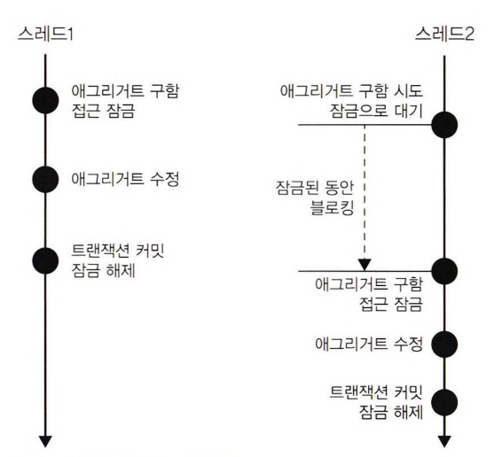

# 6장 응용 서비스와 표현 영역

## 6.1 표현 영역과 응용 영역

표현 영역은 사용자의 요청을 해석한다.

실제 사용자가 원하는 기능을 제공하는 것은 응용 영역에 위치한 서비스다. 응용 서비스는 표현 영역에 의존하지 않는다.

## 6.2 응용 서비스의 역할

응용 서비스의 주요 역할은 도메인 객체를 사용해서 사용자의 요청을 처리하는 것이다.

응용 서비스가 복잡하다면 응용 서비스에서 도메인 로직의 일부를 구현하고 있을 가능성이 높다.  
응용 서비스가 도메인 로직을 일부 구현하면 코드 중복, 로직 분산 등 코드 품질에 안 좋은 영향을 줄 수 있다.

응용 서비스는 트랜잭션 처리도 담당한다.

### 6.2.1 도메인 로직 넣지 않기

도메인 로직은 도메인 영역에 위치하고 응용 서비스는 도메인 로직을 구현하지 않는다.

도메인 로직을 도메인 영역과 응용 서비스에 분산해서 구현하면 코드 품질에 문제가 발생한다.

1. 코드의 응집성이 떨어진다.  
   도메인 로직을 파악하기 위해 여러 영역을 분석해야 할 수도 있다.
2. 여러 응용 서비스에서 동일한 도메인 로직을 구현할 가능성이 높아진다.

일부 도메인 로직이 응용 서비스에 출현하면서 발생하는 두 가지 문제는 결과적으로 코드 변경을 어렵게 만든다.

<u>**소프트웨어의 가치를 높이려면 도메인 로직을 도메인 영역에 모아서 코드 중복을 줄이고 응집도를 높여야 한다.**</u>

## 6.3 응용 서비스의 구현

응용 서비스는 표현 영역과 도메인 영역을 연결하는 매개체 역할을 하는데 이는 디자인 패턴에서 파사드(facade)와 같은 역할을 한다.  
*파사드(facade): 저수준 모듈을 고수준 모듈로 감싸는 디자인 패턴*

### 6.3.1 응용 서비스의 크기

응용 서비스는 보통 다음의 두 가지 방법 중 한 가지 방식으로 구현한다.  
* 한 응용 서비스 클래스에 특정 도메인의 모든 기능 구현하기
* 구분되는 기능별로 응용 서비스 클래스를 따로 구현하기

도메인과 관련된 기능을 한 클래스에 모두 구현하면 각 기능에서 동일 로직에 대한 코드 중복을 제거할 수 있다는 장점이 있다.  
다만, 한 서비스 클래스의 크기(코드 라인 수)가 커진다는 것이 이 방식의 단점이다.  
코드 크기가 커지면 연관성이 적은 코드가 한 클래스에 함께 위치할 가능성이 높아지게 되는데 결과적으로 관련 없는 코드가 뒤섞여 코드를 이해하는 데 방해가 된다.

구분되는 기능별로 서비스 클래스를 구현하는 방식은 한 응용 서비스 클래스에서 한 개 내지는 2~3개의 기능을 구현한다.  
클래스 개수는 많아지지만 한 클래스에 관련 기능을 모두 구현하는 것과 비교해서 코드 품질을 일정 수준으로 유지하는 데 도움이 된다.  
또한 각 클래스별로 필요한 의존 객체만 포함하므로 다른 기능을 구현한 코드에 영향을 받지 않는다.  
각 기능마다 동일한 로직을 구현할 경우 여러 클래스에 중복해서 동일한 코드를 구현할 가능성이 있다.  
이 경우 별도 클래스에 로직을 구현해서 코드가 중복되는 것을 방지할 수 있다.

### 6.3.2 응용 서비스의 인터페이스와 클래스

인터페이스가 필요한 몇가지 상황이 있다.

1. 구현 클래스가 여러 개인 경우  
    구현 클래스가 다수 존재하거나 런타임에 구현 객체를 교체해야 할 때 인터페이스를 유용하게 사용한다.  
    다만 응용 서비스는 런타임에 교체하는 경우가 거의 없고 한 응용 서비스의 구현 클래스가 두 개인 경우도 드물다.
2. 테스트 주도 개발(TDD)를 즐겨 하고 표현 영역부터 개발을 시작한다면, 미리 응용 서비스를 구현할 수 없으므로 응용 서비스의 인터페이스부터 작성하게 된다.
3. 표현 영역이 아닌 도메인 영역이나 응용 영역의 개발을 먼저 시작하면 응용 서비스 클래스가 먼저 만들어진다.  
    표현 영역의 단위 테스트를 위해 응용 서비스 클래스의 가짜 객체가 필요한데 이를 위해 인터페이스를 추가할 수도 있다.

### 6.3.3 메서드 파라미터와 값 리턴

응용 서비스에 데이터로 전달할 요청 파라미터가 두 개 이상 존재하면 데이터 전달을 위한 별도 클래스를 사용하는 것이 편리하다.

응용 서비스의 결과를 표현 영역에서 사용해야 하면 응용 서비스 메소드의 결과로 필요한 데이터를 리턴한다.

기능 실행 로직을 응용 서비스와 표현 영역에 분산시켜 코드의 응집도를 낮추는 원인이 된다.  
응용 서비스는 표현 영역에서 필요한 데이터만 리턴하는 것이 기능 실행 로직의 응집도를 높이는 확실한 방법이다.

### 6.3.4 표현 영역에 의존하지 않기

응용 서비스의 파라미터 타입을 결정할 때 주의할 점은 표현 영역과 관련된 타입을 사용하면 안 된다는 점이다.  
응용 서비스에서 표현 영역에 대한 의존이 발생하면 응용 서비스만 단독으로 테스트하기가 어려워진다.  
게다가 표현 영역의 구현이 변경되면 응용 서비스의 구현도 함께 변경해야 하는 문제도 발생한다.

두 문제보다 더 심각한 것은 응용 서비스가 표현 영역의 역할까지 대신하는 상황이 벌어질 수도 있다는 것이다.

### 6.3.5 트랜잭션 처리

트랜잭션을 관리하는 것은 응용 서비스의 중요한 역할이다.

## 6.4 표현 영역

표현 영역의 책임은 다음과 같다.  
* 사용자가 시스템을 사용할 수 있는 흐름(화면)을 제공하고 제어한다.
* 사용자의 요청을 알맞은 응용 서비스에 전달하고 결과를 사용자에게 제공한다.
* 사용자의 세션을 관리한다.

## 6.5 값 검증

값 검증은 표현 영역과 응용 서비스 두 곳에서 모두 수행할 수 있다.  

원칙적으로 모든 값에 대한 검증은 응용 서비스에서 처리한다.  
다만 응용 서비스에서 각 값이 유효한지 확인할 목적으로 Exception을 사용할 때의 문제점은 사용자에게 좋지 않은 경험을 제공한다는 것이다.  
첫 번째 값이 올바르지 않아 Exception을 발생시키면 나머지 항목에 대해서는 값을 검사하지 않는다.  
이는 사용자가 같은 폼에 값을 여러 번 입력하게 만든다.  
이와 같은 사용자의 불편을 해소하기 위해 응용 서비스에서 에러 코드를 모아 하나의 Exception으로 발생시키는 방법도 있다.

표현 영역에서 필수 값을 검증하는 방법도 있다.  
표현 영역에서 필수 값과 값의 형식을 검사하면 실질적으로 응용 서비스는 ID 중복 여부와 같은 논리적 오류만 검사하면 된다.  
즉, 표현 영역과 응용 서비스가 값 검증을 나눠서 수행하는 것이다.  
* 표현 영역: 필수 값, 값의 형식, 범위 등을 검증
* 응용 서비스: 데이터의 존재 유무와 같은 논리적 오류를 검증

응용 서비스에서 필요한 값 검증을 모두 처리하면 프레임워크가 제공하는 검증 기능을 사용할 때보다 작성할 코드가 늘어나는 불편함이 있지만 반대로 응용 서비스의 완성도가 높아지는 이점이 있다.

## 6.6 권한 검사

보안 프레임워크에 대한 이해가 부족하면 프레임워크를 무턱대고 도입하는 것보다 개발할 시스템에 맞는 권한 검사 기능을 구현하는 것이 시스템 유지 보수에 유리할 수 있다.

보통 권한 검사를 수행하는 영역은 다음과 같다.  
* 표현 영역
* 응용 서비스
* 도메인

표현 영역에서 할 수 있는 기본적인 검사는 인증된 사용자인지 아닌지 검사하는 것이다.  
이런 접근 제어를 하기에 좋은 위치가 서블릿 필터(Servlet Filter)다.

URL 만으로 접근 제어를 할 수 없는 경우 응용 서비스의 메소드 단위로 권한 검사를 수행해야 한다.

## 6.7 조회 전용 기능과 응용 서비스

서비스에서 수행하는 추가적인 로직이 없고 단일 쿼리만 실행하는 조회 전용 기능이어서 트랜잭션이 필요하지 않은 경우가 있다.  
이 경우 굳이 서비스를 만들 필요 없이 표현 영역에서 바로 조회 전용 기능을 사용해도 문제가 없다.

위는 책의 저자의 의견이나, 이 요약을 작성하고 있는 모임의 생각은 다르다.  
코드의 일관성, 표현 영역에서는 응용 서비스를 호출하고 응용 서비스에서는 레포지토리를 호출한다, 를 유지하기 위해서라면 굳이 서비스를 만들어서 사용하는 것이 좋은 것 같다.

# 7장 도메인 서비스

## 7.1 여러 애그리거트가 필요한 기능

한 애그리거트에 넣기 애매한 도메인 기능을 억지로 특정 애그리거트에 구현하면 안 된다.  
억지로 구현하면 애그리거트는 자신의 책임 범위를 넘어서는 기능을 구현하기 때문에 코드가 길어지고 외부에 대한 의존이 높아지게 되며 코드를 복잡하게 만들어 수정을 어렵게 만드는 요인이 된다.  
이런 문제를 해소하는 가장 쉬운 방법이 도메인 기능을 별도 서비스로 구현하는 것이다.

## 7.2 도메인 서비스

주로 다음 상황에서 도메인 서비스를 사용한다.  
* 계산 로직: 여러 애그리거트가 필요한 계산 로직이나, 한 애그리거트에 넣기에는 다소 복잡한 계산 로직
* 외부 시스템 연동이 필요한 도메인 로직: 구현하기 위해 타 시스템을 사용해야 하는 도메인 로직

### 7.2.1 계산 로직과 도메인 서비스

도메인 서비스를 이용해서 도메인 개념을 명시적으로 드러내면 된다.  
응용 영역의 서비스가 응용 로직을 다룬다면 도메인 서비스는 도메인 로직을 다룬다.

도메인 영역과 도메인 서비스를 비교할 때 다른 점은 도메인 서비스는 상태 없이 로직만 구현한다는 점이다.  
도메인 서비스를 구현하는데 필요한 상태는 다른 방법으로 전달받는다.

도메인 서비스를 사용하는 주체는 애그리거트가 될 수도 있고 응용 서비스가 될 수도 있다.  
애그리거트 객체에 도메인 서비스를 전달하는 것은 응용 서비스 책임이다.

도메인 서비스 객체를 애그리거트에 주입하지 않는다.  
애그리거트의 메소드를 실행할 때 도메인 서비스 객체를 파라미터로 전달한다는 것은 애그리거트가 도메인 서비스에 의존한다는 것을 의미한다.  
모델의 데이터를 담는 필드는 모델에서 중요한 구성요소다. 그런데 도메인 서비스를 `@Autowired`를 통해 주입받은 필드는 데이터 자체와는 관련이 없다.  
객체를 DB에 보관할 때 다른 필드와는 달리 저장 대상도 아니다.

반대로 도메인 서비스의 기능을 실행할 때 애그리거트를 전달하기도 한다.  
도메인 서비스는 도메인 로직을 수행하지 응용 로직을 수행하지않는다. 트랜잭션 처리와 같은 로직은 응용 로직이므로 도메인 서비스가 아닌 응용 서비스에서 처리해야 한다.

특정 기능이 응용 서비스인지 도메인 서비스인지 감을 잡기 어려울 때는 해당 로직이 애그리거트의 상태를 변경하거나 애그리거트의 상태 값을 계산하는지 검사해보면 된다.

### 7.2.2 외부 시스템 연동과 도메인 서비스

외부 시스템이나 타 도메인과의 연동 기능도 도메인 서비스가 될 수 있다.

도메인 로직은 도메인 서비스로 표현될 수 있지만, 중요한 점은 도메인 로직 관점에서 인터페이스를 작성한다는 점이다.  
외부 시스템과 연동한다는 관점으로 인터페이스를 작성하지 않는다.

### 7.2.3 도메인 서비스의 패키지 위치

도메인 서비스는 도메인 로직을 표현하므로 도메인 서비스의 위치는 다른 도메인 구성요소와 동일한 패키지에 위치한다.  
도메인 서비스의 개수가 많아지거나 엔티티, 밸류와 같은 다른 구성요소와 명시적으로 구분하고 싶다면 도메인 패키지 밑에 하위 패키지를 구분하여 위치시킨다.

### 7.2.4 도메인 서비스의 인터페이스와 클래스 

도메인 서비스의 로직이 고정되어 있지 않은 경우 도메인 서비스 자체를 인터페이스로 구현하고 이를 구현한 클래스를 둘 수도 있다.

# 8장 애그리거트 트랜잭션 관리

## 8.1 애그리거트와 트랜잭션

일관성이 깨지는 문제가 발생하지 않도록 하려면 두 가지 중 하나를 해야 한다.  
* 운영자가 배송지 정보를 조회하고 상태를 변경하는 동안 고객이 애그리거트를 수정하지 못하게 막는다.
* 운영자가 배송지 정보를 조회한 이후에 고객이 정보를 변경하면, 운영자가 애그리거트를 다시 조회한 뒤 수정하도록 한다.

두 가지는 애그리거트 자체의 트랜잭션과 관련이 있다.  
애그리거트를 위한 추가적인 트랜잭션 처리 기법이 필요하다.  
애그리거트에 대해 사용할 수 있는 대표적인 트랜잭션 처리 방식에는 선점(Pessimistic) 잠금과 비선점(Optimistic) 잠금의 두 가지 방식이 있다.  
선점과 비선점은 비관적과 낙관적이라는 용어로 표현하기도 한다.

## 8.2 선점 잠금

선점 잠금은 먼저 애그리거트를 구한 스레드가 애그리거트 사용이 끝날 때까지 다른 스레드가 해당 애그리거트를 수정하지 못하게 하는 방식이다.

스레드1이 선점 잠금 방식으로 애그리거트를 구한 뒤 이어서 스레드2가 같은 애그리거트를 구하고 있다.  
이때 스레드2는 스레드1이 애그리거트에 대한 잠금을 해제할 때까지 블로킹된다.

한 스레드가 애그리거트를 구하고 수정하는 동안 다른 스레드가 수정할 수 없으므로 동시에 애그리거트를 수정할 때 발생하는 데이터 충돌 문제를 해소할 수 있다.

선점 잠금은 보통 DBMS가 제공하는 행단위 잠금을 사용해서 구현한다.  
다수의 DBMS가 for update와 같은 쿼리를 사용해서 특정 레코드에 한 커넥션만 접근할 수 있는 잠금장치를 제공한다.

JPA EntityManager는 `LockModeType`을 인자로 받는 `find()` 메소드를 제공한다.  
`LockModeType.PESSIMISTIC_WRITE`를 값으로 전달하면 해당 엔티티와 매핑된 테이블을 이용해서 선점 잠금 방식을 적용할 수 있다.  
하이버네이트의 경우 PESSIMISTIC_WRITE를 잠금 모드로 사용하면 for update 쿼리를 이용해서 선점잠금을 구현한다.  
스프링 데이터 JPA는 `@Lock` 어노테이션을 사용해서 잠금 모드를 지정한다.

### 8.2.1 선점 잠금과 교착 상태

선점 잠금 기능을 사용할 때는 잠금 순서에 따른 교착 상태(deadlock)가 발생하지 않도록 주의해야 한다.

선점 잠금에 따른 교착 상태는 상대적으로 사용자 수가 많을 때 발생할 가능성이 높고, 사용자 수가 많아지면 교착 상태에 빠지는 스레드는 더 빠르게 증가한다.  

이런 문제가 발생하지 않도록 하려면 잠금을 구할 때 최대 대기 시간을 지정해야 한다.  
지정한 시간 이내에 잠금을 구하지 못하면 Exception을 발생시킨다.  
스프링 데이터 JPA는 `@QueryHints` 어노테이션을 사용해서 쿼리 힌트를 지정할 수 있다.

## 8.3 비선점 잠금

비선점 잠금은 동시에 접근하는 것을 막는 대신 변경한 데이터를 실제 DBMS에 반영하는 시점에 변경 가능 여부를 확인하는 방식이다.  
비선점 잠금을 구현하려면 애그리거트에 버전으로 사용할 숫자 타입 프로퍼티를 추가해야 한다.  
애그리거트를 수정할 때마다 버전으로 사용할 프로퍼티 값이 1씩 증가한다.  
수정할 애그리거트와 매핑되는 테이블의 버전 값이 현재 애그리거트의 버전과 동일한 경우에만 데이터를 수정한다.  
수정에 성공하면 버전 값을 1 증가시킨다.

JPA는 버전을 이용한 비선점 잠금 기능을 지원한다.  
`@Version` 어노테이션을 붙이고 매핑되는 테이블에 버전을 저장할 칼럼을 추가하면 된다.  
엔티티가 변경되어 UPDATE 쿼리를 실행할 때 `@Version`에 명시한 필드를 이용해서 비선점 잠금 쿼리를 실행한다.

응용 서비스는 버전에 대해 알 필요가 없다. 리포지터리에서 필요한 애그리거트를 구하고 알맞은 기능만 실행하면 된다.  
다만 요청을 받아 표현 영역에서 응용 서비스에 전달할 요청 데이터는 사용자가 전송한 버전 값을 포함한다.  
응용 서비스는 표현 영역으로부터 전달받은 버전 값을 이용해서 애그리거트 버전과 일치하는지 확인하고, 일치하는 경우에만 기능을 수행한다.

### 8.3.1 강제 버전 증가

기능 실행 도중 루트가 아닌 다른 엔티티의 값만 변경되는 경우, JPA는 루트 엔티티의 버전 값을 증가시키지 않는다.  
이런 JPA의 특징은 애그리거트 관점에서 보면 문제가 된다.  
따라서 애그리거트 내에 어떤 구성요소의 상태가 바뀌면 루트 애그리거트의 버전 값이 증가해야 비선점 잠금이 올바르게 동작한다.  
JPA는 이런 문제를 처리할 수 있도록 `EntityManager#find()` 메소드로 엔티티를 구할 때 강제로 버전 값을 증가시키는 잠금 모드를 지원한다.  
`LockModeType.OPTIMISTIC_FORCE_INCREMENT`를 사용하면 해당 엔티티의 상태가 변경되었는지에 상관없이 트랜잭션 종료 시점에 버전 값 증가 처리를 한다.

## 8.4 오프라인 선점 잠금

과거 컨플루언스는 사전에 충돌 여부를 알려주지만 동시에 수정하는 것을 막지는 않았다.  
이 때 필요한 것이 오프라인 선점 잠금 방식이다.  
단일 트랜잭션에서 동시 변경을 막는 선점 잠금 방식과 달리 오프라인 선점 잠금은 여러 트랜잭션에 걸쳐 동시 변경을 막는다.

오프라인 선점 방식은 잠금 유효 시간을 가져야 한다. 유효 시간이 지나면 자동으로 잠금을 해제해서 다른 사용자가 잠금을 일정 시간 후에 다시 구할 수 있도록 해야한다.

### 8.4.1 오프라인 선점 잠금을 위한 LockManager 인터페이스와 관련 클래스

### 8.4.2 DB를 이용한 LockManager 구현