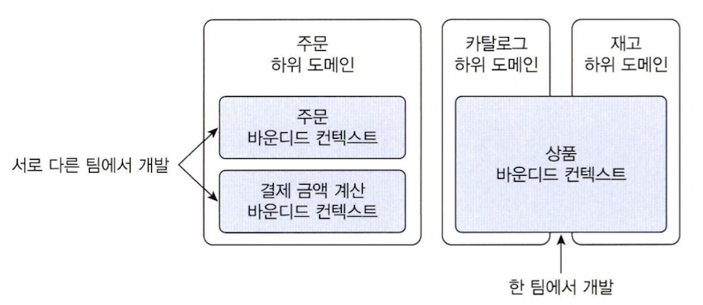
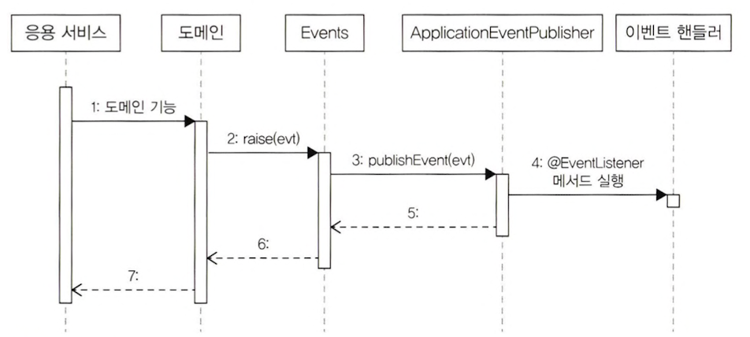

# 9장 도메인 모델과 바운디드 컨텍스트

## 9.1 도메인 모델과 경계

한 개의 모델로 여러 하위 도메인을 모두 표현하려고 시도하면 오히려 모든 하위 도메인에 맞지 않는 모델을 만들게 된다.

하위 도메인마다 같은 용어라도 의미가 다르고 같은 대상이라도 지칭하는 용어가 다를 수 있기 때문에 한 개의 모델로 모든 하위 도메인을 표현하려는 시도는 올바른 방법 아니며 표현할 수도 없다.  
올바른 도메인 모델을 개발하려면 하위 도메인마다 모델을 만들어야 한다.  
각 모델은 명시적으로 구분되는 경계를 가져서 섞이지 않도록 해야 한다.

모델은 특정한 컨텍스트 하에서 완전한 의미를 갖는다.  
구분되는 경계를 갖는 컨텍스트를 DDD에서는 바운디드 컨텍스트라고 부른다.

## 9.2 바운디드 컨텍스트

바운디드 컨텍스트는 모델의 경계를 결정하며 한 개의 바운디드 컨텍스트는 논리적으로 한 개의 모델을 갖는다.  
바운디드 컨텍스트는 용어를 기준으로 구분한다.  
바운디드 컨텍스트는 실제로 사용자에게 기능을 제공하는 물리적 시스템으로 도메인 모델은 이 바운디드 컨텍스트 안에서 도메인을 구현한다.

이상적으로 하위 도메인과 바운디드 컨텍스트가 일대일 관계를 가지면 좋겠지만 현실은 그렇지 않을 때가 많다. 바운디드 컨텍스트는 기업의 팀 조직 구조에 따라 결정되기도 한다.

여러 하위 도메인을 하나의 바운디드 컨텍스트에서 개발할 때 주의할 점은 하위 도메인의 모델이 섞이지 않도록 하는 것이다.  
비록 한 개의 바운디드 컨텍스트가 여러 하위 도메인을 포함하더라도 하위 도메인마다 구분되는 패키지를 갖도록 구현해야 한다.  

바운디드 컨텍스트는 도메인 모델을 구분하는 경계가 되기 때문에 구현하는 하위 도메인에 알맞은 모델을 포함한다.

## 9.3 바운디드 컨텍스트 구현

바운디드 컨텍스트가 도메인 모델만 포함하는 것은 아니다. 바운디드 컨텍스트는 도메인 기능을 사용자에게 제공하는 데 필요한 표현 영역, 응용 서비스, 인프라스트럭처 영역을 모두 포함한다.

모든 바운디드 컨텍스트를 반드시 도메인 주도로 개발할 필요는 없다. 상품의 리뷰는 복잡한 도메인 로직을 갖지 않기 때문에 CRUD 방식으로 구현해도 된다.

한 바운디드 컨텍스트에서 두 방식을 혼합해서 사용할 수도 있다. 대표적인 예가 CQRS 패턴이다. CQRS는 상태를 변경하는 명령 기능과 내용을 조회하는 쿼리 기능을 위한 모델을 구분하는 패턴이다.

## 9.4 바운디드 컨텍스트 간 통합

REST API를 호출하는 것은 두 바운디드 컨텍스트를 직접 통합하는 방법이다.

직접 통합하는 대신 간접적으로 통합하는 방법도 있다.  
대표적인 간접 통합 방식이 메시지 큐를 사용하는 것이다.  
메시지 큐는 비동기로 메시지를 처리하기 때문에 바운디드 컨텍스트는 메시지를 큐에 추가한 뒤에 다른 바운디드 컨텍스트가 메시지를 처리할 때까지 기다리지 않고 바로 이어서 자신의 처리를 계속한다.

**마이크로서비스와 바운디드 컨텍스트**  
마이크로서비스의 특징은 바운디드 컨텍스트와 잘 어울린다. 각 바운디드 컨텍스트는 모델의 경계를 형성하는데 바운디드 컨텍스트를 마이크로서비스로 구현하면 자연스럽게 컨텍스트별로 모델이 분리된다.  
개발한 바운디드 컨텍스트는 독립적으로 배포하고 모니터링하여 확장되는데 이 역시 마이크로서비스가 갖는 특징이다.

## 9.5 바운디드 컨텍스트 간 관계

두 바운디드 컨텍스트는 다양한 방식으로 관계를 맺는다.  
가장 흔한 관계는 한쪽에서 API를 제공하고 다른 한쪽에서 그 API를 호출하는 관계이다.  
API를 사용하는 바운디드 컨텍스트는 API를 제공하는 바운디드 컨텍스트에 의존하게 된다.

하류 컴포넌트인 컨텍스트는 상류 컴포넌트인 컨텍스트가 제공하는 데이터와 기능에 의존한다.  
상류 컴포넌트가 제공하는 REST API의 인터페이스가 바뀌면 하류 컴포넌트 시스템의 코드도 바뀌게 된다.

하류 컴포넌트는 상류 서비스의 모델이 자신의 도메인 모델에 영향을 주지 않도록 보호해주는 완충지대를 만들어야 한다.  
내 모델이 깨지는 것을 막아주는 안티코럽션 계층이 된다.  
이 계층에서 두 바운디드 컨텍스트 간의 모델 변환을 처리해 주기 때문에 다른 바운디드 컨텍스트의 모델에 영향을 받지 않고 내 도메인 모델을 유지할 수 있다.

두 바운디드 컨텍스트가 같은 모델을 공유하는 경우도 있다. 이런 모델을 공유 커널이라고 부른다.  
공유 커널의 장점은 중복을 줄여준다는 것이다.  
한 팀에서 임의로 모델을 변경하면 안 되며 두 팀이 밀접한 관계를 유지해야 한다.

다음으로 살펴볼 관계는 독립 방식이다. 서로 통합하지 않는 방식으로 두 바운디드 컨텍스트 간에 통합하지 않으므로 독립적으로 모델을 발전시킨다.  
독립 방식에서 두 바운디드 컨텍스트 간의 통합은 수동으로 이루어진다.  
수동으로 통합하는 방식이 나쁜 것은 아니지만 규모가 커질수록 수동 통합에는 한계가 있으므로 규모가 커지기 시작하면 두 바운디드 컨텍스트를 통합해야 한다.

## 9.6 컨텍스트 맵

컨텍스트 맵은 전체 비즈니스를 조망할 수 있는 지도이다.

컨텍스트 맵을 그리는 규칙은 따로 없다. 간단한 도형과 선을 이용해서 각 컨텍스트의 관계를 이해할 수 있는 수준에서 그리면 된다.

# 10장 이벤트

## 10.1 시스템 간 강결합 문제

외부 시스템을 호출하는 경우 두 가지 문제가 발생할 수 있다.

첫 번째 문제는 외부 서비스가 정상이 아닐 경우 트랜잭션 처리를 어떻게 해야 할지 애매하다는 것이다.  
두 번째 문제는 성능에 대한 것이다. 외부 시스템의 응답 시간이 길어지면 그만큼 대기 시간도 길어진다.  
즉, 외부 서비스 성능에 직접적인 영향을 받게 된다.  
두 가지 문제 외에도 도메인 객체에 서비스를 전달하면 추가로 두 로직이 섞이는 설계상 문제가 나타날 수 있다.

위의 문제가 발생하는 이유는 바운디드 컨텍스트와 다른 바운디드 컨텍스트 간의 강결합 때문이다. 두 로직이 강하게 결합되어 있어서 바운디드 컨텍스트가 다른 바운디드 컨텍스트에 영향을 받게 되는 것이다.  

강한 결합을 없애는 방벙이 있다. 바로 이벤트를 사용하는 것이다.  
특히 비동기 이벤트를 사용하면 두 시스템 간의 결합을 크게 낮출 수 있다.

## 10.2 이벤트 개요

이벤트가 발생한다는 것은 상태가 변경됐다는 것을 의미한다.  
이벤트가 발생하면 그 이벤트에 반응하여 원하는 동작을 수행하는 기능을 구현한다.

### 10.2.1 이벤트 관련 구성요소

이벤트, 이벤트 생성 주체, 이벤트 디스패처(퍼블리셔), 이벤트 핸들러(구독자)를 구현해야 한다.

이벤트 생성 주체는 엔티티, 밸류, 도메인 서비스와 같은 도메인 객체이다.  
이벤트 핸들러는 이벤트 생성 주체가 발생한 이벤트에 반응한다.  
이벤트 디스페처는 이벤트 생성 주체와 이벤트 핸들러를 연결해 준다.  
이벤트 생성 주체는 이벤트를 생성해서 디스패처에 이벤트를 전달한다. 이벤트를 전달받은 디스패처는 해당 이벤트를 처리할 수 있는 핸들러에 이벤트를 전파한다. 이벤트 디스패처의 구현 방식에 따라 이벤트 생성과 처리를 동기나 비동기로 실행하게 된다.

### 10.2.2 이벤트의 구성

이벤트는 현재 기준으로 과거(바로 직전이라도)에 벌어진 것을 표현하기 때문에 이벤트 이름에는 과거 시제를 사용한다.

이벤트는 이벤트 핸들러가 작업을 수행하는 데 필요한 데이터를 담아야 한다.

이벤트는 데이터를 담아야 하지만 그렇다고 이벤트 자체와 관련 없는 데이터를 포함할 필요는 없다.

### 10.2.3 이벤트 용도

크게 두 가지 용도로 쓰인다.  
첫 번째 용도는 트리거다. 도메인 상태가 바뀔때 다른 후처리가 필요하면 후처리를 실행하기 위한 트리거로 이벤트를 사용할 수 있다.  
두 번째 용도는 서로 다른 시스템 간의 데이터 동기화이다.

### 10.2.4 이벤트 장점

서로 다른 도메인 로직이 섞이는 것을 방지할 수 있다.

이벤트 핸들러를 사용하면 기능 확장에 용이하다.

## 10.3 이벤트, 핸들러, 디스패처구현

### 10.3.1 이벤트 클래스

### 10.3.2 Events 클래스와 ApplicationEventPublisher

이벤트 발생과 출판을 위해 스프링이 제공하는 `ApplicationEventPublisher`를 사용한다.

### 10.3.3 이벤트 발생과 이벤트 핸들러

이벤트를 처리할 핸들러는 스프링이 제공하는 `@EventListener` 어노테이션을 사용해서 구현한다.

### 10.3.4 흐름 정리

도메인 상태 변경과 이벤트 핸들러는 같은 트랜잭션 범위에서 실행된다.

## 10.4 동기이벤트처리문제

외부 서비스의 성능 저하가 내 시스템의 성능 저하로 연결된다는 것을 의미한다.  
성능 저하뿐만 아니라 트랜잭션도 문제가 된다.

외부 시스템과의 연동을 동기로 처리할 때 발생하는 성능과 트랜잭션 범위 문제를 해소하는 방법은 이벤트를 비동기로 처리하거나 이벤트와 트랜잭션을 연계하는 것이다.

## 10.5 비동기이벤트처리

이벤트를 비동기로 처리하는 방식으로 구현할 수 있다.  
A 이벤트가 발생하면 별도 스레드로 B를 수행하는 핸들러를 실행하는 방식으로 요구사항을 구현할 수 있다.

비동기 이벤트 처리를 구현하는 방법으로 네 가지가 있다.  
* 로컬 핸들러를 비동기로 실행하기
* 메시지 큐를 사용하기
* 이벤트 저장소와 이벤트 포워더 사용하기
* 이벤트 저장소와 이벤트 제공 API 사용하기

### 10.5.1 로컬 핸들러 비동기 실행

이벤트 핸들러를 비동기로 실행하는 방법은 이벤트 핸들러를 별도 스레드로 실행하는 것이다.  
스프링이 제공하는 `@Async` 어노테이션을 사용하면 손쉽게 비동기로 이벤트 핸들러를 실행할 수 있다. 이를 위해 다음 두 가지만 하면 된다.  
* @EnableAsync 어노테이션을 사용해서 비동기 기능을 활성화한다.
* 이벤트 핸들러 메소드에 `@Async` 어노테이션을 붙인다.

### 10.5.2 메시징 시스템을 이용한 비동기 구현

카프카나 래빗MQ와 같은 메시징 시스템을 사용할 수도 있다.  
메시지 큐에서 이벤트를 읽어와 처리하는 과정은 별도 스레드나 프로세스로 처리된다.

도메인 기능을 실행한 결과를 DB에 반영하고 이 과정에서 발생한 이벤트를 메시지 큐에 저장하는 것을 같은 트랜잭션 범위에서 실행하려면 글로벌 트랜잭션이 필요하다.  
글로벌 트랜잭션을 사용하면 안전하게 이벤트를 메시지 큐에 전달할 수 있는 장점이 있지만 반대로 글로벌 트랜잭션으로 인해 전체 성능이 떨어지는 단점도 있다.

래빗MQ처럼 많이 사용되는 메시징 시스템은 글로벌 트랜잭션 지원과 함께 클러스터와 고가용성을 지원하기 때문에 안정적으로 메시지를 전달할 수 있는 장점이 있다. 또한 다양한 개발언어와 통신 프로토콜을 지원하고 있다.  
메시지를 전달하기 위해 많이 사용되는 것 중 카프카도 있다. 카프카는 글로벌 트랜잭션을 지원하진 않지만 다른 메시징 시스템에 비해 높은 성능을 보여준다.

### 10.5.3 이벤트 저장소를 이용한 비동기 처리

이벤트를 일단 DB에 저장한 뒤에 별도 프로그램을 이용해서 이벤트 핸들러에 전달하는 방법도 있다.

포워더는 주기적으로 이벤트 저장소에서 이벤트를 가져와 이벤트 핸들러를 실행한다. 포워더는 별도 스레드를 이용하기 때문에 이벤트 발행과 처리가 비동기로 처리된다.

이 방식은 도메인의 상태와 이벤트 저장소로 동일한 DB를 사용한다. 도메인의 상태 변화와 이벤트 저장이 로컬 트랜잭션으로 처리된다.  
이벤트 저장소를 이용한 두 번째 방법은 이벤트를 외부에 제공하는 API를 사용하는 것이다.

포워더 방식이 포워더를 이용해서 이벤트를 외부에 전달한다면, API 방식은 외부 핸들러가 API 서버를 통해 이벤트 목록을 가져간다.

REST API로 구현하는 방식은 단순하다. `offset`과 `limit`의 웹 요청 파라미터를 이용해서 `EventStore#get`을 실행하고 그 결과를 JSON으로 리턴하면 된다.

포워더는 일정 주기로 EventStore에서 이벤트를 읽어와 이벤트 핸들러에 전달하면 된다.

**자동 증가 칼럼 주의 사항**  
insert 쿼리를 실행해서 자동 증가 칼럼이 증가했더라도 트랜잭션을 커밋하기 전에 조회하면 증가한 값을 가진 레코드는 조회되지 않는다.

## 10.6 이벤트적용시추가고려사항

첫 번째는 이벤트 소스를 EventEntry에 추가할지 여부이다. 특정 주체가 발생시킨 이벤트만 조회하는 기능을 구현할 수 없다. 이 기능을 구현하려면 이벤트에 발생 정보 주체를 추가해야 한다.

두 번째로 고려할 점은 포워더에서 전송 실패를 얼마나 허용할 것이냐에 대한 것이다. 포워더는 이벤트 전송에 실패하면 실패한 이벤트로부터 다시 읽어와 전송을 시도한다. 따라서 포워더를 구현할 때는 실패한 이벤트의 재전송 횟수 제한을 두어야 한다.

잠깐! 처리에 실패한 이벤트를 생략하지 않고 별도의 실패용 DB나 메시지 큐에 저장하기도 한다. 처리에 실패한 이벤트를 물리저인 저장소에 남겨두면 이후 실패 이유 분석이나 후처리에 도움이 된다.

세 번째로 고려할 점은 이벤트 손실에 대한 것이다. 이벤트 저장소를 사용하는 방식은 이벤트 발생과 이벤트 저장을 한 트랜잭션으로 처리하기 때문에 트랜잭션에 성공하면 이벤트가 저장소에 보관된다는 것을 보장할 수 있다. 반면에 로컬 핸들러를 이용해서 이벤트를 비동기로 처리할 경우 이벤트 처리에 실패하면 이벤트를 유실하게 된다.

네 번째로 고려할 점은 이벤트 순서에 대한 것이다. 이벤트 발생 순서대로 외부 시스템에 전달해야 할 경우, 이벤트 저장소를 사용하는 것이 좋다. 메시징 시스템은 사용기술에 따라 이벤트 발생 순서와 메시지 전달 순서가 다를 수 있다.

다섯 번째 고려할 점은 이벤트 재처리에 대한 것이다. 동일한 이벤트를 다시 처리해야 할 때 이벤트를 어떻게 할지 결정해야 한다. 가장 쉬운 방법은 마지막으로 처리한 이벤트의 순번을 기억해 두었다가 이미 처리한 순번의 이벤트가 도착하면 해당 이벤트를 처리하지 ㅇ낳고 무시하는 것이다. 이 외에 이벤트를 멱등으로 처리하는 방법도 있다.

**멱등성**  
연산을 여러 번 적용해도 결과가 달라지지 않는 성질을 멱등성이라고 한다.  
이벤트 핸들러가 멱등성을 가지면 시스템 장애로 인해 같은 이벤트가 중복해서 발생해도 결과적으로 동일 상태가 된다. 이는 이벤트 중복 발생이나 중복 처리에 대한 부담을 줄여준다.

### 10.6.1 이벤트 처리와 DB 트랜잭션 고려

이벤트를 처리할 때는 DB 트랜잭션을 함께 고려해야 한다.

이벤트 처리를 동기로 하든 비동기로 하든 이벤트 처리 실패와 트랜잭션 실패를 함께 고려해야 한다. 트랜잭션 실패와 이벤트 처리 실패를 모두 고려하면 복잡해지므로 경우의 수를 줄이면 도움이 된다. 경우의 수를 줄이는 방법은 트랜잭션이 성공할 때만 이벤트 핸들러를 실행하는 것이다.

스프링은 `@TransactionalEventListener` 어노테이션을 지원한다.  
스프링 트랜잭션 상태에 따라 이벤트 핸들러를 실행할 수 있게 한다.

# 11장 CQRS

## 11.1 단일 모델의 단점

구현 복잡도를 낮추는 간단한 방법은 상태 변경을 위한 모델과 조회를 위한 모델을 분리하는 것이다.

## 11.2 CQRS

시스템이 제공하는 기능은 크게 두 가지로 나눌 수 있다.  
하나는 상태를 변경하는 기능이다.  
다른 하나는 사용자 입장에서 상태 정보를 조회하는 기능이다.

상태를 변경하는 범위와 상태를 조회하는 범위가 정확하게 일치하지 않기 때문에 단일 모델로 두 종류의 기능을 구현하면 모델이 불필요하게 복잡해진다. 단일 모델을 사용할 때 발생하는 복잡도를 해결하기 위해 사용하는 방법이 있는데 바로 CQRS다.

CQRS는 Command Query Responsibility Segregation의 약자로 상태를 변경하는 명령을 위한 모델과 상태를 제공하는 조회를 위한 모델을 분리하는 패턴이다.

### 11.2.1 웹과 CQRS

일반적인 웹 서비스는 상태를 변경하는 요청보다 상태를 조회하는 요청이 많다.

조회 성능을 높이기 위해 다양한 기법을 사용하는 것은 결과적으로 CQRS를 적용하는 것과 같은 효과를 만든다. 메모리에 캐싱 하는 데이터는 DB에 보관된 데이터를 그대로 저장하기보다는 화면에 맞는 모양으로 변환한 데이터를 캐싱할 때 성능에 더 유리하다. 즉, 조회 전용 모델을 캐시하는 것이다.

### 11.2.2 CQRS 장단점

CQRS 패턴을 적용할 때 얻을 수 있는 장점은 명령 모델을 구현할 때 도메인 자체에 집중할 수 있다는 점이다. 또한 명령 모델에서 조회 관련 로직이 사라져 복잡도가 낮아진다.

또 다른 장점은 조회 성능을 향상시키는 데 유리하다는 점이다. 조회 단위로 캐시 기술을 적용할 수 있고, 조회에 특화된 쿼리를 마음대로 사용할 수도 있다.

첫 번째 단점은 구현해야 할 코드가 더 많다는 점이다. 단일 모델을 사용할 때 발생하는 복잡함 때문에 발생하는 구현 비용과 조회 전용 모델을 만들 때 발생하는 구현 비용을 따져봐야 한다.

두 번째 단점은 더 많은 구현 기술이 필요하다는 것이다. 명령 모델과 조회 모델을 다른 구현 기술을 사용해서 구현하기도 하고 경우에 따라 다른 저장소를 사용하기도 한다. 또한 데이터 동기화를 위해 메시징 시스템을 도입해야 할 수도 있다.

도메인이 복잡하지 않은데 CQRS를 도입하면 두 모델을 유지하는 비용만 높아지고 얻을 수 있는 이점은 없다. 반면에 트래픽이 높은 서비스인데 단일 모델을 고집하면 유지 보수 비용이 오히려 높아질 수 있으므로 CQRS 도입을 고려해본다.